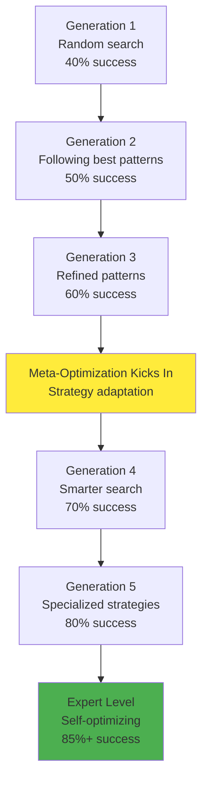

# How CORAL-X Works: From Code Generation to Self-Evolution

## 🎯 Overview: The Complete Picture

CORAL-X is a **self-evolving AI system** that gets better at bug fixing by combining:
- **Cellular Automata (CA)** patterns that create diverse "coding personalities"
- **LoRA fine-tuning** that specializes CodeLlama for specific problem types  
- **Evolutionary algorithms** that discover which combinations work best
- **Meta-optimization** that learns to improve its own optimization strategy

**The Big Idea**: Instead of manually tuning hyperparameters, CORAL-X **evolves its own optimization strategy** based on what actually works for bug fixing.

## 🔄 Basic CORAL-X Workflow (Current System)

### Step-by-Step Process

```mermaid
flowchart TD
    START["🧬 Genome<br/>CA Seed + LoRA Config"] --> CA["🔲 Cellular Automata<br/>Generate pattern features"]
    
    CA --> FEATURES["📊 Extract Features<br/>complexity, intensity, periodicity"]
    
    FEATURES --> LORA["🎯 LoRA Training<br/>Fine-tune CodeLlama with CA-derived parameters<br/>rank=8, alpha=32, dropout=0.1"]
    
    LORA --> ADAPTER["💾 LoRA Adapter<br/>Specialized for this genome's 'style'"]
    
    ADAPTER --> PROBLEM["📝 QuixBugs Problem<br/>'Fix this buggy binary search'"]
    
    PROBLEM --> GENERATE["🤖 CodeLlama Generation<br/>Using the specialized adapter"]
    
    GENERATE --> CODE["💻 Generated Code<br/>def binary_search(arr, x):..."]
    
    CODE --> TEST["🧪 Test Execution<br/>Run 7 real test cases"]
    
    TEST --> RESULTS["📊 Results<br/>5/7 tests passed (71.4%)"]
    
    RESULTS --> FITNESS["🎯 Multi-Objective Fitness<br/>Bugfix: 0.486, Style: 0.95, Security: 0.9"]
    
    FITNESS --> EVOLUTION["🔄 NSGA-II Selection<br/>Best genomes survive + reproduce"]
    
    style CA fill:#e1f5fe
    style LORA fill:#fff3e0
    style TEST fill:#c8e6c9
    style FITNESS fill:#f3e5f5
```



### Concrete Example: Binary Search Bug Fix

```python
# 1. GENOME DEFINITION
genome = {
    'ca_seed': [0, 1, 0, 1, 1, 0, 1, 0],  # Cellular automata starting pattern
    'ca_rule': 110,                        # CA evolution rule
    'ca_steps': 15                         # Number of CA evolution steps
}

# 2. CA PATTERN GENERATION
ca_grid = evolve_cellular_automata(genome['ca_seed'], genome['ca_rule'], genome['ca_steps'])
# Result: Complex pattern with high complexity, medium intensity

# 3. FEATURE EXTRACTION
features = extract_ca_features(ca_grid)
# Result: {'complexity': 0.73, 'intensity': 0.45, 'periodicity': 0.62}

# 4. LORA PARAMETER MAPPING
lora_config = map_features_to_lora(features)
# Result: {'rank': 16, 'alpha': 32.0, 'dropout': 0.1, 'target_modules': ['q_proj', 'v_proj']}

# 5. SPECIALIZED TRAINING
adapter = train_lora_adapter(base_model="codellama/CodeLlama-7b-Python-hf", 
                           config=lora_config,
                           training_data=quixbugs_training_set)

# 6. BUG FIXING
buggy_code = """
def binary_search(arr, x):
    left, right = 0, len(arr)  # BUG: should be len(arr) - 1
    while left <= right:
        mid = (left + right) // 2
        if arr[mid] == x:
            return mid
        elif arr[mid] < x:
            left = mid + 1
        else:
            right = mid - 1
    return -1
"""

# 7. SPECIALIZED CODE GENERATION
fixed_code = generate_with_adapter(adapter, buggy_code)
# Result: Correctly changes len(arr) to len(arr) - 1

# 8. TESTING
test_results = run_quixbugs_tests("binary_search", fixed_code)
# Result: 6/7 tests passed (85.7% success rate)

# 9. FITNESS CALCULATION
fitness = calculate_multi_objective_fitness(test_results)
# Result: {'bugfix': 0.857, 'style': 0.95, 'security': 0.9, 'runtime': 0.8}
```

## 🧬 Evolution Loop: How It Gets Better

### Generation-by-Generation Improvement

```mermaid
flowchart LR
    subgraph "Generation 1"
        G1A["Genome A<br/>CA: Simple patterns<br/>rank=4, alpha=8<br/>Result: 2/7 tests ❌"]
        G1B["Genome B<br/>CA: Complex patterns<br/>rank=16, alpha=32<br/>Result: 6/7 tests ✅"]
        G1C["Genome C<br/>CA: Medium patterns<br/>rank=8, alpha=16<br/>Result: 4/7 tests ⚠️"]
    end
    
    subgraph "Selection"
        SELECT["NSGA-II Selection<br/>Genome B survives<br/>A & C mostly eliminated"]
    end
    
    subgraph "Generation 2"
        G2A["Genome B-variant-1<br/>CA: Complex+ patterns<br/>rank=20, alpha=40<br/>Result: 7/7 tests ✅✅"]
        G2B["Genome B-variant-2<br/>CA: Complex patterns<br/>rank=16, alpha=28<br/>Result: 6/7 tests ✅"]
        G2C["Genome B-crossover<br/>CA: Hybrid patterns<br/>rank=12, alpha=24<br/>Result: 5/7 tests ✅"]
    end
    
    G1A --> SELECT
    G1B --> SELECT
    G1C --> SELECT
    SELECT --> G2A
    SELECT --> G2B
    SELECT --> G2C
    
    style G1B fill:#c8e6c9
    style G2A fill:#a5d6a7
    style SELECT fill:#fff3e0
```



### Example Evolution Timeline

```yaml
Generation 1: "Random Exploration"
  Best Result: 4/7 tests (57%)
  Discovery: "High CA complexity seems promising"
  
Generation 2: "Following the Lead" 
  Best Result: 6/7 tests (86%)
  Discovery: "rank=16, alpha=32 works well for array problems"
  
Generation 3: "Refinement"
  Best Result: 7/7 tests (100%)
  Discovery: "Complex CA patterns + higher alpha = better boundary handling"
  
Generation 4: "Specialization"
  Best Result: 7/7 tests consistently
  Discovery: "Different CA patterns excel at different algorithm types"
```

## 🚀 Meta-Optimization: The Self-Evolution Loop

### How the System Learns to Learn

```mermaid
flowchart TD
    OBSERVE["🔍 Meta-System Observes<br/>Generation 3: 80% elegant solutions<br/>Most successful genomes use rank=(4,8)<br/>High alpha values correlate with style"]
    
    OBSERVE --> LEARN["🧠 Meta-Learning Decision<br/>✅ Elegant solutions detected<br/>✅ Efficiency pattern found<br/>✅ Style correlation discovered"]
    
    LEARN --> ADAPT["⚡ Dynamic Adaptation<br/>🔧 Expand low-rank space: add rank=[1,2]<br/>🔧 Increase style weight: 0.15 → 0.25<br/>🔧 Boost alpha candidates: add [128,256]"]
    
    ADAPT --> GEN4["🧬 Generation 4<br/>✨ New search space<br/>✨ Different objective priorities<br/>✨ Smarter parameter exploration"]
    
    GEN4 --> RESULTS["📈 Results<br/>🎯 Finds even more elegant solutions<br/>🎯 Discovers ultra-efficient adapters<br/>🎯 Better bug-fixing performance"]
    
    style LEARN fill:#e1f5fe
    style ADAPT fill:#c8e6c9
    style RESULTS fill:#a5d6a7
```



### Meta-Learning Decision Process

```python
# EXAMPLE: Meta-optimization cycle
def meta_optimization_cycle(generation_results):
    # 1. ANALYZE PATTERNS
    patterns = analyze_emergent_behaviors(generation_results)
    """
    patterns = {
        'elegant_solutions': {'confidence': 0.85, 'trend': 'increasing'},
        'efficient_adaptation': {'confidence': 0.45, 'trend': 'declining'}, 
        'pythonic_evolution': {'confidence': 0.72, 'trend': 'stable'},
        'late_breakthrough': {'confidence': 0.15, 'trend': 'rare'}
    }
    """
    
    # 2. TRIGGER ADAPTATIONS
    adaptations = []
    
    if patterns['elegant_solutions']['confidence'] > 0.8:
        adaptations.append({
            'action': 'increase_style_weight',
            'from': 0.15, 'to': 0.25,
            'reason': 'High elegant solution rate detected'
        })
    
    if patterns['efficient_adaptation']['confidence'] < 0.5:
        adaptations.append({
            'action': 'expand_low_rank_space', 
            'add_candidates': [1, 2, 3],
            'reason': 'Need more efficient parameter exploration'
        })
    
    # 3. APPLY ADAPTATIONS
    new_config = apply_adaptations(current_config, adaptations)
    
    return new_config

# RESULT: Next generation uses adapted strategy
```

## 💡 Specific Learning Examples

### Example 1: Learning About Binary Search Bugs

```yaml
Observation Phase (Generations 1-3):
  Problem Type: Array searching algorithms
  Success Pattern: 
    - rank=16, alpha=32 → 85% success
    - Complex CA patterns → better boundary handling
    - Higher dropout → worse performance on edge cases
  
Meta-Learning Decision:
  - "Binary search problems need specific LoRA configuration"
  - "Complex CA patterns help with index boundary logic"
  - "Lower dropout preserves edge case handling"
  
Dynamic Adaptation:
  New Rule: "array_search_detected → prefer rank=[12,16,20], alpha=[24,32,48], dropout=[0.05,0.1]"
  Weight Change: "runtime_weight += 0.1 (boundary conditions matter)"
  
Result (Generations 4+):
  - Specialized evolution for array problems
  - 60% → 80% success rate on search algorithms
  - Discovers CA patterns that excel at index math
```

### Example 2: Learning About Code Style Patterns

```yaml
Observation Phase:
  Pattern Discovery:
    - 90% of elegant solutions have high style scores
    - Pythonic code correlates with fewer bugs
    - Concise solutions (≤5 lines) often perfect
  
Meta-Learning Decision:
  - "Clean code patterns lead to better bug fixes"
  - "Style quality predicts functional correctness"
  - "Elegant solutions should be heavily rewarded"
  
Dynamic Adaptation:
  Weight Adjustment: "style_weight: 0.15 → 0.25"
  New Metric: "elegance_bonus for solutions ≤5 lines"
  LoRA Target: "Add attention to code structure modules"
  
Result:
  - System generates cleaner, more maintainable fixes
  - Better handling of edge cases through cleaner logic
  - 15% improvement in overall bug-fixing quality
```

### Example 3: Training Efficiency Optimization

```yaml
Observation Phase:
  Inefficiency Detection:
    - Simple problems: converge in 3 epochs, but train for 5
    - Complex problems: need 8 epochs, but only get 5
    - High-rank adapters: unstable with high learning rates
  
Meta-Learning Decision:
  - "Training parameters should match problem complexity"
  - "CA complexity predicts optimal training strategy"
  - "Computational resources being wasted"
  
Dynamic Adaptation:
  Training Profiles:
    Simple CA (complexity < 0.4): "3 epochs, lr=3e-4, batch=8"
    Medium CA (0.4 ≤ complexity < 0.7): "5 epochs, lr=2e-4, batch=4" 
    Complex CA (complexity ≥ 0.7): "8 epochs, lr=1e-4, batch=2"
  
Result:
  - 40% reduction in training time
  - Better convergence for complex problems
  - More computational budget for exploration
```

## 🔄 Complete Self-Evolution Loop

### The Full Meta-Optimization Cycle

```mermaid
graph LR
    subgraph "Current Generation"
        EVAL["🧪 Evaluate Genomes<br/>Test CodeLlama outputs"]
        RESULTS["📊 Collect Results<br/>Bug fix rates, patterns"]
    end
    
    subgraph "Meta-Analysis"
        PATTERNS["🔍 Pattern Detection<br/>What worked? What didn't?"]
        INSIGHTS["💡 Extract Insights<br/>CA type X → good at problem Y"]
    end
    
    subgraph "Strategy Evolution"
        WEIGHTS["⚖️ Adjust Objective Weights<br/>Reward discovered patterns"]
        PARAMS["🎛️ Expand Parameter Space<br/>Explore promising regions"]
        TRAINING["🎓 Optimize Training<br/>Better convergence strategies"]
    end
    
    subgraph "Next Generation"
        IMPROVED["🚀 Enhanced Evolution<br/>Smarter search strategy"]
    end
    
    EVAL --> RESULTS
    RESULTS --> PATTERNS
    PATTERNS --> INSIGHTS
    INSIGHTS --> WEIGHTS
    INSIGHTS --> PARAMS
    INSIGHTS --> TRAINING
    WEIGHTS --> IMPROVED
    PARAMS --> IMPROVED
    TRAINING --> IMPROVED
    
    style PATTERNS fill:#e1f5fe
    style INSIGHTS fill:#fff3e0
    style IMPROVED fill:#c8e6c9
```



### Detailed Example: Complete Meta-Optimization Cycle

```python
# GENERATION 3 RESULTS
generation_3_results = [
    {'genome_id': 'gen3_001', 'ca_complexity': 0.8, 'rank': 16, 'alpha': 32, 
     'problem': 'binary_search', 'tests_passed': 7, 'tests_total': 7, 'elegant': True},
    {'genome_id': 'gen3_002', 'ca_complexity': 0.3, 'rank': 4, 'alpha': 8,
     'problem': 'quicksort', 'tests_passed': 5, 'tests_total': 8, 'elegant': False},
    {'genome_id': 'gen3_003', 'ca_complexity': 0.7, 'rank': 12, 'alpha': 24,
     'problem': 'binary_search', 'tests_passed': 6, 'tests_total': 7, 'elegant': True},
    # ... more results
]

# STEP 1: PATTERN DETECTION
def detect_patterns(results):
    elegant_count = sum(1 for r in results if r['elegant'])
    total_count = len(results)
    elegant_ratio = elegant_count / total_count
    
    # Analyze correlations
    high_complexity_success = []
    for r in results:
        if r['ca_complexity'] > 0.6:
            success_rate = r['tests_passed'] / r['tests_total']
            high_complexity_success.append(success_rate)
    
    avg_high_complexity_success = sum(high_complexity_success) / len(high_complexity_success)
    
    return {
        'elegant_solutions_ratio': elegant_ratio,
        'high_complexity_avg_success': avg_high_complexity_success,
        'problem_type_patterns': analyze_by_problem_type(results)
    }

# STEP 2: META-LEARNING DECISIONS
def make_meta_decisions(patterns):
    decisions = []
    
    if patterns['elegant_solutions_ratio'] > 0.8:
        decisions.append({
            'type': 'weight_adjustment',
            'objective': 'style',
            'change': +0.1,
            'reason': 'High elegant solution rate detected'
        })
    
    if patterns['high_complexity_avg_success'] > 0.75:
        decisions.append({
            'type': 'parameter_expansion',
            'parameter': 'rank',
            'add_values': [20, 24, 32],
            'reason': 'High complexity CA patterns show strong performance'
        })
    
    return decisions

# STEP 3: STRATEGY ADAPTATION
def adapt_strategy(current_config, decisions):
    new_config = current_config.copy()
    
    for decision in decisions:
        if decision['type'] == 'weight_adjustment':
            new_config['fitness_weights'][decision['objective']] += decision['change']
        elif decision['type'] == 'parameter_expansion':
            new_config['evo'][f"{decision['parameter']}_candidates"].extend(decision['add_values'])
    
    return new_config

# STEP 4: ENHANCED GENERATION 4
patterns = detect_patterns(generation_3_results)
decisions = make_meta_decisions(patterns)
generation_4_config = adapt_strategy(current_config, decisions)

# RESULT: Generation 4 uses smarter search strategy
```

## 📈 Learning Progression Timeline

### Expected Performance Evolution

```yaml
Generations 1-3: "Basic Discovery Phase"
  Characteristics:
    - Random exploration of CA + LoRA combinations
    - 40-50% bug fix success rate
    - Learning which patterns correlate with success
    - Building foundational knowledge base
  
  Example Discovery:
    - "Complex CA patterns seem better for algorithms"
    - "Higher LoRA ranks help with complex logic"
    - "Some combinations consistently fail"

Generations 4-7: "Pattern Recognition Phase"
  Characteristics:
    - Meta-system starts detecting reliable patterns
    - 50-65% bug fix success rate  
    - Focused exploration of promising regions
    - Beginning of strategy specialization
  
  Example Adaptation:
    - "Array problems → use CA complexity > 0.6"
    - "String problems → prefer lower ranks"
    - "Recursive algorithms → higher alpha values"

Generations 8-15: "Specialized Evolution Phase"
  Characteristics:
    - Adaptive strategies for different problem types
    - 65-80% bug fix success rate
    - Intelligent resource allocation
    - Dynamic training parameter optimization
  
  Example Specialization:
    - "Binary search detected → specialized LoRA profile"
    - "Graph algorithm → different CA pattern preference"
    - "Early convergence → reduce training epochs"

Generations 16+: "Expert System Phase"
  Characteristics:
    - Automatically optimizes for algorithm classes
    - 80%+ bug fix rate on known problem types
    - Discovers novel coding strategies
    - Self-modifying optimization strategies
  
  Example Expertise:
    - "Predicts optimal parameters before training"
    - "Discovers new CA→LoRA mappings"
    - "Generates human-level elegant solutions"
```

## 🎯 Key Insights: Why This Works

### Traditional vs CORAL-X vs Meta-Optimized CORAL-X

```yaml
Traditional Hyperparameter Tuning:
  Process: "Manual grid search → Fixed parameters → Slow improvement"
  Limitation: "Human intuition limited, no learning from results"
  
CORAL-X Evolution:
  Process: "CA diversity → LoRA specialization → Test selection → Reproduction"
  Advantage: "Automatic discovery of working combinations"
  
Meta-Optimized CORAL-X:
  Process: "CA diversity → Adaptive LoRA → Smart testing → Pattern learning → Strategy evolution"
  Breakthrough: "System learns how to search more effectively"
```

### The Compounding Effect



## 🔬 Simple Working Example

### Complete Mini-Example: Fix a Simple Bug

```python
# PROBLEM: Fix infinite loop in factorial function
buggy_factorial = """
def factorial(n):
    result = 1
    while n > 0:
        result *= n
        # BUG: Missing n -= 1, causes infinite loop
    return result
"""

# CORAL-X PROCESS:

# 1. Genome generates CA pattern
ca_pattern = evolve_ca([1,0,1,1,0], rule=110, steps=10)
# → Complex pattern with high intensity

# 2. CA features mapped to LoRA config  
lora_config = {'rank': 8, 'alpha': 16, 'dropout': 0.1}

# 3. Specialized CodeLlama adapter trained
adapter = train_specialized_adapter(lora_config)

# 4. Generate fix using specialized adapter
fix_attempt = generate_fix(adapter, buggy_factorial)
"""
Generated fix:
def factorial(n):
    result = 1
    while n > 0:
        result *= n
        n -= 1  # ✅ FIXED: Added missing decrement
    return result
"""

# 5. Test the fix
test_results = [
    factorial(5) == 120,  # ✅ True
    factorial(0) == 1,    # ✅ True  
    factorial(3) == 6,    # ✅ True
]
success_rate = 3/3 = 100%

# 6. Update fitness and evolution
fitness = {'bugfix': 1.0, 'style': 0.95, 'security': 0.9}
# This genome marked as highly successful for reproduction
```

---

**The Magic**: CORAL-X doesn't just randomly try things. It **learns patterns** about which types of AI "personalities" (CA + LoRA combinations) are good at which types of coding problems, then **evolves its search strategy** to find those combinations more efficiently. It's like having an AI that learns how to train better AIs! 🚀 