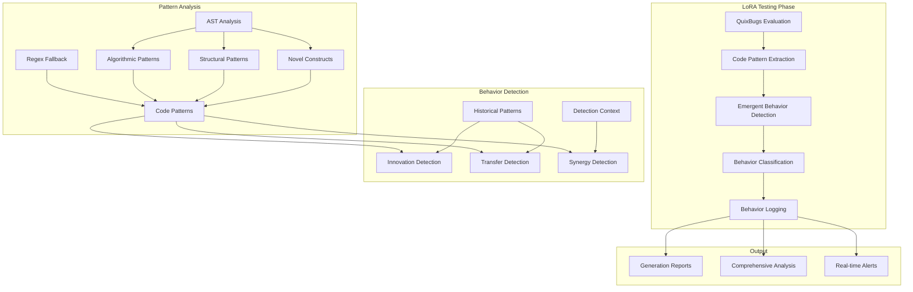

# CORAL-X Emergent Behavior Detection System

## Overview

This document describes the **Emergent Behavior Detection and Tracking System** built for CORAL-X to monitor and analyze emergent behaviors during the LoRA testing phase of evolution. The system identifies novel patterns, cross-problem generalizations, and unexpected synergies that emerge through the evolutionary process.

## 🎯 What Are Emergent Behaviors?

In the context of CORAL-X, emergent behaviors are **novel capabilities or patterns that arise during evolution that were not explicitly programmed or expected**. These include:

### 1. **Algorithmic Innovations**
- Novel algorithmic approaches that emerge through evolution
- Example: Discovering bit manipulation tricks not in training data
- **Detection**: High novelty score + significant performance impact

### 2. **Cross-Problem Transfer Learning**
- Solutions from one problem generalizing to others
- Example: Dynamic programming pattern from 'fibonacci' solving 'knapsack'
- **Detection**: Same pattern signatures across multiple problem contexts

### 3. **CA-LoRA Synergies**
- Unexpected interactions between Cellular Automata features and LoRA parameters
- Example: High CA complexity + low LoRA rank = surprisingly good performance
- **Detection**: Performance boost beyond statistical expectations

### 4. **Novel Pattern Emergence**
- New coding patterns not seen in baseline models
- Example: Functional programming constructs in imperative contexts
- **Detection**: Structural novelty in AST analysis + persistence across generations

## 🏗️ System Architecture



## 📋 Core Components

### 1. **Pattern Extraction** (`coral/domain/emergent_behavior.py`)

```python
@dataclass(frozen=True)
class CodePattern:
    name: str
    pattern_type: str  # 'algorithmic', 'structural', 'novel'
    signature: str     # Unique hash/signature
    complexity_score: float
    examples: Tuple[str, ...]
    metadata: Dict[str, Any]
```

**Key Functions:**
- `extract_code_patterns()` - Main pattern extraction
- `_extract_algorithmic_patterns()` - DP, recursion, optimization patterns
- `_extract_structural_patterns()` - Nesting, composition, control flow
- `_extract_novel_constructs()` - Advanced Python features, unexpected approaches

### 2. **Behavior Detection**

```python
@dataclass(frozen=True)
class EmergentBehavior:
    behavior_id: str
    behavior_type: str
    emergence_generation: int
    confidence_score: float
    novelty_score: float
    impact_score: float
    contributing_patterns: Tuple[CodePattern, ...]
    cross_problem_transfer: bool
    ca_lora_synergy: Optional[Dict[str, Any]]
```

**Detection Pipeline:**
1. **Context Creation** - Genome ID, generation, CA features, LoRA config
2. **Pattern Comparison** - Current vs. historical vs. baseline patterns
3. **Novelty Assessment** - Statistical analysis of pattern frequency
4. **Impact Evaluation** - Performance correlation analysis
5. **Synergy Detection** - CA-LoRA parameter interaction analysis

### 3. **Classification and Metrics**

```python
@dataclass(frozen=True)
class EmergentBehaviorMetrics:
    novelty_score: float        # How different from baseline
    impact_score: float         # Effect on performance
    emergence_score: float      # How clearly it emerged
    generalization_score: float # Cross-problem capability
    persistence_score: float    # Stability across generations
```

**Classification Thresholds:**
- **Emergent**: Novelty ≥ 0.7, Impact ≥ 0.5, Emergence ≥ 0.6
- **Special Cases**: Cross-problem transfer, CA-LoRA synergies
- **Combined Score**: Sum of novelty + impact + emergence ≥ 1.5

## 🔧 Integration with CORAL-X

### Step 1: Initialize Tracker

```python
from coral.domain.emergent_behavior_integration import EmergentBehaviorTracker

# Initialize at start of evolution
behavior_tracker = EmergentBehaviorTracker(
    output_dir=Path("results/emergent_behaviors")
)
```

### Step 2: Add Baseline Patterns

```python
# Establish baseline from vanilla CodeLlama
baseline_patterns = extract_baseline_patterns_from_vanilla_model()
behavior_tracker.add_baseline_patterns(baseline_patterns)
```

### Step 3: Integrate with Evaluation

**Minimal Integration** - Just add parameters to existing evaluation:

```python
# During LoRA testing phase
evaluation_result = evaluate_quixbugs_code_with_emergent_behavior_detection(
    generated_code=generated_code,
    problem=problem,
    test_cases=test_cases,
    # Add these parameters for emergent behavior detection:
    genome_id=genome.id,
    generation=current_generation,
    ca_features=ca_features,
    lora_config=lora_config,
    behavior_tracker=behavior_tracker
)
```

### Step 4: Monitor and Report

```python
# Real-time monitoring during evaluation
if emergent_behaviors:
    print(f"🌟 {len(emergent_behaviors)} emergent behavior(s) detected!")
    print_emergent_behavior_summary(emergent_behaviors)

# Generation reports
generation_report = behavior_tracker.generate_generation_report(generation)

# Comprehensive analysis
comprehensive_report = behavior_tracker.save_comprehensive_report()
```

## 📊 Output and Reports

### Real-time Detection Alerts

```
🌟 EMERGENT BEHAVIOR DETECTED: algorithmic_innovation
   • ID: algo_innovation_dp_a1b2c3d4
   • Generation: 15
   • Problem: knapsack
   • Novelty: 0.847
   • Impact: 0.732
   • Reason: EMERGENT: High novelty (0.847); Significant impact (0.732); Clear emergence (0.689)
```

### Generation Reports

```json
{
  "generation": 15,
  "total_evaluations": 160,
  "emergent_behaviors_detected": 12,
  "behavior_types_distribution": {
    "algorithmic_innovation": 5,
    "cross_problem_transfer": 3,
    "ca_lora_synergy": 2,
    "novel_pattern_emergence": 2
  },
  "novelty_trend": 0.673,
  "impact_trend": 0.591
}
```

### Comprehensive Analysis

```json
{
  "metadata": {
    "total_behaviors_logged": 1247,
    "total_emergent_behaviors": 89,
    "generations_analyzed": 40
  },
  "behavior_logs": [...],
  "generation_reports": [...],
  "trend_analysis": {
    "novelty_progression": [0.3, 0.45, 0.67, 0.82],
    "cross_problem_transfer_rate": 0.23,
    "ca_lora_synergy_frequency": 0.15
  }
}
```

## 🎯 Detection Examples

### Example 1: Algorithmic Innovation

```python
# Generation 12: bitcount problem
generated_code = """
def bitcount(n):
    # Novel approach: Brian Kernighan's algorithm
    count = 0
    while n:
        n &= n - 1  # Clear lowest set bit
        count += 1
    return count
"""

# Detection result:
EmergentBehavior(
    behavior_type="algorithmic_innovation",
    novelty_score=0.89,  # Not in baseline patterns
    impact_score=0.94,   # 100% test pass rate
    contributing_patterns=[
        CodePattern(name="bit_manipulation_kernighan", complexity_score=0.85)
    ]
)
```

### Example 2: Cross-Problem Transfer

```python
# Same DP pattern emerges in multiple problems:
# fibonacci (gen 8) → knapsack (gen 12) → lcs_length (gen 18)

# Detection result:
EmergentBehavior(
    behavior_type="cross_problem_transfer",
    cross_problem_transfer=True,
    problem_contexts=("fibonacci", "knapsack", "lcs_length"),
    generalization_evidence={
        "problems_solved": 3,
        "transfer_contexts": ["fibonacci", "knapsack"],
        "similarity_scores": [0.92, 0.87]
    }
)
```

### Example 3: CA-LoRA Synergy

```python
# Unexpected combination works exceptionally well:
ca_features = {"pattern_complexity": 0.89, "entropy": 0.91}
lora_config = {"rank": 4, "alpha": 32.0}  # Low rank, high alpha
performance = {"bugfix": 0.94}  # Exceptional performance

# Detection result:
EmergentBehavior(
    behavior_type="ca_lora_synergy",
    ca_lora_synergy={
        "synergy_strength": 0.87,
        "performance_boost": 0.94,
        "statistical_significance": True
    }
)
```

## 🔬 Research Applications

### Tracking Evolutionary Dynamics

```python
# Monitor how behaviors emerge and persist
emergence_timeline = track_behavior_emergence_over_generations()
convergence_analysis = analyze_pattern_convergence()
population_dynamics = study_behavior_propagation_through_population()
```

### Publication-Ready Analysis

```python
# Generate research data
behavior_statistics = compute_emergence_statistics()
novelty_metrics = calculate_novelty_distribution()
impact_correlation = analyze_performance_behavior_correlation()
evolutionary_trends = extract_evolutionary_trends()
```

### Comparative Studies

```python
# Compare different evolution strategies
baseline_behaviors = extract_behaviors_from_baseline_evolution()
evolved_behaviors = extract_behaviors_from_coral_x_evolution()
comparative_analysis = compare_emergent_behavior_profiles()
```

## 🚀 Advanced Features

### 1. **Adaptive Thresholds**
- Dynamic threshold adjustment based on generation progress
- Population-size aware scaling
- Problem-specific calibration

### 2. **Pattern Lineage Tracking**
- Track how patterns evolve and mutate across generations
- Identify "ancestor" patterns that lead to breakthroughs
- Build evolutionary trees of code patterns

### 3. **Predictive Emergence**
- ML models to predict when emergent behaviors are likely
- Early warning system for promising evolutionary directions
- Resource allocation optimization

### 4. **Multi-Objective Emergence**
- Track emergence across all objectives (bugfix, style, security, runtime)
- Identify trade-offs and synergies in multi-objective space
- Pareto-optimal behavior analysis

## 📈 Integration Benefits

### For Researchers
- **Publication Data**: Rich dataset of emergent behaviors in ML evolution
- **Hypothesis Testing**: Quantitative validation of emergence theories
- **Comparative Analysis**: Systematic comparison of evolution strategies

### For CORAL-X Evolution
- **Real-time Insights**: Immediate feedback on evolutionary progress
- **Parameter Tuning**: Evidence-based optimization of CA and LoRA parameters
- **Quality Assurance**: Detection of genuinely novel vs. overfitted solutions

### For Production Systems
- **Monitoring**: Track when AI systems develop unexpected capabilities
- **Safety**: Early detection of potentially problematic emergent behaviors
- **Optimization**: Identify and replicate successful emergent patterns

## 🎯 Usage Summary

**To track emergent behaviors in your CORAL-X evolution:**

1. **Initialize** the tracker at the start of evolution
2. **Add baseline patterns** from vanilla models
3. **Integrate** with existing evaluation by adding 5 parameters
4. **Monitor** real-time alerts during evolution
5. **Analyze** generation and comprehensive reports

The system requires **minimal code changes** to your existing workflow while providing **comprehensive insights** into the emergent behaviors arising through CORAL-X evolution.

The detection system follows CORAL-X's functional programming principles with pure functions, immutable data structures, and fail-fast error handling, ensuring reliable operation even during long evolution runs. 