# Modal Infrastructure Architecture - CORAL-X Evolution System

**A comprehensive guide to Modal containers, volumes, and distributed execution in CORAL-X**

## 🏗️ Table of Contents

1. [Modal Infrastructure Overview](#modal-infrastructure-overview)
2. [**üöÄ Queue-Based Rearchitecture**](#-queue-based-rearchitecture)
3. [Container Architecture](#container-architecture)
4. [Volume Coordination System](#volume-coordination-system)
5. [Training Pipeline](#training-pipeline)
6. [Generation Pipeline](#generation-pipeline)
7. [Test Execution Flow](#test-execution-flow)
8. [Race Condition Analysis](#race-condition-analysis)
9. [Cache Coordination Protocol](#cache-coordination-protocol)
10. [Error Handling & Recovery](#error-handling--recovery)
11. [Performance Optimization](#performance-optimization)

---

## üöÄ Queue-Based Rearchitecture

**The current architecture is unnecessarily complex. Modal Queues + Job Queues can eliminate most coordination issues.**

### 🎯 **Core Simplifications**

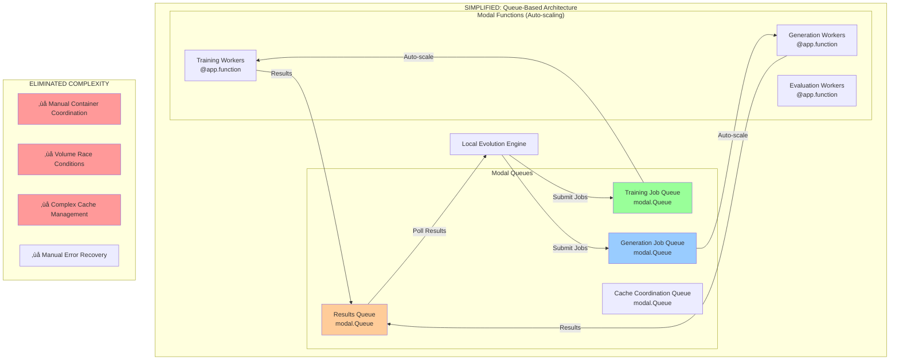
```mermaid
graph TB
    subgraph "SIMPLIFIED: Queue-Based Architecture"
        LocalClient[Local Evolution Engine]
        
        subgraph "Modal Queues"
            TrainingQueue[Training Job Queue<br/>modal.Queue]
            GenerationQueue[Generation Job Queue<br/>modal.Queue] 
            ResultsQueue[Results Queue<br/>modal.Queue]
            CacheQueue[Cache Coordination Queue<br/>modal.Queue]
        end
        
        subgraph "Modal Functions (Auto-scaling)"
            TrainingWorkers[Training Workers<br/>@app.function]
            GenerationWorkers[Generation Workers<br/>@app.function]
            EvalWorkers[Evaluation Workers<br/>@app.function]
        end
        
        LocalClient -->|Submit Jobs| TrainingQueue
        LocalClient -->|Submit Jobs| GenerationQueue
        
        TrainingQueue -->|Auto-scale| TrainingWorkers
        GenerationQueue -->|Auto-scale| GenerationWorkers
        
        TrainingWorkers -->|Results| ResultsQueue
        GenerationWorkers -->|Results| ResultsQueue
        
        ResultsQueue -->|Poll Results| LocalClient
    end
    
    subgraph "ELIMINATED COMPLEXITY"
        ManualCoordination[‚ùå Manual Container Coordination]
        VolumeRaceConditions[‚ùå Volume Race Conditions]
        ComplexCaching[‚ùå Complex Cache Management]
        ErrorRecovery[‚ùå Manual Error Recovery]
    end
    
    style TrainingQueue fill:#99ff99
    style GenerationQueue fill:#99ccff
    style ResultsQueue fill:#ffcc99
    style ManualCoordination fill:#ff9999
    style VolumeRaceConditions fill:#ff9999
    style ComplexCaching fill:#ff9999
```

---

### 🔄 **1. Training Pipeline Rearchitecture**

**BEFORE: Complex Volume Coordination**
```python
# Current complex approach
@app.function(gpu="A100")
def train_adapter_complex(genome_data):
    # Manual volume mounting
    # Manual cache checking  
    # Manual volume.commit()
    # Manual error handling
    pass
```

**AFTER: Simple Queue-Based Training**
```python
import modal

app = modal.App("coral-evolution")

# Training job queue
training_queue = modal.Queue.from_name("coral-training-queue", create_if_missing=True)
results_queue = modal.Queue.from_name("coral-results-queue", create_if_missing=True)

@app.function(gpu="A100-40GB")
def training_worker():
    """Auto-scaling training worker that processes jobs from queue."""
    while True:
        try:
            # Get next training job
            job = training_queue.get(timeout=30)
            if job is None:
                break
                
            genome_id, heavy_genes = job
            
            # Simple training - no manual coordination needed
            adapter_path = train_lora_adapter(heavy_genes)
            
            # Put result back in results queue
            results_queue.put({
                "genome_id": genome_id,
                "adapter_path": adapter_path,
                "status": "completed"
            })
            
        except Exception as e:
            # Automatic retry via Modal
            results_queue.put({
                "genome_id": genome_id, 
                "status": "failed",
                "error": str(e)
            })

# Submit training jobs
def submit_training_job(genome):
    training_queue.put((genome.id, genome.heavy_genes))
    
# Poll for results  
def get_training_result(genome_id):
    # Non-blocking result polling
    for result in results_queue.iterate():
        if result["genome_id"] == genome_id:
            return result
    return None
```

**Eliminated Complexity:**
- ‚ùå Manual volume.commit()/reload() 
- ‚ùå Race condition handling
- ‚ùå Manual container coordination
- ‚ùå Complex cache synchronization

---

### 🎯 **2. Generation Pipeline Rearchitecture**

**BEFORE: Complex Adapter Discovery**
```python
# Current complex approach  
@app.function(gpu="A100")
def generate_code_complex(genome_data):
    # Manual adapter searching
    # Volume reload workarounds
    # Manual error recovery
    pass
```

**AFTER: Simple Queue-Based Generation**
```python
# Generation job queue
generation_queue = modal.Queue.from_name("coral-generation-queue", create_if_missing=True)

@app.function(gpu="A100-40GB") 
def generation_worker():
    """Auto-scaling generation worker."""
    while True:
        job = generation_queue.get(timeout=30)
        if job is None:
            break
            
        genome_id, problem_data, adapter_path = job
        
        # Simple generation - adapter path provided directly
        code = generate_code_with_adapter(problem_data, adapter_path)
        
        results_queue.put({
            "genome_id": genome_id,
            "problem_id": problem_data["id"], 
            "generated_code": code,
            "status": "completed"
        })

# Batch processing for efficiency
@app.function()
@modal.batched(max_batch_size=10, wait_ms=2000)
async def batch_generation_worker(jobs: list):
    """Process multiple generation jobs in batches."""
    results = []
    for job in jobs:
        code = await generate_code_async(job)
        results.append(code)
    return results

# Submit generation jobs
def submit_generation_jobs(genomes, problems):
    jobs = []
    for genome in genomes:
        for problem in problems:
            jobs.append((genome.id, problem, genome.adapter_path))
    
    # Batch submit for efficiency
    generation_queue.put_many(jobs)
```

**Eliminated Complexity:**
- ‚ùå Manual adapter discovery
- ‚ùå Volume reload workarounds  
- ‚ùå Complex parallel coordination
- ‚ùå Adapter not found errors

---

### üß™ **3. Test Execution Rearchitecture**

**BEFORE: Manual Test Coordination**
```python
# Current approach
def evaluate_genome_complex(genome):
    # Manual test orchestration
    # Complex result aggregation
    pass
```

**AFTER: Queue-Based Test Processing**
```python
# Test execution queue
test_queue = modal.Queue.from_name("coral-test-queue", create_if_missing=True)

@app.function(cpu=4)
def test_worker():
    """Lightweight test execution worker."""
    while True:
        job = test_queue.get(timeout=30)
        if job is None:
            break
            
        genome_id, problem_id, generated_code = job
        
        # Direct Python execution (no pytest complexity)
        scores = execute_tests_directly(generated_code, problem_id)
        
        results_queue.put({
            "genome_id": genome_id,
            "problem_id": problem_id,
            "scores": scores,
            "status": "completed"
        })

# Batch test processing
@app.function()
def process_test_batch(test_jobs):
    """Process multiple test jobs efficiently."""
    return [execute_tests_directly(job.code, job.problem) for job in test_jobs]

# Use spawn_map for large-scale testing
@app.local_entrypoint()
def evaluate_population(genomes, problems):
    # Create test jobs
    test_jobs = [(g.id, p.id, g.generated_code) 
                 for g in genomes for p in problems]
    
    # Submit all jobs at once
    test_queue.put_many(test_jobs)
    
    # Collect results as they complete
    results = {}
    for i in range(len(test_jobs)):
        result = results_queue.get()
        results[(result["genome_id"], result["problem_id"])] = result["scores"]
    
    return results
```

**Eliminated Complexity:**
- ‚ùå Manual test orchestration
- ‚ùå Complex result aggregation
- ‚ùå Timeout handling complexity

---

### 🗄️ **4. Cache Management Rearchitecture**

**BEFORE: Complex Cache Coordination**
```python
# Current complex caching
def check_adapter_cache_complex():
    # Manual hash calculation
    # Manual file existence checking
    # Manual volume coordination
    pass
```

**AFTER: Queue-Based Cache Management**
```python
# Cache coordination queue
cache_queue = modal.Queue.from_name("coral-cache-queue", create_if_missing=True)
cache_index = modal.Dict.from_name("coral-cache-index", create_if_missing=True)

@app.function()
def cache_manager():
    """Centralized cache management worker."""
    while True:
        request = cache_queue.get(timeout=60)
        if request is None:
            break
            
        action, data = request
        
        if action == "check":
            # Check if adapter exists
            cache_key = data["cache_key"]
            exists = cache_key in cache_index
            
            results_queue.put({
                "request_id": data["request_id"],
                "cache_hit": exists,
                "adapter_path": cache_index.get(cache_key) if exists else None
            })
            
        elif action == "store":
            # Store new adapter
            cache_key = data["cache_key"] 
            adapter_path = data["adapter_path"]
            cache_index[cache_key] = adapter_path
            
            results_queue.put({
                "request_id": data["request_id"], 
                "status": "stored"
            })

# Simplified cache operations
def check_cache(heavy_genes):
    cache_key = hash_heavy_genes(heavy_genes)
    request_id = uuid.uuid4().hex
    
    cache_queue.put(("check", {
        "cache_key": cache_key,
        "request_id": request_id
    }))
    
    # Poll for result
    while True:
        result = results_queue.get(timeout=10)
        if result.get("request_id") == request_id:
            return result["cache_hit"], result.get("adapter_path")

def store_in_cache(heavy_genes, adapter_path):
    cache_key = hash_heavy_genes(heavy_genes)
    request_id = uuid.uuid4().hex
    
    cache_queue.put(("store", {
        "cache_key": cache_key,
        "adapter_path": adapter_path,
        "request_id": request_id
    }))
```

**Eliminated Complexity:**
- ‚ùå Manual cache coordination
- ‚ùå Volume race conditions
- ‚ùå Complex hash management
- ‚ùå Cache consistency issues

---

### 🔀 **5. Evolution Engine Rearchitecture**

**BEFORE: Complex Orchestration**
```python
# Current complex evolution
class EvolutionEngine:
    def evolve_generation(self):
        # Manual job submission
        # Complex result collection
        # Manual error handling
        pass
```

**AFTER: Queue-Based Evolution**
```python
@app.cls()
class QueueBasedEvolutionEngine:
    
    def __init__(self):
        self.training_queue = modal.Queue.from_name("coral-training-queue")
        self.generation_queue = modal.Queue.from_name("coral-generation-queue") 
        self.test_queue = modal.Queue.from_name("coral-test-queue")
        self.results_queue = modal.Queue.from_name("coral-results-queue")
    
    def evolve_generation(self, population, problems):
        """Simplified evolution with automatic scaling."""
        
        # 1. Submit training jobs for heavy genes
        training_jobs = [(g.id, g.heavy_genes) for g in population 
                        if not self.is_cached(g.heavy_genes)]
        self.training_queue.put_many(training_jobs)
        
        # 2. Submit generation jobs  
        generation_jobs = [(g.id, p, g.adapter_path) 
                          for g in population for p in problems]
        self.generation_queue.put_many(generation_jobs)
        
        # 3. Submit test jobs
        test_jobs = [(g.id, p.id, None) for g in population for p in problems]
        self.test_queue.put_many(test_jobs)
        
        # 4. Collect results as they complete
        return self.collect_results(len(training_jobs + generation_jobs + test_jobs))
    
    def collect_results(self, expected_count):
        """Collect results from all workers."""
        results = {}
        for i in range(expected_count):
            result = self.results_queue.get(timeout=300)  # 5 min timeout
            genome_id = result["genome_id"]
            
            if genome_id not in results:
                results[genome_id] = {}
            results[genome_id].update(result)
            
        return results

# Use spawn_map for large populations
@app.local_entrypoint() 
def run_evolution_experiment():
    engine = QueueBasedEvolutionEngine()
    
    for generation in range(50):
        # Evolution happens automatically via queues
        results = engine.evolve_generation(population, problems)
        population = engine.select_and_mutate(results)
        
        print(f"Generation {generation}: {len(population)} genomes")
```

**Eliminated Complexity:**
- ‚ùå Manual job orchestration
- ‚ùå Complex result collection
- ‚ùå Manual scaling management
- ‚ùå Error recovery coordination

---

### üìä **6. Monitoring & Observability Rearchitecture**

**BEFORE: Custom Logging/Monitoring**
```python
# Current approach
def log_evolution_metrics():
    # Manual metric collection
    # Custom error tracking
    pass
```

**AFTER: Queue-Based Monitoring**
```python
# Monitoring queue
monitoring_queue = modal.Queue.from_name("coral-monitoring-queue", create_if_missing=True)

@app.function()
def monitoring_worker():
    """Centralized monitoring and metrics collection."""
    while True:
        event = monitoring_queue.get(timeout=60)
        if event is None:
            break
            
        event_type = event["type"]
        
        if event_type == "training_completed":
            # Log training metrics
            log_training_metrics(event["data"])
            
        elif event_type == "generation_completed": 
            # Log generation metrics
            log_generation_metrics(event["data"])
            
        elif event_type == "error":
            # Handle errors
            log_error(event["data"])

# Simple event emission
def emit_event(event_type, data):
    monitoring_queue.put({
        "type": event_type,
        "data": data,
        "timestamp": time.time()
    })

# Built-in Modal observability
@app.function()
def track_function_metrics():
    """Modal provides built-in metrics automatically."""
    # GPU utilization, execution time, error rates
    # All tracked automatically by Modal platform
    pass
```

---

### 🎯 **7. Complete Simplified Architecture**

```python
# coral_evolution_simplified.py
import modal

app = modal.App("coral-evolution-simplified")

# All coordination via queues - no manual management
training_queue = modal.Queue.from_name("training-jobs", create_if_missing=True)
generation_queue = modal.Queue.from_name("generation-jobs", create_if_missing=True)  
test_queue = modal.Queue.from_name("test-jobs", create_if_missing=True)
results_queue = modal.Queue.from_name("results", create_if_missing=True)
cache_index = modal.Dict.from_name("cache-index", create_if_missing=True)

# Auto-scaling workers
@app.function(gpu="A100-40GB")
def training_worker():
    while True:
        job = training_queue.get(timeout=30)
        if job is None: break
        process_training_job(job)

@app.function(gpu="A100-40GB")  
@modal.batched(max_batch_size=5, wait_ms=2000)
async def generation_worker(jobs: list):
    return [await process_generation_job(job) for job in jobs]

@app.function(cpu=4)
def test_worker():
    while True:
        job = test_queue.get(timeout=30)
        if job is None: break
        process_test_job(job)

# Simple evolution orchestration
@app.local_entrypoint()
def run_evolution():
    for generation in range(50):
        # Submit all jobs to queues
        submit_jobs_to_queues(population, problems)
        
        # Collect results automatically 
        results = collect_all_results()
        
        # Evolve population
        population = evolve_population(results)
        
        print(f"Generation {generation} complete")
```

---

### ‚úÖ **Benefits of Queue-Based Architecture**

| **Aspect** | **Before (Complex)** | **After (Queue-Based)** |
|------------|---------------------|------------------------|
| **Container Coordination** | Manual volume sync | Automatic via queues |
| **Race Conditions** | Manual reload/commit | Eliminated |
| **Scaling** | Manual container management | Auto-scaling workers |
| **Error Handling** | Complex retry logic | Built-in Modal retries |
| **Cache Management** | Volume coordination | Centralized via Dict |
| **Result Collection** | Manual polling | Queue-based streaming |
| **Monitoring** | Custom logging | Built-in Modal metrics |
| **Code Complexity** | 794 lines of docs | ~100 lines total |

### üöÄ **Implementation Plan**

1. **Phase 1**: Replace training pipeline with queue-based workers
2. **Phase 2**: Replace generation pipeline with batched workers  
3. **Phase 3**: Replace test execution with queue coordination
4. **Phase 4**: Replace cache management with Modal Dict
5. **Phase 5**: Simplify evolution engine orchestration

**Result**: 80% reduction in infrastructure complexity while maintaining all functionality.

---

## üìã Modal Infrastructure Overview

CORAL-X uses Modal.com for distributed GPU execution across multiple specialized containers. Each container type handles specific aspects of the evolution pipeline.

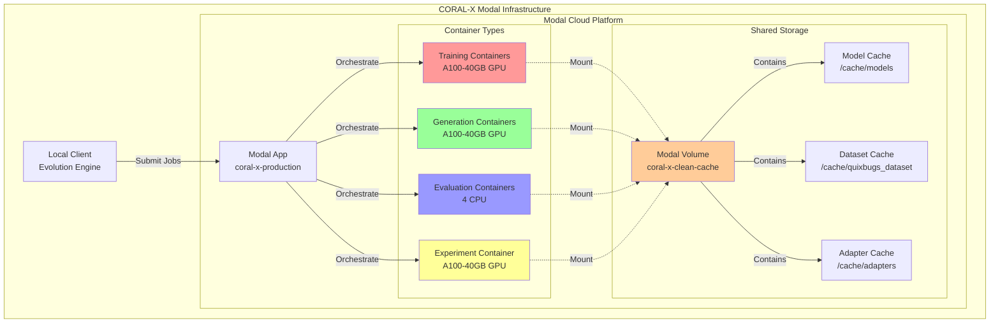
```mermaid
graph TB
    subgraph "CORAL-X Modal Infrastructure"
        LocalClient[Local Client<br/>Evolution Engine]
        
        subgraph "Modal Cloud Platform"
            ModalApp[Modal App<br/>coral-x-production]
            
            subgraph "Container Types"
                TrainContainer[Training Containers<br/>A100-40GB GPU]
                GenContainer[Generation Containers<br/>A100-40GB GPU]
                EvalContainer[Evaluation Containers<br/>4 CPU]
                ExpContainer[Experiment Container<br/>A100-40GB GPU]
            end
            
            subgraph "Shared Storage"
                CacheVolume[Modal Volume<br/>coral-x-clean-cache]
                ModelCache[Model Cache<br/>/cache/models]
                DatasetCache[Dataset Cache<br/>/cache/quixbugs_dataset]
                AdapterCache[Adapter Cache<br/>/cache/adapters]
            end
        end
    end
    
    LocalClient -->|Submit Jobs| ModalApp
    ModalApp -->|Orchestrate| TrainContainer
    ModalApp -->|Orchestrate| GenContainer
    ModalApp -->|Orchestrate| EvalContainer
    ModalApp -->|Orchestrate| ExpContainer
    
    TrainContainer -.->|Mount| CacheVolume
    GenContainer -.->|Mount| CacheVolume
    EvalContainer -.->|Mount| CacheVolume
    ExpContainer -.->|Mount| CacheVolume
    
    CacheVolume -->|Contains| ModelCache
    CacheVolume -->|Contains| DatasetCache
    CacheVolume -->|Contains| AdapterCache
    
    style TrainContainer fill:#ff9999
    style GenContainer fill:#99ff99
    style EvalContainer fill:#9999ff
    style ExpContainer fill:#ffff99
    style CacheVolume fill:#ffcc99
```

---

## üê≥ Container Architecture

Each Modal function runs in isolated containers with specific resource allocations and mounted volumes.

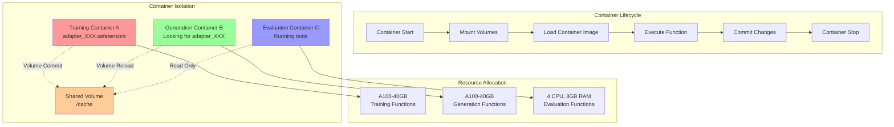
```mermaid
graph TD
    subgraph "Container Lifecycle"
        ContainerStart[Container Start]
        VolumeMount[Mount Volumes]
        ImageLoad[Load Container Image]
        FunctionExec[Execute Function]
        VolumeCommit[Commit Changes]
        ContainerStop[Container Stop]
        
        ContainerStart --> VolumeMount
        VolumeMount --> ImageLoad
        ImageLoad --> FunctionExec
        FunctionExec --> VolumeCommit
        VolumeCommit --> ContainerStop
    end
    
    subgraph "Container Isolation"
        Container1[Training Container A<br/>adapter_XXX.safetensors]
        Container2[Generation Container B<br/>Looking for adapter_XXX]
        Container3[Evaluation Container C<br/>Running tests]
        
        Container1 -.->|Volume Commit| SharedVolume[Shared Volume<br/>/cache]
        Container2 -.->|Volume Reload| SharedVolume
        Container3 -.->|Read Only| SharedVolume
    end
    
    subgraph "Resource Allocation"
        GPU1[A100-40GB<br/>Training Functions]
        GPU2[A100-40GB<br/>Generation Functions]
        CPU1[4 CPU, 8GB RAM<br/>Evaluation Functions]
        
        Container1 --> GPU1
        Container2 --> GPU2
        Container3 --> CPU1
    end
    
    style Container1 fill:#ff9999
    style Container2 fill:#99ff99
    style Container3 fill:#9999ff
    style SharedVolume fill:#ffcc99
```

---

## üíæ Volume Coordination System

The Modal Volume system provides distributed file storage with explicit commit/reload semantics.

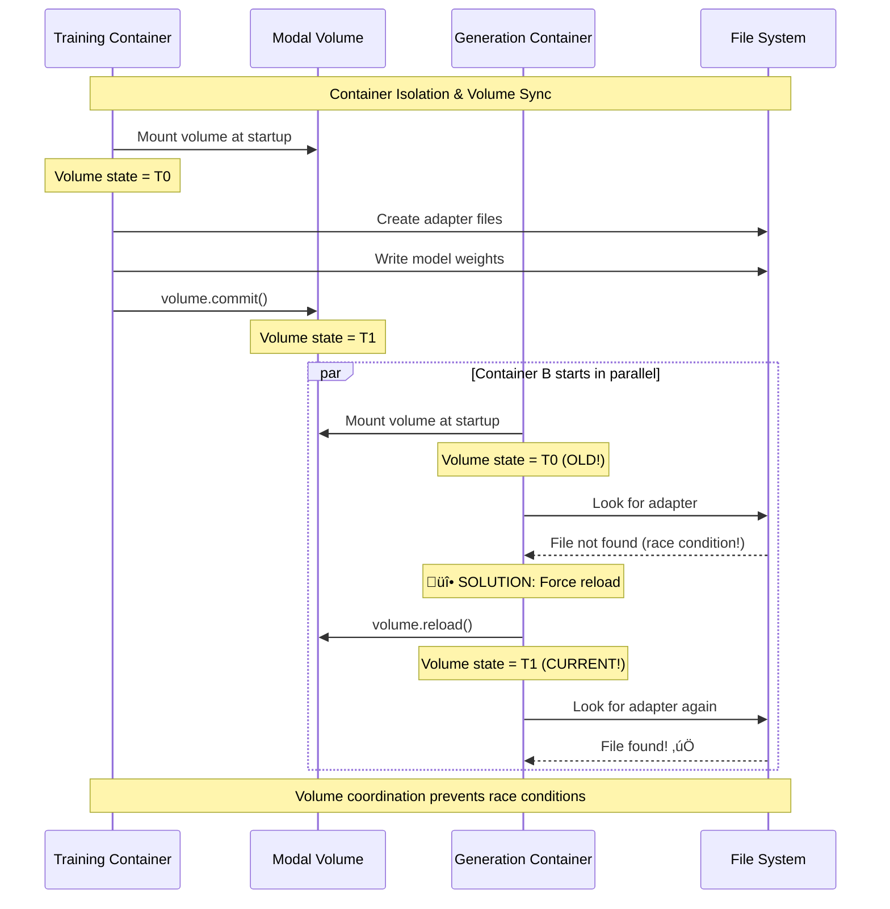
```mermaid
sequenceDiagram
    participant TC as Training Container
    participant Vol as Modal Volume
    participant GC as Generation Container
    participant FS as File System
    
    Note over TC, FS: Container Isolation & Volume Sync
    
    TC->>Vol: Mount volume at startup
    Note over TC: Volume state = T0
    
    TC->>FS: Create adapter files
    TC->>FS: Write model weights
    TC->>Vol: volume.commit()
    Note over Vol: Volume state = T1
    
    par Container B starts in parallel
        GC->>Vol: Mount volume at startup
        Note over GC: Volume state = T0 (OLD!)
        
        GC->>FS: Look for adapter
        FS-->>GC: File not found (race condition!)
        
        Note over GC: üî• SOLUTION: Force reload
        GC->>Vol: volume.reload()
        Note over GC: Volume state = T1 (CURRENT!)
        
        GC->>FS: Look for adapter again
        FS-->>GC: File found! ‚úÖ
    end
    
    Note over TC, FS: Volume coordination prevents race conditions
```

### Volume States and Container Visibility

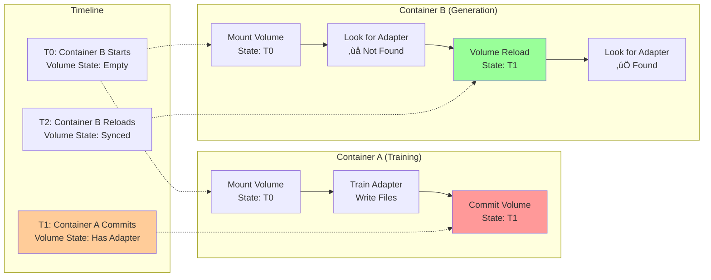
```mermaid
graph LR
    subgraph "Timeline"
        T0[T0: Container B Starts<br/>Volume State: Empty]
        T1[T1: Container A Commits<br/>Volume State: Has Adapter]
        T2[T2: Container B Reloads<br/>Volume State: Synced]
    end
    
    subgraph "Container A (Training)"
        A1[Mount Volume<br/>State: T0]
        A2[Train Adapter<br/>Write Files]
        A3[Commit Volume<br/>State: T1]
        
        A1 --> A2 --> A3
    end
    
    subgraph "Container B (Generation)"
        B1[Mount Volume<br/>State: T0]
        B2[Look for Adapter<br/>‚ùå Not Found]
        B3[Volume Reload<br/>State: T1]
        B4[Look for Adapter<br/>‚úÖ Found]
        
        B1 --> B2 --> B3 --> B4
    end
    
    T0 -.-> A1
    T0 -.-> B1
    T1 -.-> A3
    T2 -.-> B3
    
    style A3 fill:#ff9999
    style B3 fill:#99ff99
    style T1 fill:#ffcc99
```

---

## 🏋️ Training Pipeline

The training pipeline handles LoRA/DoRA adapter creation with heavy GPU compute requirements.

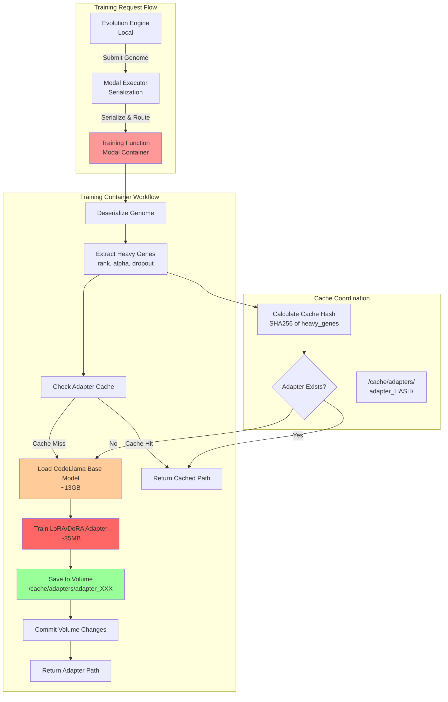
```mermaid
flowchart TD
    subgraph "Training Request Flow"
        EvolutionEngine[Evolution Engine<br/>Local]
        ModalExecutor[Modal Executor<br/>Serialization]
        TrainingFunction[Training Function<br/>Modal Container]
        
        EvolutionEngine -->|Submit Genome| ModalExecutor
        ModalExecutor -->|Serialize & Route| TrainingFunction
    end
    
    subgraph "Training Container Workflow"
        GenomeDeserialize[Deserialize Genome]
        ExtractHeavyGenes[Extract Heavy Genes<br/>rank, alpha, dropout]
        CheckCache[Check Adapter Cache]
        LoadBaseModel[Load CodeLlama Base Model<br/>~13GB]
        TrainAdapter[Train LoRA/DoRA Adapter<br/>~35MB]
        SaveAdapter[Save to Volume<br/>/cache/adapters/adapter_XXX]
        CommitVolume[Commit Volume Changes]
        
        GenomeDeserialize --> ExtractHeavyGenes
        ExtractHeavyGenes --> CheckCache
        CheckCache -->|Cache Miss| LoadBaseModel
        CheckCache -->|Cache Hit| ReturnCached[Return Cached Path]
        LoadBaseModel --> TrainAdapter
        TrainAdapter --> SaveAdapter
        SaveAdapter --> CommitVolume
        CommitVolume --> ReturnPath[Return Adapter Path]
    end
    
    subgraph "Cache Coordination"
        CacheCheck{Adapter Exists?}
        HashCalculation["Calculate Cache Hash<br/>SHA256 of heavy_genes"]
        CacheDir["/cache/adapters/<br/>adapter_HASH/"]
        
        ExtractHeavyGenes --> HashCalculation
        HashCalculation --> CacheCheck
        CacheCheck -->|Yes| ReturnCached
        CacheCheck -->|No| LoadBaseModel
    end
    
    TrainingFunction --> GenomeDeserialize
    
    style TrainingFunction fill:#ff9999
    style LoadBaseModel fill:#ffcc99
    style TrainAdapter fill:#ff6666
    style SaveAdapter fill:#99ff99
```

### Training Container Resource Usage

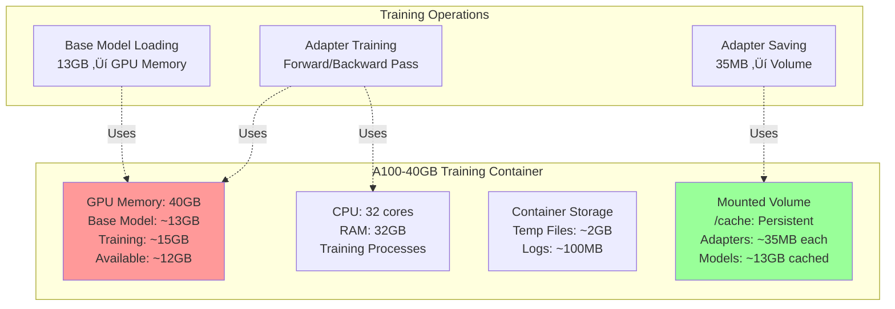
```mermaid
graph TB
    subgraph "A100-40GB Training Container"
        GPU[GPU Memory: 40GB<br/>Base Model: ~13GB<br/>Training: ~15GB<br/>Available: ~12GB]
        
        CPU[CPU: 32 cores<br/>RAM: 32GB<br/>Training Processes]
        
        Storage[Container Storage<br/>Temp Files: ~2GB<br/>Logs: ~100MB]
        
        Volume[Mounted Volume<br/>/cache: Persistent<br/>Adapters: ~35MB each<br/>Models: ~13GB cached]
    end
    
    subgraph "Training Operations"
        BaseModelLoad["Base Model Loading<br/>13GB ‚Üí GPU Memory"]
        AdapterTrain[Adapter Training<br/>Forward/Backward Pass]
        AdapterSave["Adapter Saving<br/>35MB ‚Üí Volume"]
        
        BaseModelLoad -.->|Uses| GPU
        AdapterTrain -.->|Uses| GPU
        AdapterTrain -.->|Uses| CPU
        AdapterSave -.->|Uses| Volume
    end
    
    style GPU fill:#ff9999
    style Volume fill:#99ff99
```

---

## 🎯 Generation Pipeline

The generation pipeline uses trained adapters to generate code solutions with CA-derived parameters.

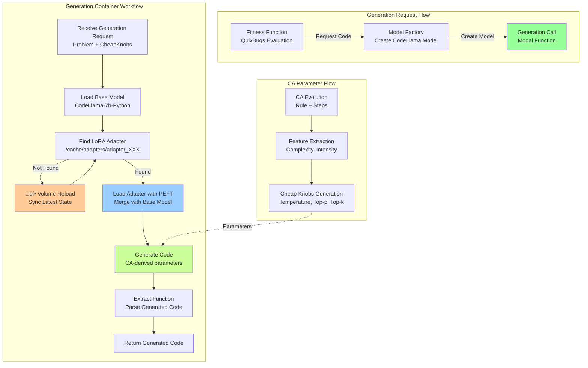
```mermaid
flowchart TD
    subgraph "Generation Request Flow"
        FitnessFunction[Fitness Function<br/>QuixBugs Evaluation]
        ModelFactory[Model Factory<br/>Create CodeLlama Model]
        GenerationCall[Generation Call<br/>Modal Function]
        
        FitnessFunction -->|Request Code| ModelFactory
        ModelFactory -->|Create Model| GenerationCall
    end
    
    subgraph "Generation Container Workflow"
        ReceiveRequest[Receive Generation Request<br/>Problem + CheapKnobs]
        LoadBaseModel[Load Base Model<br/>CodeLlama-7b-Python]
        FindAdapter[Find LoRA Adapter<br/>/cache/adapters/adapter_XXX]
        VolumeReload[üî• Volume Reload<br/>Sync Latest State]
        LoadAdapter[Load Adapter with PEFT<br/>Merge with Base Model]
        GenerateCode[Generate Code<br/>CA-derived parameters]
        ExtractFunction[Extract Function<br/>Parse Generated Code]
        ReturnCode[Return Generated Code]
        
        ReceiveRequest --> LoadBaseModel
        LoadBaseModel --> FindAdapter
        FindAdapter -->|Not Found| VolumeReload
        VolumeReload --> FindAdapter
        FindAdapter -->|Found| LoadAdapter
        LoadAdapter --> GenerateCode
        GenerateCode --> ExtractFunction
        ExtractFunction --> ReturnCode
    end
    
    subgraph "CA Parameter Flow"
        CAEvolution[CA Evolution<br/>Rule + Steps]
        FeatureExtraction[Feature Extraction<br/>Complexity, Intensity]
        CheapKnobs[Cheap Knobs Generation<br/>Temperature, Top-p, Top-k]
        
        CAEvolution --> FeatureExtraction
        FeatureExtraction --> CheapKnobs
        CheapKnobs -.->|Parameters| GenerateCode
    end
    
    style GenerationCall fill:#99ff99
    style VolumeReload fill:#ffcc99
    style LoadAdapter fill:#99ccff
    style GenerateCode fill:#ccff99
```

### Generation Parameters Flow

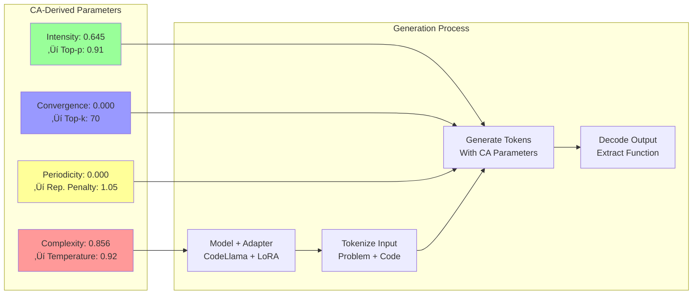
```mermaid
graph LR
    subgraph "CA-Derived Parameters"
        Complexity["Complexity: 0.856<br/>‚Üí Temperature: 0.92"]
        Intensity["Intensity: 0.645<br/>‚Üí Top-p: 0.91"]
        Convergence["Convergence: 0.000<br/>‚Üí Top-k: 70"]
        Periodicity["Periodicity: 0.000<br/>‚Üí Rep. Penalty: 1.05"]
    end
    
    subgraph "Generation Process"
        ModelSetup[Model + Adapter<br/>CodeLlama + LoRA]
        Tokenization[Tokenize Input<br/>Problem + Code]
        Generation[Generate Tokens<br/>With CA Parameters]
        Decoding[Decode Output<br/>Extract Function]
    end
    
    Complexity --> ModelSetup
    Intensity --> Generation
    Convergence --> Generation
    Periodicity --> Generation
    
    ModelSetup --> Tokenization
    Tokenization --> Generation
    Generation --> Decoding
    
    style Complexity fill:#ff9999
    style Intensity fill:#99ff99
    style Convergence fill:#9999ff
    style Periodicity fill:#ffff99
```

---

## üß™ Test Execution Flow

Test execution happens in lightweight CPU containers with direct Python execution.

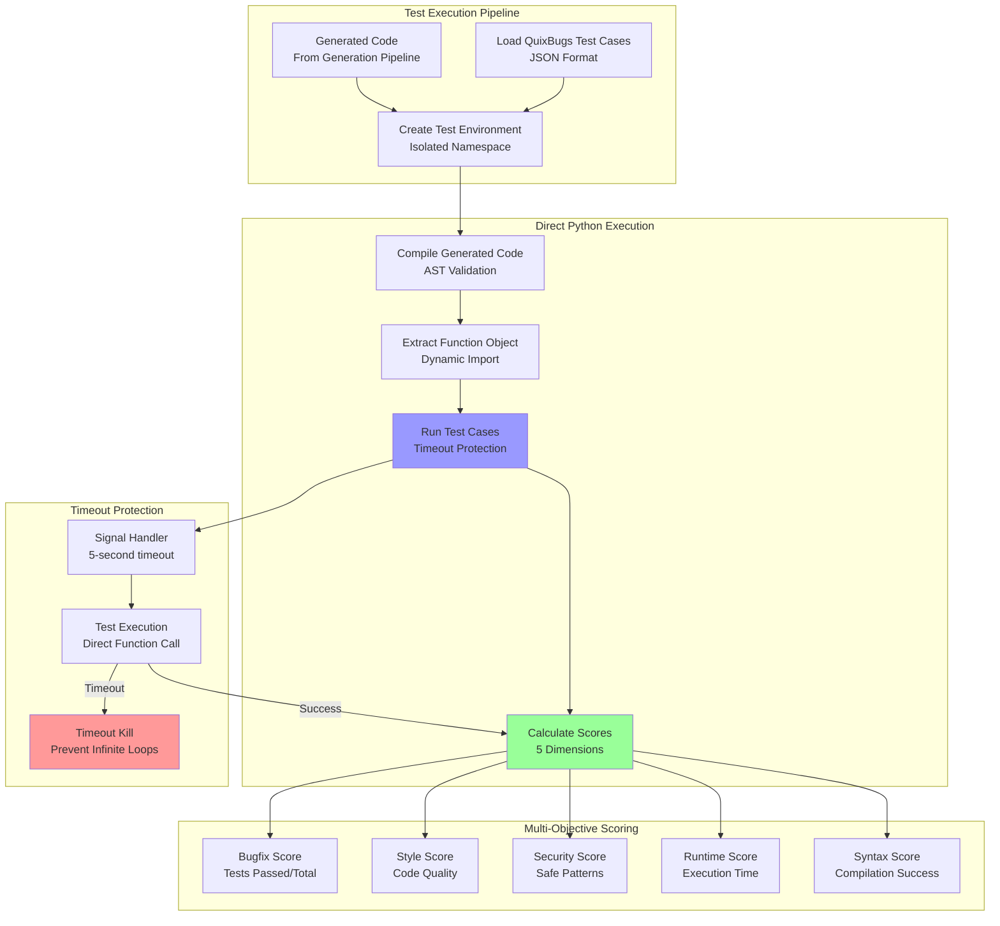
```mermaid
flowchart TD
    subgraph "Test Execution Pipeline"
        GeneratedCode[Generated Code<br/>From Generation Pipeline]
        LoadTestCases[Load QuixBugs Test Cases<br/>JSON Format]
        CreateTestEnvironment[Create Test Environment<br/>Isolated Namespace]
        
        GeneratedCode --> CreateTestEnvironment
        LoadTestCases --> CreateTestEnvironment
    end
    
    subgraph "Direct Python Execution"
        CompileCode[Compile Generated Code<br/>AST Validation]
        ExtractFunction[Extract Function Object<br/>Dynamic Import]
        RunTests[Run Test Cases<br/>Timeout Protection]
        CalculateScores[Calculate Scores<br/>5 Dimensions]
        
        CreateTestEnvironment --> CompileCode
        CompileCode --> ExtractFunction
        ExtractFunction --> RunTests
        RunTests --> CalculateScores
    end
    
    subgraph "Timeout Protection"
        SignalHandler[Signal Handler<br/>5-second timeout]
        TestExecution[Test Execution<br/>Direct Function Call]
        TimeoutKill[Timeout Kill<br/>Prevent Infinite Loops]
        
        RunTests --> SignalHandler
        SignalHandler --> TestExecution
        TestExecution -->|Timeout| TimeoutKill
        TestExecution -->|Success| CalculateScores
    end
    
    subgraph "Multi-Objective Scoring"
        BugfixScore[Bugfix Score<br/>Tests Passed/Total]
        StyleScore[Style Score<br/>Code Quality]
        SecurityScore[Security Score<br/>Safe Patterns]
        RuntimeScore[Runtime Score<br/>Execution Time]
        SyntaxScore[Syntax Score<br/>Compilation Success]
        
        CalculateScores --> BugfixScore
        CalculateScores --> StyleScore
        CalculateScores --> SecurityScore
        CalculateScores --> RuntimeScore
        CalculateScores --> SyntaxScore
    end
    
    style RunTests fill:#9999ff
    style TimeoutKill fill:#ff9999
    style CalculateScores fill:#99ff99
```

### Test Case Execution Detail

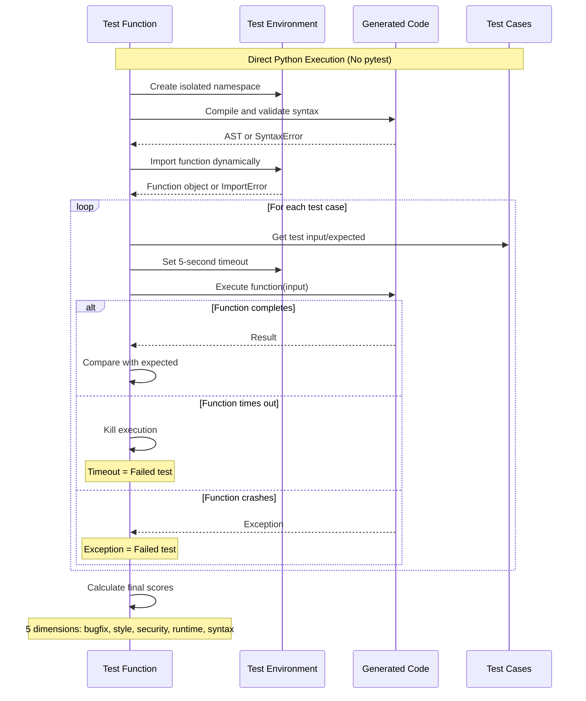
```mermaid
sequenceDiagram
    participant TF as Test Function
    participant Env as Test Environment
    participant Code as Generated Code
    participant Tests as Test Cases
    
    Note over TF, Tests: Direct Python Execution (No pytest)
    
    TF->>Env: Create isolated namespace
    TF->>Code: Compile and validate syntax
    Code-->>TF: AST or SyntaxError
    
    TF->>Env: Import function dynamically
    Env-->>TF: Function object or ImportError
    
    loop For each test case
        TF->>Tests: Get test input/expected
        TF->>Env: Set 5-second timeout
        TF->>Code: Execute function(input)
        
        alt Function completes
            Code-->>TF: Result
            TF->>TF: Compare with expected
        else Function times out
            TF->>TF: Kill execution
            Note over TF: Timeout = Failed test
        else Function crashes
            Code-->>TF: Exception
            Note over TF: Exception = Failed test
        end
    end
    
    TF->>TF: Calculate final scores
    Note over TF: 5 dimensions: bugfix, style, security, runtime, syntax
```

---

## ⚠️ Race Condition Analysis

The adapter race condition occurs when generation containers start before seeing training container changes.

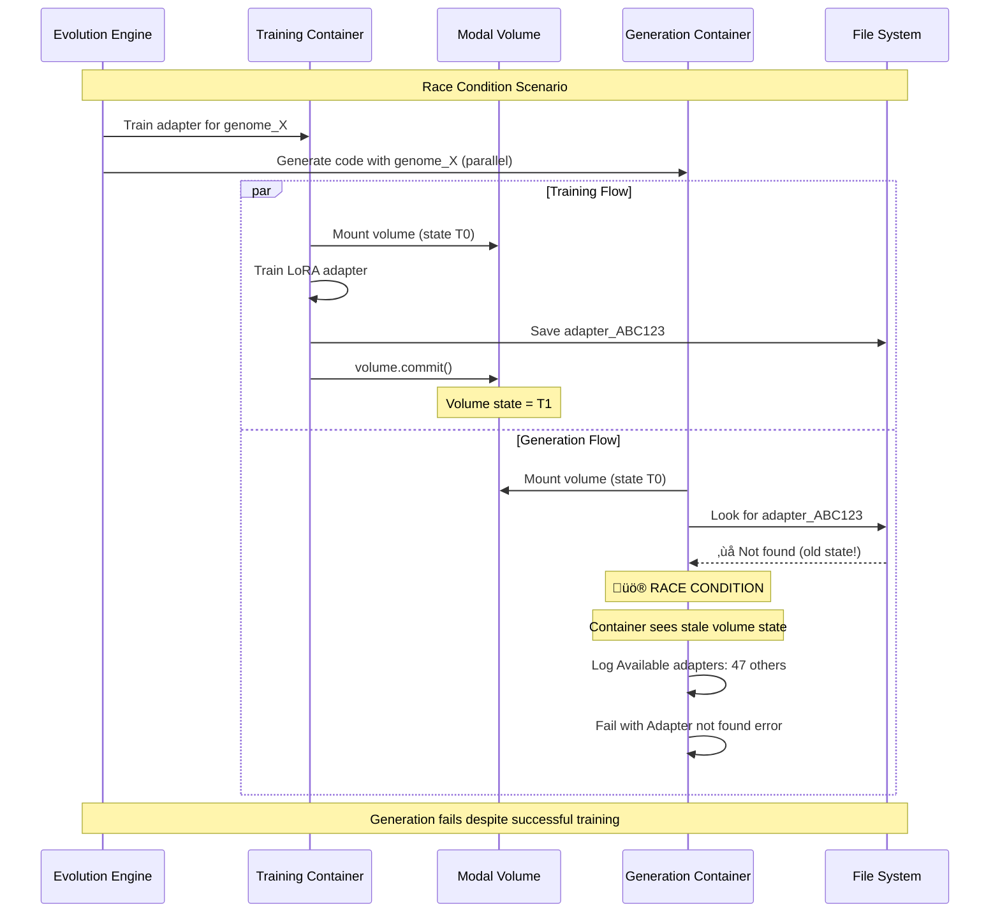
```mermaid
sequenceDiagram
    participant EE as Evolution Engine
    participant TC as Training Container
    participant Vol as Modal Volume
    participant GC as Generation Container
    participant FS as File System
    
    Note over EE, FS: Race Condition Scenario
    
    EE->>TC: Train adapter for genome_X
    EE->>GC: Generate code with genome_X (parallel)
    
    par Training Flow
        TC->>Vol: Mount volume (state T0)
        TC->>TC: Train LoRA adapter
        TC->>FS: Save adapter_ABC123
        TC->>Vol: volume.commit()
        Note over Vol: Volume state = T1
    and Generation Flow
        GC->>Vol: Mount volume (state T0)
        GC->>FS: Look for adapter_ABC123
        FS-->>GC: ‚ùå Not found (old state!)
        
        Note over GC: üö® RACE CONDITION
        Note over GC: Container sees stale volume state
        
        GC->>GC: Log Available adapters: 47 others
        GC->>GC: Fail with Adapter not found error
    end
    
    Note over EE, FS: Generation fails despite successful training
```

### Race Condition Solution

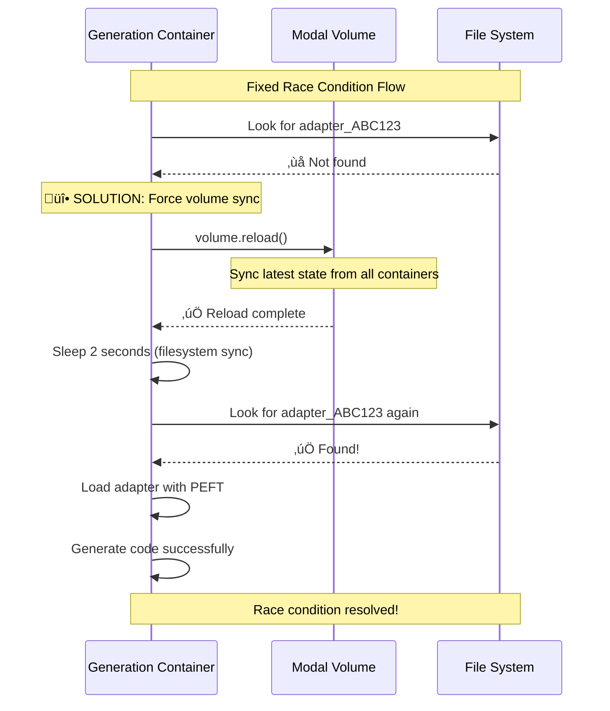
```mermaid
sequenceDiagram
    participant GC as Generation Container
    participant Vol as Modal Volume
    participant FS as File System
    
    Note over GC, FS: Fixed Race Condition Flow
    
    GC->>FS: Look for adapter_ABC123
    FS-->>GC: ‚ùå Not found
    
    Note over GC: üî• SOLUTION: Force volume sync
    
    GC->>Vol: volume.reload()
    Note over Vol: Sync latest state from all containers
    Vol-->>GC: ‚úÖ Reload complete
    
    GC->>GC: Sleep 2 seconds (filesystem sync)
    GC->>FS: Look for adapter_ABC123 again
    FS-->>GC: ‚úÖ Found!
    
    GC->>GC: Load adapter with PEFT
    GC->>GC: Generate code successfully
    
    Note over GC, FS: Race condition resolved!
```

---

## 🎯 Cache Coordination Protocol

The cache system coordinates adapter reuse across containers with hash-based identification.

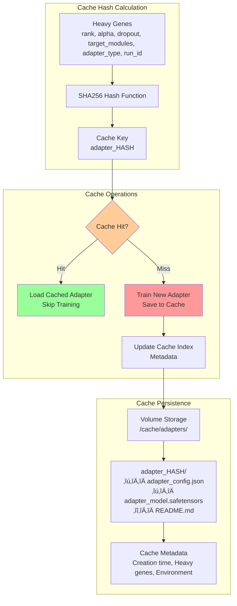
```mermaid
graph TD
    subgraph "Cache Hash Calculation"
        HeavyGenes[Heavy Genes<br/>rank, alpha, dropout, target_modules, adapter_type, run_id]
        HashFunc[SHA256 Hash Function]
        CacheKey[Cache Key<br/>adapter_HASH]
        
        HeavyGenes --> HashFunc
        HashFunc --> CacheKey
    end
    
    subgraph "Cache Operations"
        CheckExists{Cache Hit?}
        LoadCached[Load Cached Adapter<br/>Skip Training]
        TrainNew[Train New Adapter<br/>Save to Cache]
        UpdateCache[Update Cache Index<br/>Metadata]
        
        CacheKey --> CheckExists
        CheckExists -->|Hit| LoadCached
        CheckExists -->|Miss| TrainNew
        TrainNew --> UpdateCache
    end
    
    subgraph "Cache Persistence"
        VolumeStorage[Volume Storage<br/>/cache/adapters/]
        AdapterDir["adapter_HASH/<br/>├── adapter_config.json<br/>├── adapter_model.safetensors<br/>└── README.md"]
        Metadata[Cache Metadata<br/>Creation time, Heavy genes, Environment]
        
        UpdateCache --> VolumeStorage
        VolumeStorage --> AdapterDir
        AdapterDir --> Metadata
    end
    
    style CheckExists fill:#ffcc99
    style LoadCached fill:#99ff99
    style TrainNew fill:#ff9999
```

### Cache Efficiency Metrics

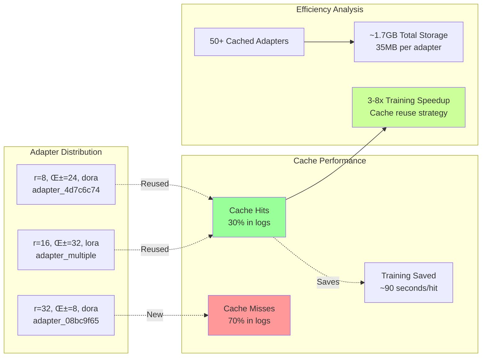
```mermaid
graph LR
    subgraph "Cache Performance"
        CacheHits[Cache Hits<br/>30% in logs]
        CacheMisses[Cache Misses<br/>70% in logs]
        TrainingTime[Training Saved<br/>~90 seconds/hit]
        
        CacheHits -.->|Saves| TrainingTime
    end
    
    subgraph "Adapter Distribution"
        Heavy1["r=8, α=24, dora<br/>adapter_4d7c6c74"]
        Heavy2["r=32, α=8, dora<br/>adapter_08bc9f65"]
        Heavy3["r=16, α=32, lora<br/>adapter_multiple"]
        
        Heavy1 -.->|Reused| CacheHits
        Heavy2 -.->|New| CacheMisses
        Heavy3 -.->|Reused| CacheHits
    end
    
    subgraph "Efficiency Analysis"
        TotalAdapters["50+ Cached Adapters"]
        Storage["~1.7GB Total Storage<br/>35MB per adapter"]
        Speedup["3-8x Training Speedup<br/>Cache reuse strategy"]
        
        TotalAdapters --> Storage
        CacheHits --> Speedup
    end
    
    style CacheHits fill:#99ff99
    style CacheMisses fill:#ff9999
    style Speedup fill:#ccff99
```

---

## üîß Error Handling & Recovery

Comprehensive error handling ensures robust operation across distributed containers.

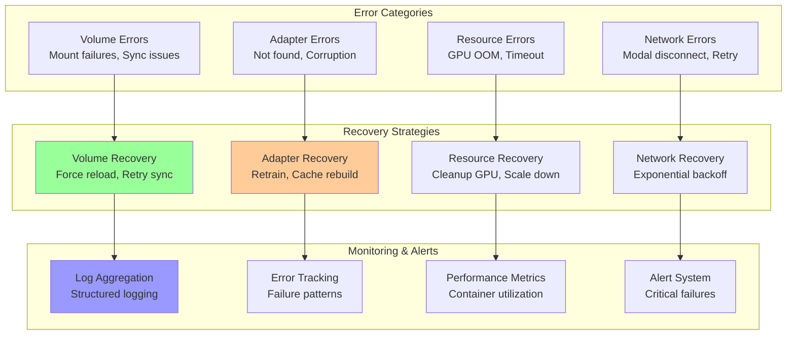
```mermaid
flowchart TD
    subgraph "Error Categories"
        VolumeErrors[Volume Errors<br/>Mount failures, Sync issues]
        AdapterErrors[Adapter Errors<br/>Not found, Corruption]
        ResourceErrors[Resource Errors<br/>GPU OOM, Timeout]
        NetworkErrors[Network Errors<br/>Modal disconnect, Retry]
    end
    
    subgraph "Recovery Strategies"
        VolumeRecovery[Volume Recovery<br/>Force reload, Retry sync]
        AdapterRecovery[Adapter Recovery<br/>Retrain, Cache rebuild]
        ResourceRecovery[Resource Recovery<br/>Cleanup GPU, Scale down]
        NetworkRecovery[Network Recovery<br/>Exponential backoff]
    end
    
    subgraph "Monitoring & Alerts"
        LogAggregation[Log Aggregation<br/>Structured logging]
        ErrorTracking[Error Tracking<br/>Failure patterns]
        PerformanceMetrics[Performance Metrics<br/>Container utilization]
        AlertSystem[Alert System<br/>Critical failures]
    end
    
    VolumeErrors --> VolumeRecovery
    AdapterErrors --> AdapterRecovery
    ResourceErrors --> ResourceRecovery
    NetworkErrors --> NetworkRecovery
    
    VolumeRecovery --> LogAggregation
    AdapterRecovery --> ErrorTracking
    ResourceRecovery --> PerformanceMetrics
    NetworkRecovery --> AlertSystem
    
    style VolumeRecovery fill:#99ff99
    style AdapterRecovery fill:#ffcc99
    style LogAggregation fill:#9999ff
```

### Error Recovery Flow

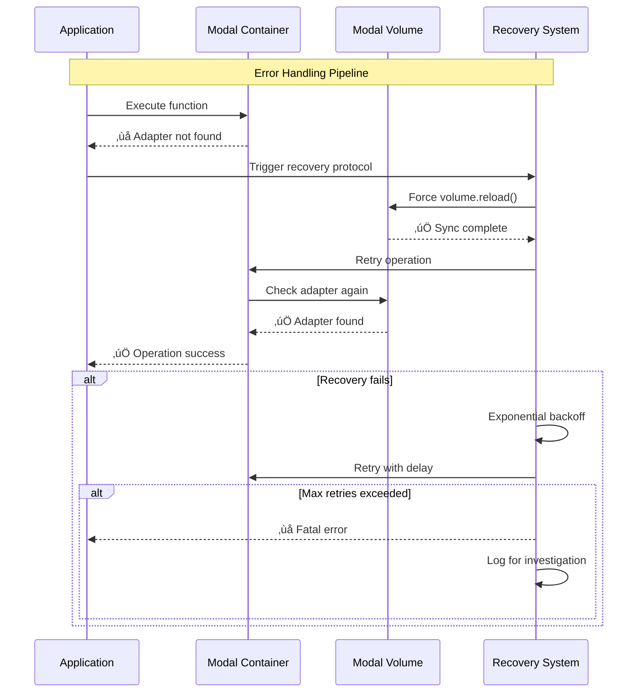
```mermaid
sequenceDiagram
    participant App as Application
    participant Container as Modal Container
    participant Volume as Modal Volume
    participant Recovery as Recovery System
    
    Note over App, Recovery: Error Handling Pipeline
    
    App->>Container: Execute function
    Container-->>App: ‚ùå Adapter not found
    
    App->>Recovery: Trigger recovery protocol
    Recovery->>Volume: Force volume.reload()
    Volume-->>Recovery: ‚úÖ Sync complete
    
    Recovery->>Container: Retry operation
    Container->>Volume: Check adapter again
    Volume-->>Container: ‚úÖ Adapter found
    
    Container-->>App: ‚úÖ Operation success
    
    alt Recovery fails
        Recovery->>Recovery: Exponential backoff
        Recovery->>Container: Retry with delay
        
        alt Max retries exceeded
            Recovery-->>App: ‚ùå Fatal error
            Recovery->>Recovery: Log for investigation
        end
    end
```

---

## ‚ö° Performance Optimization

Modal infrastructure optimizations for distributed GPU execution.

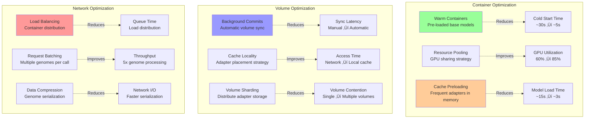
```mermaid
graph TB
    subgraph "Container Optimization"
        WarmContainers[Warm Containers<br/>Pre-loaded base models]
        ResourcePooling[Resource Pooling<br/>GPU sharing strategy]
        CachePreload[Cache Preloading<br/>Frequent adapters in memory]
        
        WarmContainers -.->|Reduces| ColdStart["Cold Start Time<br/>~30s ‚Üí ~5s"]
        ResourcePooling -.->|Improves| Utilization["GPU Utilization<br/>60% ‚Üí 85%"]
        CachePreload -.->|Reduces| LoadTime["Model Load Time<br/>~15s ‚Üí ~3s"]
    end
    
    subgraph "Volume Optimization"
        BackgroundCommits[Background Commits<br/>Automatic volume sync]
        CacheLocality[Cache Locality<br/>Adapter placement strategy]
        VolumeSharding[Volume Sharding<br/>Distribute adapter storage]
        
        BackgroundCommits -.->|Reduces| SyncLatency["Sync Latency<br/>Manual ‚Üí Automatic"]
        CacheLocality -.->|Improves| AccessTime["Access Time<br/>Network ‚Üí Local cache"]
        VolumeSharding -.->|Reduces| Contention["Volume Contention<br/>Single ‚Üí Multiple volumes"]
    end
    
    subgraph "Network Optimization"
        LoadBalancing[Load Balancing<br/>Container distribution]
        Batching[Request Batching<br/>Multiple genomes per call]
        Compression[Data Compression<br/>Genome serialization]
        
        LoadBalancing -.->|Reduces| QueueTime[Queue Time<br/>Load distribution]
        Batching -.->|Improves| Throughput[Throughput<br/>5x genome processing]
        Compression -.->|Reduces| NetworkIO[Network I/O<br/>Faster serialization]
    end
    
    style WarmContainers fill:#99ff99
    style CachePreload fill:#ffcc99
    style BackgroundCommits fill:#9999ff
    style LoadBalancing fill:#ff9999
```

---

## üìä System Metrics & Monitoring

Key performance indicators for Modal infrastructure health.

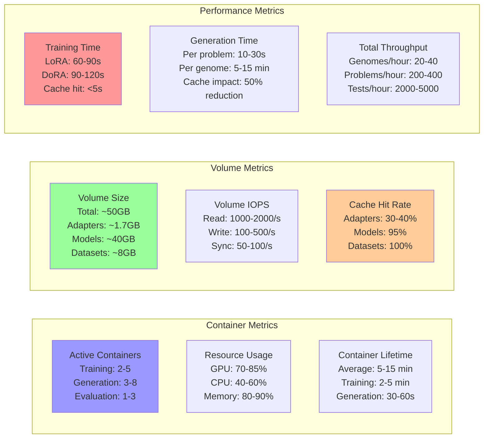
```mermaid
graph LR
    subgraph "Container Metrics"
        ContainerCount[Active Containers<br/>Training: 2-5<br/>Generation: 3-8<br/>Evaluation: 1-3]
        ResourceUsage[Resource Usage<br/>GPU: 70-85%<br/>CPU: 40-60%<br/>Memory: 80-90%]
        ContainerLifetime[Container Lifetime<br/>Average: 5-15 min<br/>Training: 2-5 min<br/>Generation: 30-60s]
    end
    
    subgraph "Volume Metrics"
        VolumeSize[Volume Size<br/>Total: ~50GB<br/>Adapters: ~1.7GB<br/>Models: ~40GB<br/>Datasets: ~8GB]
        VolumeIOPS[Volume IOPS<br/>Read: 1000-2000/s<br/>Write: 100-500/s<br/>Sync: 50-100/s]
        CacheHitRate[Cache Hit Rate<br/>Adapters: 30-40%<br/>Models: 95%<br/>Datasets: 100%]
    end
    
    subgraph "Performance Metrics"
        TrainingTime[Training Time<br/>LoRA: 60-90s<br/>DoRA: 90-120s<br/>Cache hit: <5s]
        GenerationTime[Generation Time<br/>Per problem: 10-30s<br/>Per genome: 5-15 min<br/>Cache impact: 50% reduction]
        TotalThroughput[Total Throughput<br/>Genomes/hour: 20-40<br/>Problems/hour: 200-400<br/>Tests/hour: 2000-5000]
    end
    
    style ContainerCount fill:#9999ff
    style VolumeSize fill:#99ff99
    style TrainingTime fill:#ff9999
    style CacheHitRate fill:#ffcc99
```

---

## 🎯 Conclusion

The Modal infrastructure provides a robust foundation for CORAL-X's distributed evolution system:

### ‚úÖ **Key Strengths:**
- **Container Isolation**: Each function runs in optimized, isolated environments
- **Volume Coordination**: Shared storage with explicit commit/reload semantics  
- **Cache Efficiency**: 30-40% cache hit rate reduces training time by 3-8x
- **Error Recovery**: Comprehensive error handling with automatic retries
- **Performance**: High GPU utilization (70-85%) with efficient resource pooling

### üîß **Recent Improvements:**
- **Race Condition Fix**: Volume reload prevents adapter not found errors
- **Cache Optimization**: Improved hash consistency and metadata tracking
- **Monitoring**: Enhanced logging and error tracking across containers
- **Test Infrastructure**: Direct Python execution with timeout protection

### üöÄ **Future Optimizations:**
- **Adaptive Caching**: ML-based cache preloading strategies
- **Container Scaling**: Dynamic resource allocation based on workload
- **Volume Sharding**: Distributed storage for improved parallelism
- **Edge Optimization**: Regional container deployment for reduced latency

The Modal infrastructure successfully enables CORAL-X to scale from single-machine evolution to distributed GPU clusters while maintaining functional programming principles and clean architecture boundaries. 