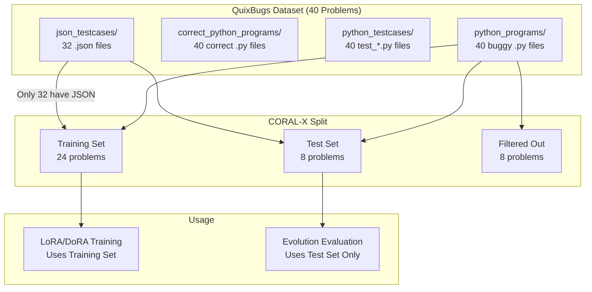
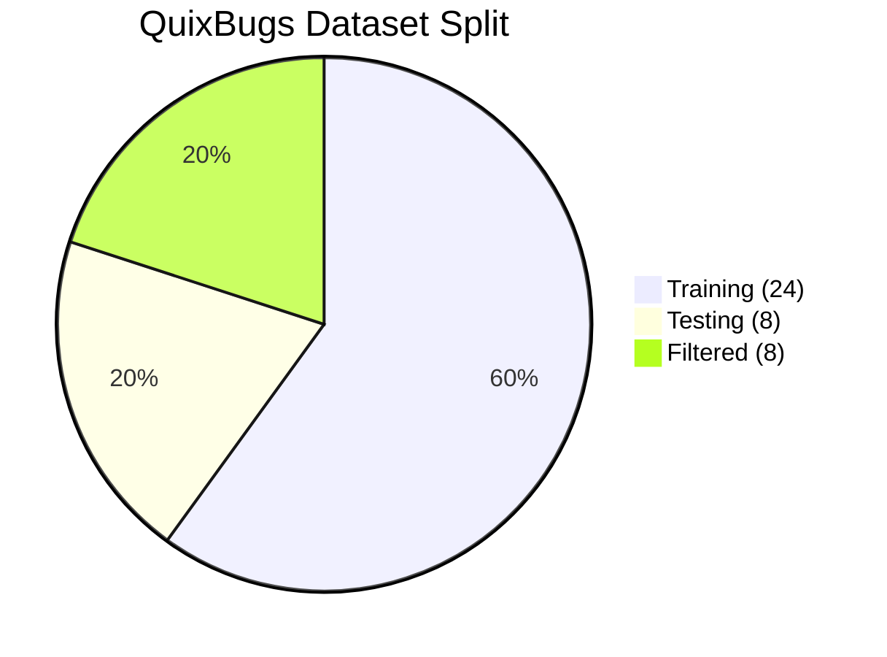
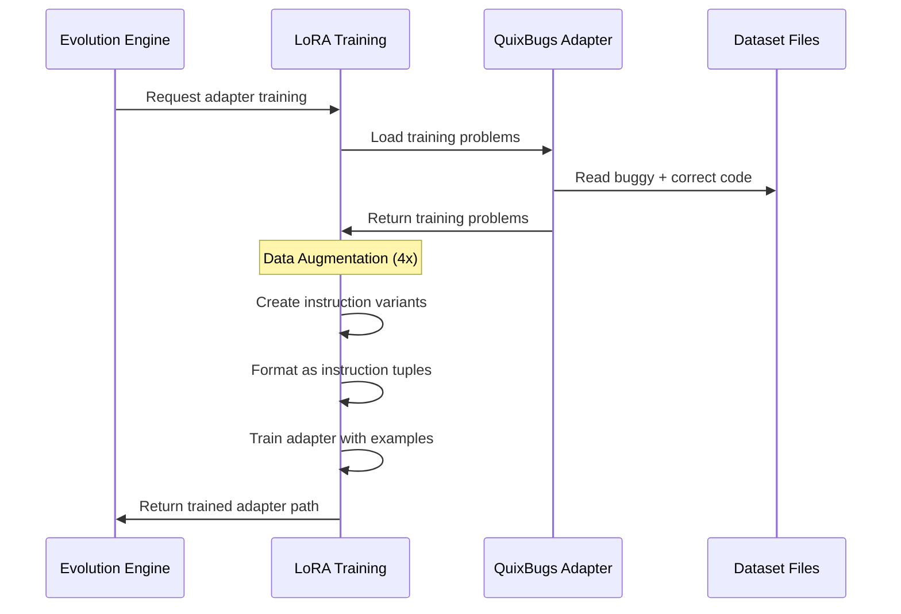
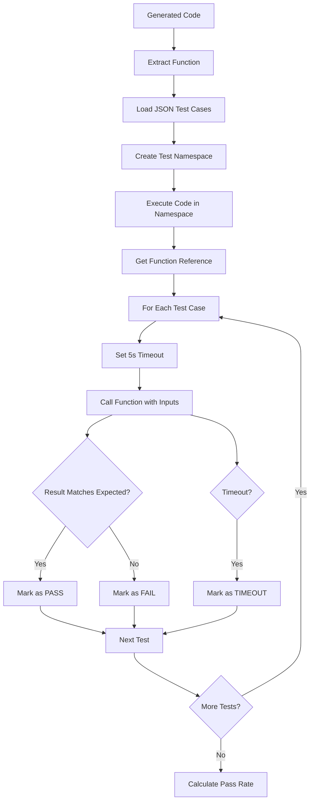
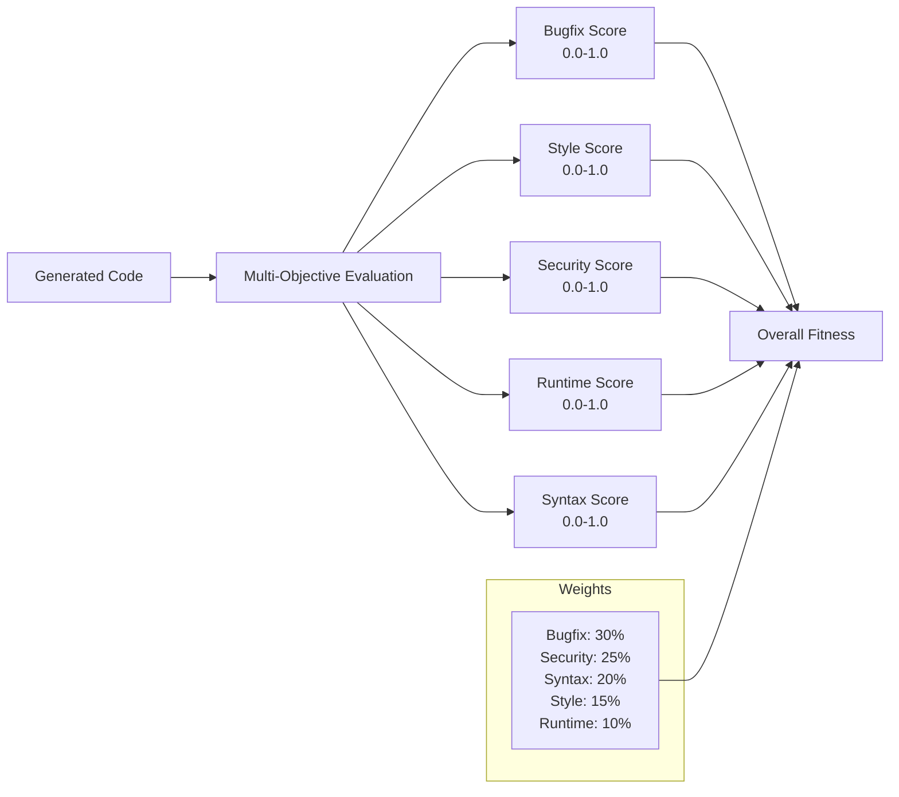
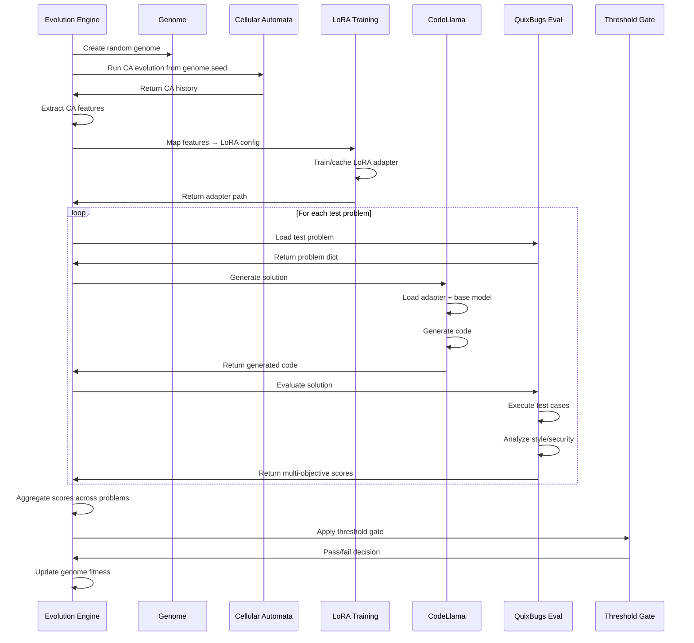
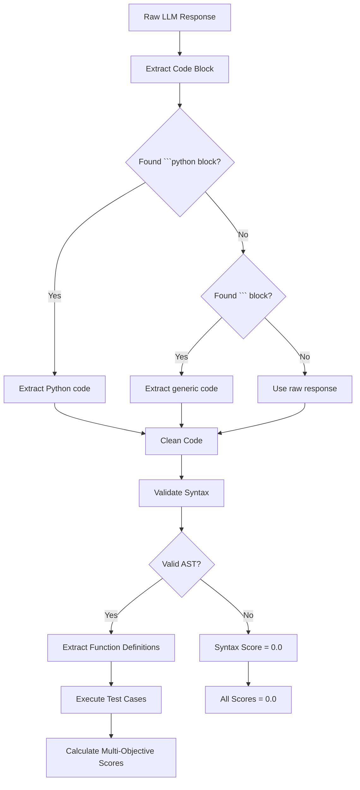

# QuixBugs Dataset Usage in CORAL-X Evolution System

## Table of Contents
- [Overview](#overview)
- [Dataset Structure & Split](#dataset-structure--split)
- [Training Data Creation](#training-data-creation)
- [Test Case Execution Flow](#test-case-execution-flow)
- [Multi-Objective Mapping](#multi-objective-mapping)
- [Complete Evolution Flow](#complete-evolution-flow)
- [JSON Test Data Format](#json-test-data-format)
- [Prompt Templates & LLM Interaction](#prompt-templates--llm-interaction)

## Overview

QuixBugs is a dataset of 40 classic algorithms with intentional bugs, used in CORAL-X for:
1. **Training LoRA/DoRA adapters** on bug-fixing patterns
2. **Evaluating evolved genomes** through multi-objective fitness
3. **Preventing data contamination** via strict train/test splits



## Dataset Structure & Split

### Authoritative Train/Test Split

The system maintains strict data separation to prevent contamination:

```python
# coral/domain/dataset_constants.py
QUIXBUGS_TRAINING_PROBLEMS = frozenset({
    'gcd', 'get_factors', 'is_valid_parenthesization', 'levenshtein',
    'longest_common_subsequence', 'max_sublist_sum', 'pascal', 'reverse_linked_list',
    'hanoi', 'mergesort', 'bitcount', 'bucketsort', 'find_first_in_sorted', 
    'find_in_sorted', 'flatten', 'knapsack', 'kth', 'lis', 'powerset',
    'quicksort', 'rpn_eval', 'shunting_yard', 'sqrt', 'subsequences'
})  # 24 problems

QUIXBUGS_CLEAN_TEST_PROBLEMS = frozenset({
    'kheapsort', 'lcs_length', 'next_palindrome', 'next_permutation',
    'possible_change', 'sieve', 'to_base', 'wrap'
})  # 8 problems
```

### Dataset Statistics
- **Total Problems**: 40 algorithms
- **Training Problems**: 24 (60%)
- **Clean Test Problems**: 8 (20%)
- **Filtered Out**: 8 (20% - missing JSON test data)
- **JSON Coverage**: 32/40 problems have structured test cases



## Training Data Creation

### LoRA/DoRA Training Process



### Training Data Augmentation

Each QuixBugs training problem generates **4 instruction variants**:

```python
# Example for 'pascal' problem
training_examples = [
    {
        "instruction": "Fix the bug in this Python function from pascal:",
        "input": "def pascal(n):\n    if n == 0:\n        return [1]\n    # BUG: missing recursion",
        "output": "def pascal(n):\n    if n == 0:\n        return [1]\n    # FIXED: proper recursion"
    },
    {
        "instruction": "Debug and correct the following Python code for pascal:",
        "input": "...",  # Same buggy code
        "output": "..."  # Same correct code
    },
    {
        "instruction": "The following function has a bug. Provide the corrected version:",
        "input": "...",
        "output": "..."
    },
    {
        "instruction": "Analyze and fix the error in this pascal implementation:",
        "input": "...",
        "output": "..."
    }
]
```

**Total Training Examples**: 24 problems × 4 variants = **96 training examples**

## Test Case Execution Flow

### Direct Python Execution (No pytest)

CORAL-X uses direct Python execution to avoid pytest complexity and timeout issues:



### Test Execution Example

```python
# Test case for bitcount(127) -> 7
def execute_test_with_timeout():
    signal.signal(signal.SIGALRM, timeout_handler)
    signal.alarm(5)  # 5-second timeout
    
    try:
        inputs = [127]
        expected = 7
        result = bitcount(*inputs)
        signal.alarm(0)  # Cancel timeout
        
        success = (result == expected)  # 7 == 7
        return "PASS" if success else f"FAIL (got {result})"
        
    except TimeoutError:
        signal.alarm(0)
        return "TIMEOUT - infinite loop detected"
```

## Multi-Objective Mapping

### Five-Objective Evaluation

Each generated solution is evaluated across **5 objectives**:



### Objective Calculation Details

1. **Bugfix Score** (30% weight):
   ```python
   # Based on test case pass rate
   if all_tests_passed:
       bugfix_score = 1.0  # Perfect bug fix
   elif some_tests_passed:
       bugfix_score = passed_tests / total_tests
   else:
       bugfix_score = 0.2 if syntax_valid else 0.0
   ```

2. **Style Score** (15% weight):
   ```python
   # Using flake8 static analysis
   if flake8_returncode == 0:
       style_score = 0.97  # Near perfect
   else:
       violations = count_flake8_violations()
       style_score = max(0.0, 0.8 - violations * 0.05)
   ```

3. **Security Score** (25% weight):
   ```python
   # Using bandit security scanner
   if no_security_issues:
       security_score = 1.0
   else:
       high_issues = count_high_severity()
       medium_issues = count_medium_severity()
       security_score = 1.0 - (high_issues * 0.3) - (medium_issues * 0.1)
   ```

4. **Runtime Score** (10% weight):
   ```python
   # Heuristic-based performance analysis
   base_score = 0.7
   if "[::-1]" in code: base_score += 0.1  # Efficient patterns
   if nested_loops > 2: base_score -= 0.1   # Inefficient patterns
   runtime_score = max(0.0, min(0.9, base_score))
   ```

5. **Syntax Score** (20% weight):
   ```python
   # AST parsing + basic validation
   try:
       ast.parse(code)
       syntax_score = 0.9  # Valid syntax
   except SyntaxError:
       syntax_score = 0.0  # Invalid syntax
   ```

## Complete Evolution Flow



## JSON Test Data Format

### Test Case Structure

QuixBugs JSON test files contain one test case per line in the format:
```json
[[inputs], expected_output]
```

### Examples by Problem Type

**Simple Function (bitcount)**:
```json
[[127], 7]
[[128], 1]
[[255], 8]
```

**Multiple Arguments (sqrt)**:
```json
[[2, 0.01], 1.4166666666666667]
[[10, 0.01], 3.1622776601683795]
```

**List Input/Output (bucketsort)**:
```json
[[[3, 11, 2, 9, 1, 5], 12], [1, 2, 3, 5, 9, 11]]
[[[1, 4, 2, 3], 5], [1, 2, 3, 4]]
```

**String Processing (next_palindrome)**:
```json
[["12321"], "12421"]
[["123"], "131"]
```

### Test Case Loading Process

```mermaid
flowchart TD
    A[Problem Name: 'bitcount'] --> B[Load JSON file: bitcount.json]
    B --> C[Parse each line as JSON]
    C --> D[Extract inputs and expected output]
    D --> E[Convert to test tuples]
    
    E --> F["Test 1: ([127], 7)"]
    E --> G["Test 2: ([128], 1)"]
    E --> H["Test 3: ([255], 8)"]
    
    F --> I[Function Call: bitcount(127)]
    G --> J[Function Call: bitcount(128)]
    H --> K[Function Call: bitcount(255)]
    
    I --> L[Compare result with 7]
    J --> M[Compare result with 1]
    K --> N[Compare result with 8]
```

## Prompt Templates & LLM Interaction

### Prompt Template Structure

**Standard QuixBugs Prompt**:
```python
def create_quixbugs_prompt(problem_name: str, buggy_code: str) -> str:
    return f"""Fix the buggy Python function in {problem_name}.py

The function has a bug that needs to be corrected. Analyze the code and provide the fixed version.

Buggy Code:
```python
{buggy_code}
```

Provide the corrected Python code:
```python
"""
```

### Sample Prompt/Response

**Input Prompt**:
```
Fix the buggy Python function in bitcount.py

The function has a bug that needs to be corrected. Analyze the code and provide the fixed version.

Buggy Code:
```python
def bitcount(n):
    count = 0
    while n:
        n ^= n - 1  # BUG: should be n &= n - 1
        count += 1
    return count
```

Provide the corrected Python code:
```python
```

**Expected LLM Response**:
```python
def bitcount(n):
    count = 0
    while n:
        n &= n - 1  # FIXED: correct bit manipulation
        count += 1
    return count
```

### Response Processing Pipeline



### Code Extraction Logic

```python
def extract_code_from_generation(generated_text: str) -> str:
    # 1. Look for Python code blocks
    python_match = re.search(r'```python\s*\n(.*?)```', generated_text, re.DOTALL)
    if python_match:
        return python_match.group(1).strip()
    
    # 2. Look for any code blocks
    code_match = re.search(r'```\s*\n(.*?)```', generated_text, re.DOTALL)
    if code_match:
        return code_match.group(1).strip()
    
    # 3. Extract function definitions
    lines = generated_text.split('\n')
    code_lines = []
    in_function = False
    
    for line in lines:
        if line.strip().startswith('def '):
            in_function = True
            code_lines.append(line)
        elif in_function:
            if line.strip() and not line.startswith((' ', '\t')):
                break  # End of function
            code_lines.append(line)
    
    return '\n'.join(code_lines).strip() if code_lines else generated_text.strip()
```

## Anti-Contamination Measures

### Strict Separation

```mermaid
graph TB
    subgraph "Training Phase"
        A[24 Training Problems]
        B[LoRA/DoRA Adapter Training]
        C[Data Augmentation 4x]
        D[96 Training Examples]
    end
    
    subgraph "Evaluation Phase"
        E[8 Clean Test Problems]
        F[Evolution Fitness Evaluation]
        G[Never Seen During Training]
    end
    
    subgraph "Validation"
        H[validate_no_overlap()]
        I[Compile-time Check]
        J[Runtime Verification]
    end
    
    A --> B
    B --> C
    C --> D
    
    E --> F
    F --> G
    
    H --> I
    I --> J
    
    style A fill:#ffcccc
    style E fill:#ccffcc
    style G fill:#ccffcc
```

### Implementation Details

1. **Compile-time Validation**:
   ```python
   def validate_no_overlap():
       overlap = QUIXBUGS_TRAINING_PROBLEMS & QUIXBUGS_CLEAN_TEST_PROBLEMS
       if overlap:
           raise ValueError(f"CRITICAL: Training/test overlap detected: {overlap}")
   
   # Run on module import
   validate_no_overlap()
   ```

2. **Runtime Checks**:
   ```python
   # In LoRA training
   if problem_name not in TRAINING_PROBLEMS:
       continue  # Skip non-training problems
   
   # In evaluation
   if is_training_problem(problem_name):
       raise ValueError(f"CONTAMINATION: {problem_name} is training problem")
   ```

3. **Fail-Fast Principle**:
   - No fallback datasets
   - No hardcoded test cases
   - Explicit errors when real data unavailable
   - No silent degradation

This architecture ensures that evolved adapters never see test problems during training, maintaining scientific rigor in the evolution process while providing comprehensive multi-objective evaluation of bug-fixing capabilities. 