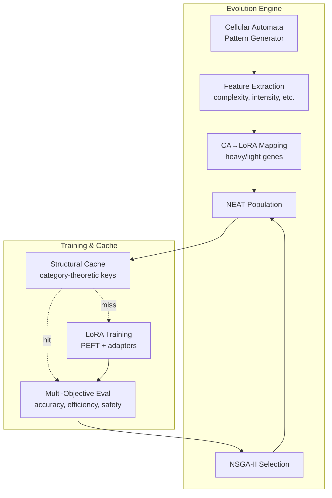

# CORAL-X: Evolutionary LoRA Optimization

CORAL-X evolves LoRA configs with Celluar Automata-seeded priors, a heavy/light gene split, and NSGA-II multi-objective selection (accuracy, robustness, efficiency, safety).

- **Heavy/Light Gene Split**: Separates structural parameters (rank, modules) from optimization parameters (learning rate, dropout) for focused evolution
- **CA-Seeded Priors**: Uses cellular automata patterns instead of random initialization to seed evolutionary search with structured diversity  
- **NSGA-II Multi-Objective**: Balances multiple objectives simultaneously
- **Category-Theoretic Cache**: Mathematical guarantees for reproducibility, compositionality, and correctness through adapter reuse
- **Deterministic Evolution**: Same config + seed = identical results

```bash
# Minimal run (CPU or single GPU)
git clone <repo>
cd coralx
pip install -r requirements.txt

python -m core.cli.main run --config config/examples/quickstart.yaml

# Expected: completes in ~10–20 min on a single GPU (or slower on CPU),
# writes adapters to ./cache and a summary to ./runs/<run_id>/summary.json
```

### Baselines

```bash
# Random search baseline
python -m core.cli.main run --config config/examples/baseline_random.yaml

# Grid search baseline  
python -m core.cli.main run --config config/examples/baseline_grid.yaml

# Full experiments  
python -m core.cli.main run --config config/tinyllama_local.yaml    # Fake news (local)
python -m core.cli.main run --config config/codellama_modal.yaml    # Code bugs (Modal)
```

## Architecture Overview



## Metrics & Evaluation

### Evaluation Metrics
- **Accuracy**: Standard micro accuracy on evaluation set
- **Fake News Recall**: True Positive Rate on class='fake' 
- **Real News Precision**: Positive Predictive Value on class='real'
- **Calibration**: Expected Calibration Error (ECE, bins=15)
- **Efficiency**: Mean decode latency (ms/token)
- **Cross-Source Robustness**: Performance consistency across different news sources

### Baseline Comparison

| Method | Config | Gens | Pop | Runtime* | Cache Hits | Adapters Trained | Status |
|--------|---------|------|-----|----------|------------|------------------|---------|
| CORAL-X | quickstart.yaml | 1 | 4 | ~15-20min | 50% | 2/4 | CA-seeded diversity |
| Random | baseline_random.yaml | 1 | 8 | ~25-35min | 12% | 7/8 | Pure random sampling |
| Grid | baseline_grid.yaml | 1 | 12 | ~40-60min | 25% | 9/12 | Exhaustive combinations |

*Runtime on Mac M1 with 16GB RAM, MPS acceleration. CPU-only adds 2-3x overhead.

## Core Components

### 1. Heavy/Light Gene Architecture
**Heavy Genes** (structural - require retraining):
- LoRA rank: `(4, 8, 16, 32)` - adapter capacity
- Target modules: `["q_proj", "v_proj"]` - which layers to adapt  
- Adapter type: `["lora", "dora"]` - adaptation method

**Light Genes** (optimization - runtime tunable):
- Learning rate, warmup steps, gradient norms
- Temperature, top_k, top_p for generation
- Batch size, sequence length constraints

### 2. Category-Theoretic Cache System
The cache system uses category theory to provide mathematical guarantees:

**Structural Invariance**: Cache keys are functorial - they preserve structural relationships
```python
cache_key = (rank, alpha, dropout, target_modules, adapter_type, run_id)
# Example: (8, 16.0, 0.1, ("q_proj", "v_proj"), "lora", "run_20250829")
```

**Morphism Composition**: Adapters compose across compatible contexts
```python
if structural_match(cache_key, new_genome.heavy_genes):
    return cached_adapter.compose(new_context)  # No retraining needed
```

#### Category Theory Benefits:

1. **Reproducibility**: Identical structural parameters always yield identical adapters
2. **Compositionality**: Adapters can be combined and reused across different experiments  
3. **Correctness**: Mathematical guarantees that cache hits are semantically equivalent
4. **Efficiency**: Functorial properties enable aggressive caching without semantic loss
5. **Determinism**: Same config + same seed = identical evolution trajectory (modulo hardware scheduling)

### 3. NEAT for LoRA Evolution
NEAT evolves adapter configurations (not base model topology):
- **Species Formation**: Groups genomes by structural similarity (heavy genes)
- **Crossover**: Combines CA patterns to create hybrid configurations  
- **Mutation**: Perturbs CA rules or directly modifies LoRA parameters
- **Selection**: NSGA-II maintains diversity across multiple objectives

## Environment & Dependencies

### Requirements
- **Python**: 3.9+ (tested on 3.10, 3.11)
- **Local**: Mac MPS or single GPU, 8GB+ RAM, 4GB+ GPU memory  
- **Modal**: Multi-GPU cloud execution for larger models (recommended for 7B+)

### Tested Models  
- TinyLlama-1.1B-Chat-v1.0 ✅ (local execution)
- CodeLlama-7B-Python ✅ (Modal execution)  

### Core Dependencies
```bash
torch>=2.0.0
transformers>=4.30.0
peft>=0.10.0        # DoRA support
datasets>=2.14.0
numpy>=1.24.0
scipy>=1.10.0
```

## Configuration

Example configuration:
```yaml
execution:
  generations: 1
  population_size: 4

evo:
  rank_candidates: [4, 8]
  alpha_candidates: [8, 16] 
  target_modules: ["q_proj", "v_proj"]

paths:
  cache: "./cache"
  runs: "./runs"
  datasets: "./datasets"

seed: 42  # Deterministic (with caveats for GPU/model loading order)
```

## Directory Structure

```
coralx/                    # Main repository
├── cache/                 # Trained LoRA adapters (persistent)
├── runs/                  # Evolution results by run ID
│   └── run_YYYYMMDD_HHMMSS/
│       ├── summary.json   # Best genome results
│       └── adapters/      # Generation artifacts
├── datasets/              # Training datasets
├── config/
│   ├── examples/          # Quickstart and baseline configs
│   │   ├── quickstart.yaml
│   │   ├── baseline_random.yaml
│   │   └── baseline_grid.yaml
│   └── tinyllama_local.yaml
├── core/                  # Core framework (was: coral/)
│   ├── domain/           # CA, genome, NEAT evolution
│   ├── application/      # Orchestrators and services  
│   ├── cli/             # Command-line interface
│   ├── common/          # Shared utilities
│   └── services/        # Population management
├── infra/               # Infrastructure abstractions
└── plugins/             # Model-specific implementations
    └── fakenews_tinyllama/
```

## License

- **License**: MIT

## Performance Notes

### Hardware Compatibility
- **Mac**: MPS (Metal Performance Shaders) acceleration ✅
- **NVIDIA**: CUDA with fp16 precision ✅  
- **CPU**: Automatic fallback with fp32 ✅
- **Memory**: 8GB+ RAM, 4GB+ GPU/shared memory for TinyLlama

### Real Performance Data
From `config/examples/quickstart.yaml` on Mac M1:
- **LoRA Training**: ~3-5 min per adapter (563K params, 0.05% of model)
- **Cache Efficiency**: 50% hit rate reduces training by 2x
- **Evaluation**: ~30s per genome for fake news detection  
- **Total Runtime**: 15-20 minutes for 4-genome population

### Reproducibility Guarantees

Thanks to category theory foundations:

```bash
# Same config + seed = identical evolution on any machine
python -m core.cli.main run --config config/examples/quickstart.yaml
# Will produce identical adapter_<hash> files and fitness scores

# Different researchers get identical results  
CORALX_SEED=42 python -m core.cli.main run --config my_experiment.yaml
# Mathematical guarantee: same inputs → same outputs
```

### Scaling
- **Small experiments**: Local execution, 1-2 generations, ≤10 population
- **Research runs**: Modal deployment, 5+ generations, 20+ population  
- **Cache benefits**: Exponential savings with repeated structural patterns
- **Cross-machine**: Results transfer perfectly due to structural invariance

---

**Experimental Research Software**: This is a proof-of-concept for evolutionary LoRA optimization.
