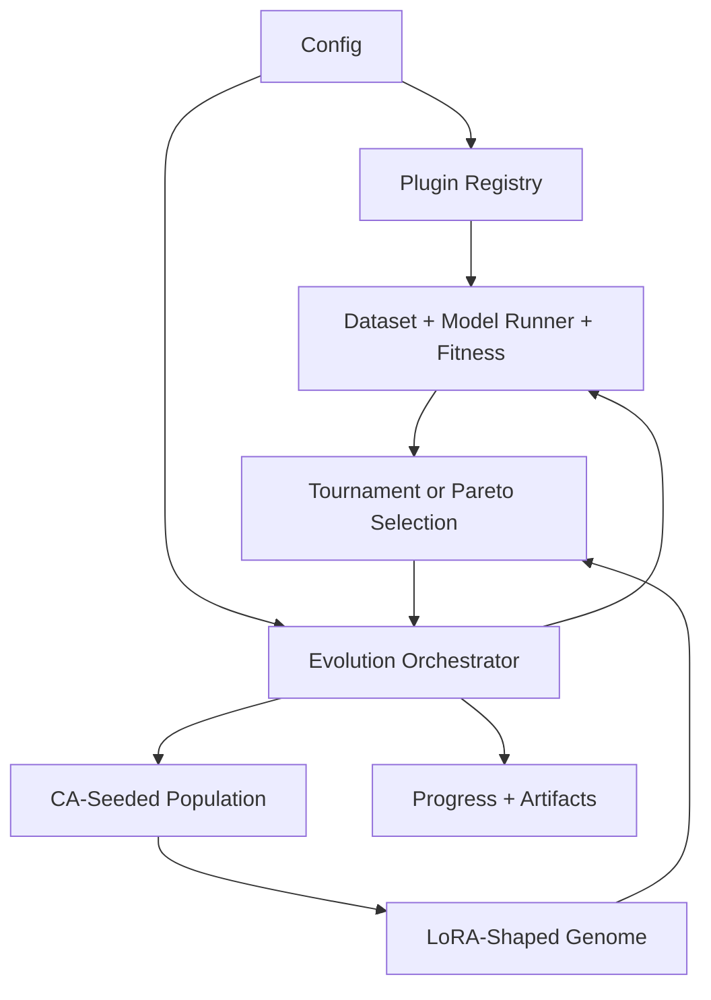

# CORAL-X

CORAL-X evolves LoRA-shaped adapter configurations with cellular automata seeded populations. It maps CA features into adapter genes, evaluates genomes with target-specific plugins, and advances the population with tournament or Pareto selection.

The CLI resolves experiment targets through a plugin registry. Available targets include local mini tasks, a controlled CA OneMax benchmark, optional Gemma 4 inference, deterministic initial population generation, stable structural cache keys, and real GSM8K LoRA benchmarks.

## Core Concepts

- CA-seeded population creation maps cellular automata features into LoRA-shaped genome parameters.
- Heavy genes describe structural adapter choices such as rank, alpha, dropout, target modules, adapter type, and run isolation.
- Cheap knobs cover runtime generation settings where a plugin supports them.
- Selection supports tournament and Pareto/NSGA-II paths over multi-objective scores.
- Structural cache keys are stable SHA-256 hashes over canonicalized heavy-gene data.
- Plugins provide the dataset, model runner, and fitness function for each experiment target.

## Supported Runs

- `config/examples/m1_tiny.yaml` runs locally without model downloads, GPUs, or external services.
- `quixbugs_mini` and `fakenews_mini` are local plugin targets that use mock-mini evaluation.
- `quixbugs_gemma4` runs local Gemma 4 inference with `google/gemma-4-E2B-it`.
- `gsm8k_lora` trains PEFT LoRA adapters for small Qwen/Qwen-Math models on `openai/gsm8k`.
- `ca_onemax` is a controlled no-model benchmark for checking whether the evolutionary loop creates selection pressure.
- Initial population generation is stable for a fixed config and seed, including across different `PYTHONHASHSEED` values.
- Heavy-gene cache keys are stable for equivalent structural data.

## Quickstart

```bash
pip install -e ".[dev]"

python -m core.cli.main run --config config/examples/m1_tiny.yaml --dry-run
python -m core.cli.main run --config config/examples/m1_tiny.yaml
```

The dry run validates config loading, plugin resolution, artifact paths, and deterministic population creation. The full run evaluates the mock-mini QuixBugs workflow locally.

## Gemma 4 Run

The Gemma 4 config downloads and loads a real model. For Apple Silicon, use a native arm64 Python environment; Rosetta/x86_64 Python may not have a new enough PyTorch wheel for the configured model stack.

```bash
/opt/homebrew/bin/python3.12 -m venv .venv
.venv/bin/python -m pip install -U pip
.venv/bin/python -m pip install -e ".[ml]"

.venv/bin/python -m core.cli.main run --config config/examples/gemma4_e2b_micro.yaml
```

The micro config runs two generations with population size two against one tiny QuixBugs task. It exercises the local model runner, plugin interface, and evolution loop with a small real-model workload.

## Controlled Evolution Benchmark

Use the CA OneMax benchmark to test whether selection and mutation improve a known objective:

```bash
python -m core.cli.main run --config config/examples/ca_onemax_evolution.yaml
```

This task maximizes active cells in the CA grid. Fitness should rise over generations when survivor selection and mutation are applying pressure to the population.

## GSM8K LoRA Run

Use this for public math benchmark runs with real PEFT LoRA training. The proof command reports exact final-answer accuracy, held-out answer-token loss, a base-model baseline, a fixed LoRA baseline, and random-search controls.

```bash
.venv/bin/python -m pip install -e ".[ml]"
.venv/bin/python -m core.cli.main run --config config/examples/gsm8k_lora_micro.yaml
```

This path downloads `Qwen/Qwen2.5-0.5B-Instruct` and `openai/gsm8k`, trains one adapter per evaluated genome, and caches evaluation metrics by structural config. The micro config is sized for laptop runs; exact GSM8K accuracy may remain zero at tiny budgets.

To compare the evolutionary run against fixed and random controls:

```bash
.venv/bin/python -m core.cli.main prove --config config/examples/gsm8k_lora_micro.yaml --random-trials 4
```

The proof command writes `proof_report.json` and `candidate_evaluations.jsonl` under the configured artifact directory. A local proof run on April 27, 2026 completed in 154.56s: evolution best `0.5611`, fixed baseline `0.5240`, random-control best `0.5600`, exact accuracy `0.0000`.

For a stronger multi-hour math run on a Mac, use the math-tuned 1.5B config:

```bash
.venv/bin/python -m core.cli.main prove --config config/examples/gsm8k_math_benchmark.yaml --random-trials 12
```

This downloads `Qwen/Qwen2.5-Math-1.5B-Instruct`, trains LoRA adapters on a deterministic GSM8K train slice, evaluates 128 held-out GSM8K test problems with boxed-answer parsing, and compares evolution against base, fixed, and random controls. Treat a result as compelling only if exact accuracy improves over the controls, not merely if loss-weighted fitness moves.

A local run on April 27, 2026 completed in 4h33m. It did not prove improved math reasoning: base model exact accuracy was `0.8281`, evolution best exact accuracy was `0.7266`, fixed-LoRA exact accuracy was `0.6484`, and random-control best exact accuracy was also `0.7266`. The evolved adapter beat fixed LoRA on exact accuracy and blended fitness, but it did not beat the base model or random search on exact accuracy.

## Architecture


```mermaid
graph TB
    Config["Config"]
    Registry["Plugin Registry"]
    Orchestrator["Evolution Orchestrator"]
    Population["CA-Seeded Population"]
    Genome["LoRA-Shaped Genome"]
    Plugin["Dataset + Model Runner + Fitness"]
    Selection["Tournament or Pareto Selection"]
    Results["Progress + Artifacts"]

    Config --> Registry
    Config --> Orchestrator
    Registry --> Plugin
    Orchestrator --> Population
    Population --> Genome
    Orchestrator --> Plugin
    Plugin --> Selection
    Genome --> Selection
    Selection --> Orchestrator
    Orchestrator --> Results
```

The core application depends on protocols, not concrete plugins. `plugins/registry.py` resolves `experiment.target` to a plugin that provides a dataset provider, model factory, and fitness function.

## Determinism

- Deterministic local config parsing, initial genome creation, and structural cache-key generation for a fixed config and seed.
- Stable cache keys for equivalent heavy genes; changed structural genes change the key.
- Real-model generation, latency, trained adapters, and fitness scores can vary by hardware, dependency versions, and model runtime settings.

## Project Layout

```text
core/
  application/      orchestration and service wiring
  cli/              command-line entry point
  common/           config, logging, exceptions
  domain/           CA, genomes, mapping, stable hashing, NEAT helpers
  ports/            public protocols
  services/         local evolution services
infra/
  executors/        local executor
  adapter_cache.py  structural cache primitives
plugins/
  quixbugs_mini/    local mock code-repair plugin
  fakenews_mini/    local mock classification plugin
  quixbugs_gemma4/  local Gemma 4 code-repair plugin
  gsm8k_lora/       real LoRA GSM8K plugin
  ca_onemax/        controlled evolutionary benchmark plugin
config/examples/
  m1_tiny.yaml      canonical local quickstart config
  gemma4_e2b_micro.yaml  optional real-model micro config
  gsm8k_lora_micro.yaml  optional real-LoRA math micro config
  gsm8k_math_benchmark.yaml  multi-hour exact-answer math benchmark config
  ca_onemax_evolution.yaml  controlled EA benchmark config
tests/
```

## Development Gates

```bash
python -m compileall -q core infra plugins tests
python -m pytest -q
python -m ruff check core infra plugins tests
python -m mypy core infra plugins
```

## License

MIT. See `LICENSE`.
