# Restaurant Business Proof System
## Category Theory for Inventory & Operations Management

Here are **Mermaid** diagrams for a complete restaurant management system using category theory principles.
Each category represents a different aspect of restaurant operations with proper morphisms and functors.

---

## 1 Packaging Category `𝘗𝘬g`

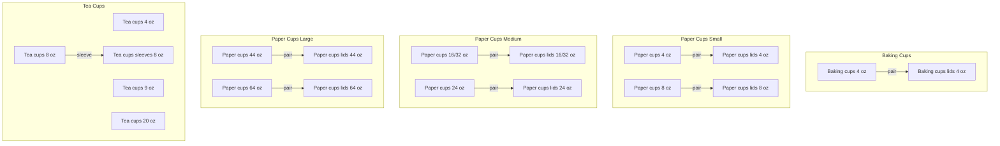

---

## 2 Packaging Accessories Category `𝘗𝘬𝘨𝘈`

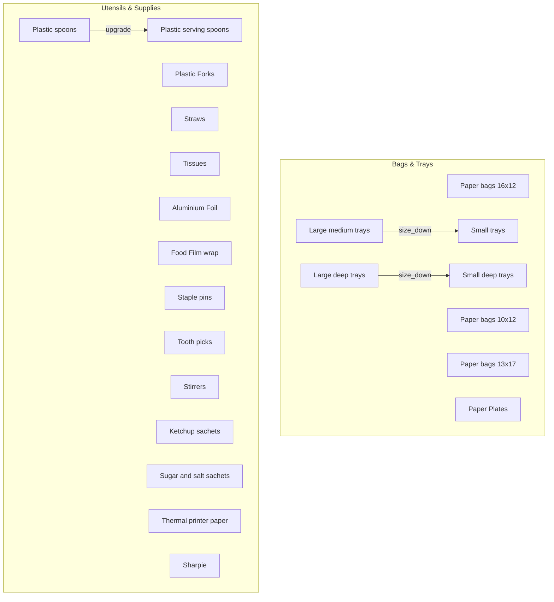

---

## 3 Fresh Produce Category `𝘍𝘳𝘦𝘴𝘩`

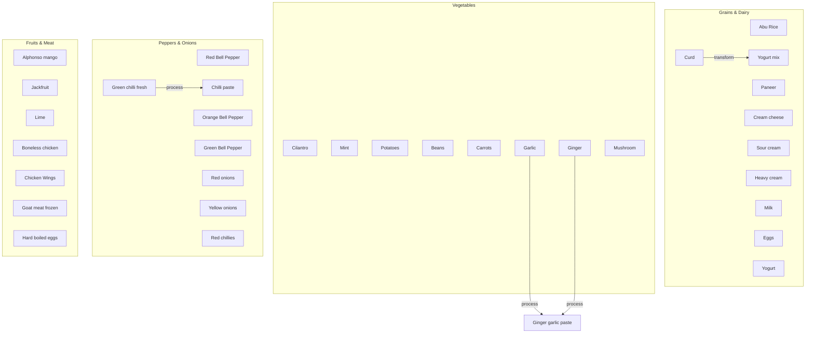

---

## 4 Spices Category `𝘚𝘱𝘪𝘤𝘦`

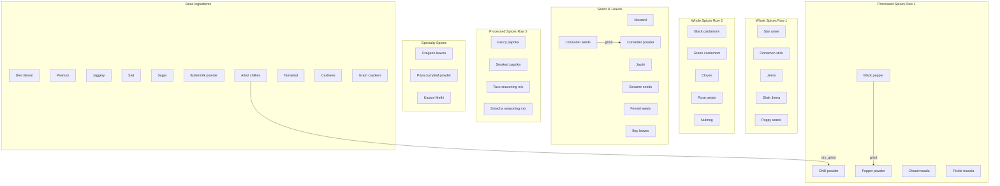

---

## 5 Condiments & Oils Category `𝘊𝘰𝘯𝘥`

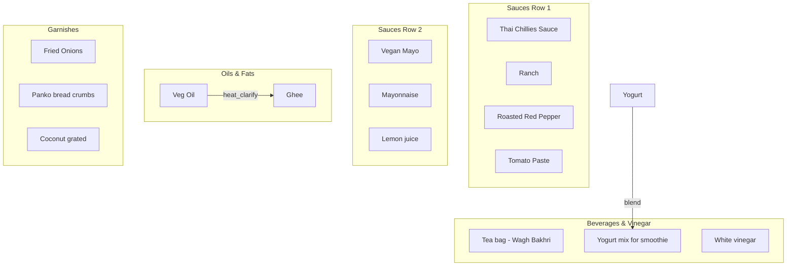

---

## 6 Beverages Category `𝘉𝘦𝘷`

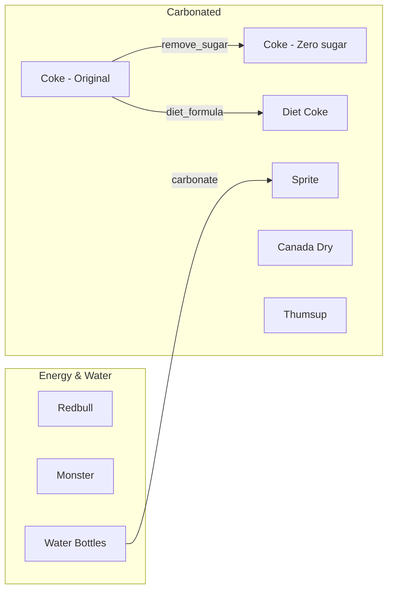

---

## 7 Food Preparation Functor `F: Ingredients → Dishes`

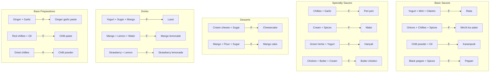

---

## 8 Biryani Category `𝘉𝘪𝘳` (Product Category)

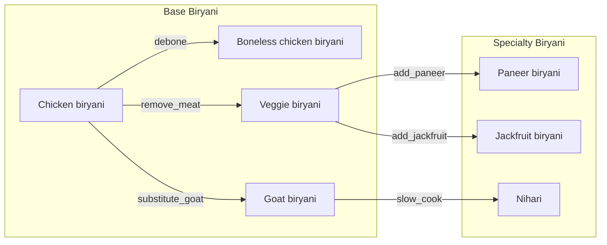

---

## 9 Kitchen Operations Category `𝘒𝘪𝘵` (Task Monoid)

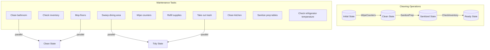

---

## 10 Cleaning Supplies Category `𝘊𝘭𝘦𝘢𝘯`

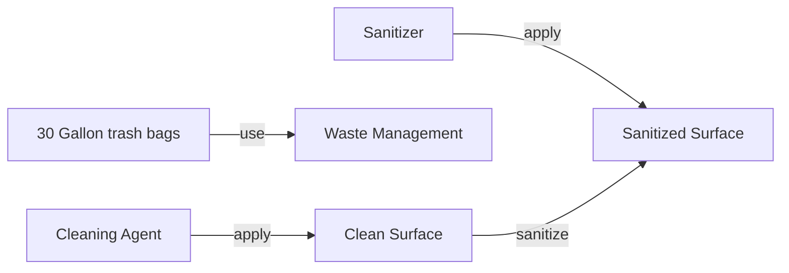

---

## 11 Natural Transformation: Order → Kitchen → Package

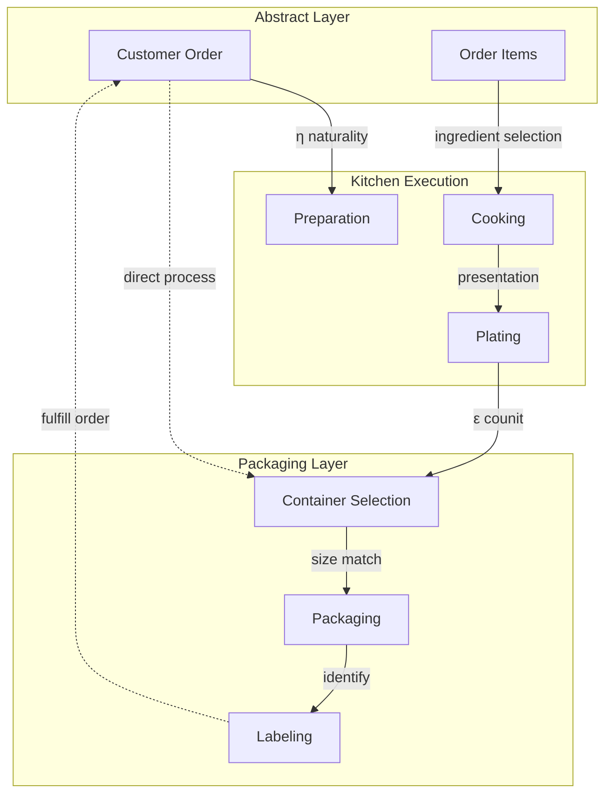

This natural transformation ensures that abstract orders commute with concrete kitchen operations and packaging.

---

## 12 Inventory Adjunction: `Stock ⊣ Demand`

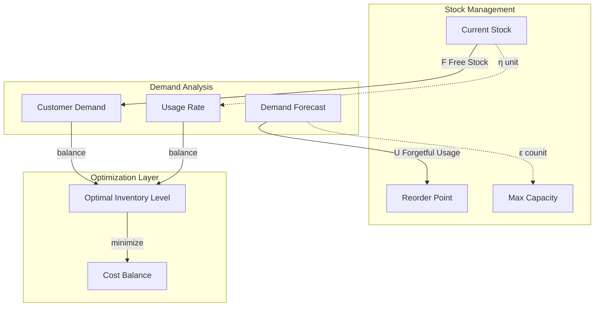

**Universal Property**: For any demand level `D` and stock level `S`, there exists a unique optimal inventory level satisfying both constraints.

---

**Restaurant Business Proof System Summary:**

This categorical framework provides:
- **Composable Operations**: All kitchen tasks form a monoid
- **Natural Transformations**: Order fulfillment preserves structure  
- **Product Categories**: Biryani variants via categorical products
- **Adjunctions**: Stock-demand balance via universal properties
- **Functors**: Recipe transformations preserve ingredient relationships

The system ensures mathematical consistency in restaurant operations while maintaining practical usability.

---

## 📱 **Mobile-Friendly Width Tips:**

### **Key Optimizations Applied:**
1. **Changed `LR` → `TD`**: Top-down flows better for mobile screens
2. **Smaller Subgraphs**: Broke large sections into digestible chunks  
3. **Shorter Labels**: Replaced `"x"` with `"+"` for ingredient combinations
4. **Vertical Stacking**: Organized related items in columns instead of rows
5. **Logical Grouping**: Related items grouped by size/type/function

### **Best Practices for Mermaid Width:**
- **Use `TD` direction** for complex diagrams
- **Limit subgraph width** to 4-5 nodes maximum  
- **Stack vertically** rather than spreading horizontally
- **Break large diagrams** into multiple focused ones
- **Use shorter node labels** when possible
- **Group related concepts** in separate subgraphs