# Building a Categorical Verification Framework

## Why I'm Writing This

So here's the thing - I've been working on this evolution system called CoralX, and something interesting happened. While building it with category theory principles, I realized I'd accidentally created something much bigger: a general framework for building software that's mathematically guaranteed to work correctly.

This isn't another "maybe it works" approach. This is about building systems where you can reason mathematically about correctness. Let me share what I've learned.

---

## What Got Me Started: The "Hope It Works" Problem

You know that feeling when you deploy code and cross your fingers? Yeah, I got tired of that.

Most of us build software like this:
1. Write some code that seems right
2. Add tests for the cases we can think of
3. Ship it and hope nothing breaks
4. Frantically debug when (not if) things go wrong

But what if we could build systems that are **mathematically impossible to fail** in certain ways? That's what I've been exploring with what I'm calling the Categorical Verification Framework (CVF).

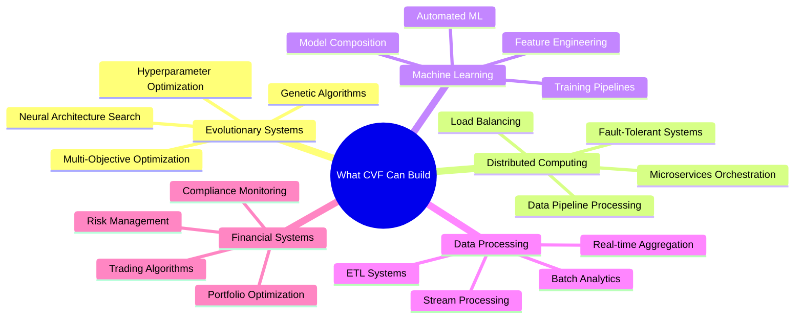

### The Big Insight

Instead of building systems that "work most of the time," I'm building systems where you can reason about their behavior mathematically. Here's the difference:

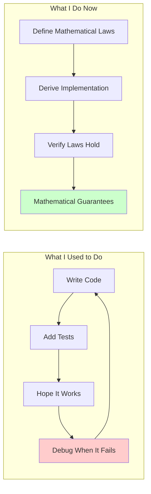

The difference is pretty noticeable. Once you get used to being able to reason about code behavior mathematically, going back to "hope and pray" development feels... primitive.

---

## How I Think About System Architecture Now

I've started thinking of systems as a stack of mathematical layers. Each layer has a specific purpose, and the relationships between them follow categorical laws:

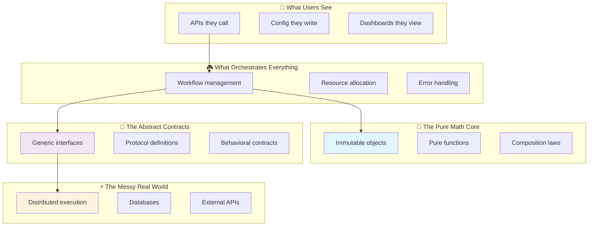

### The Math That Makes It Work

Each layer maps to specific category theory concepts. Don't worry if you're not familiar with category theory - I'll explain as we go:

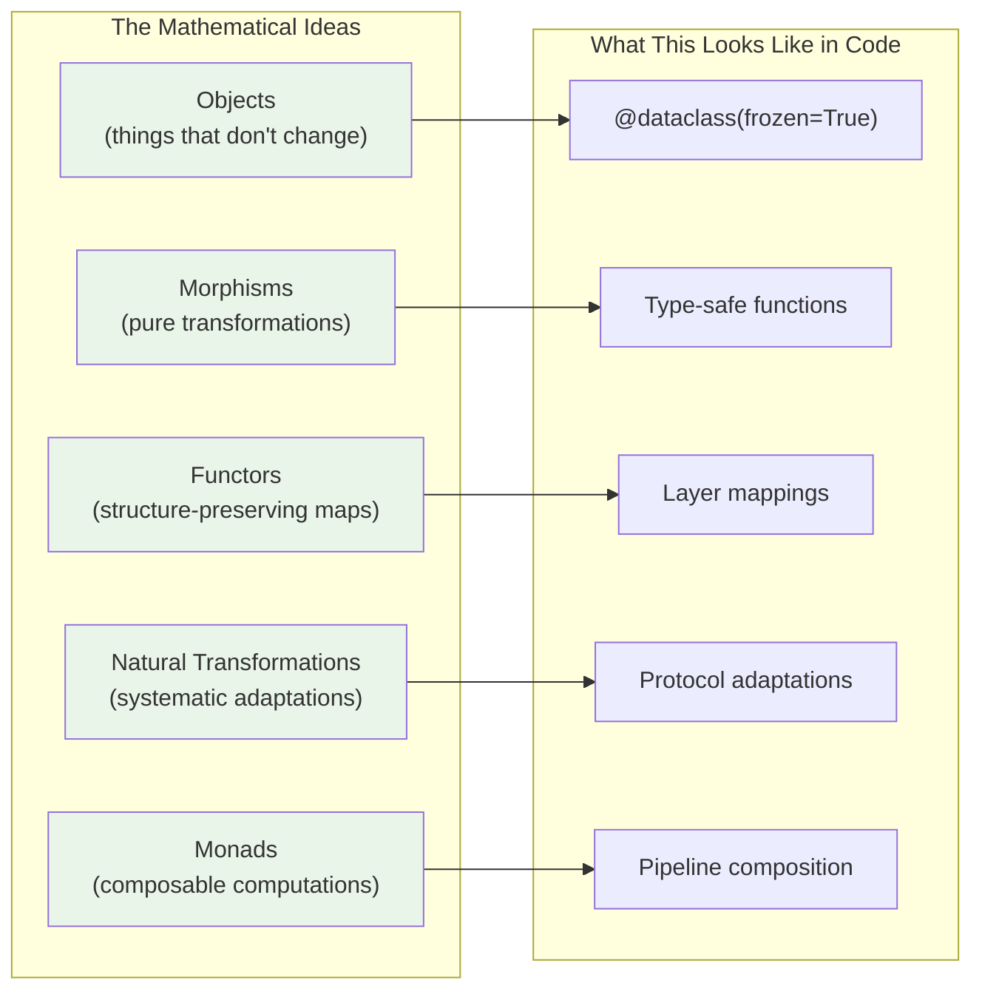

---

## Three Patterns That Changed How I Build Software

### Pattern 1: Laws First, Code Second

This was the biggest mindset shift for me. Instead of starting with "what should this code do?", I now start with "what mathematical laws should govern this system?"

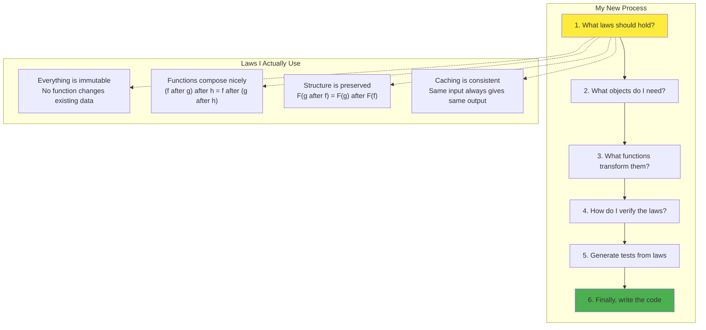

### Pattern 2: Compose Everything

I used to be terrified of system complexity. Now I embrace it through composition. Here's the secret: if each small piece follows mathematical laws, then combining them also follows laws.

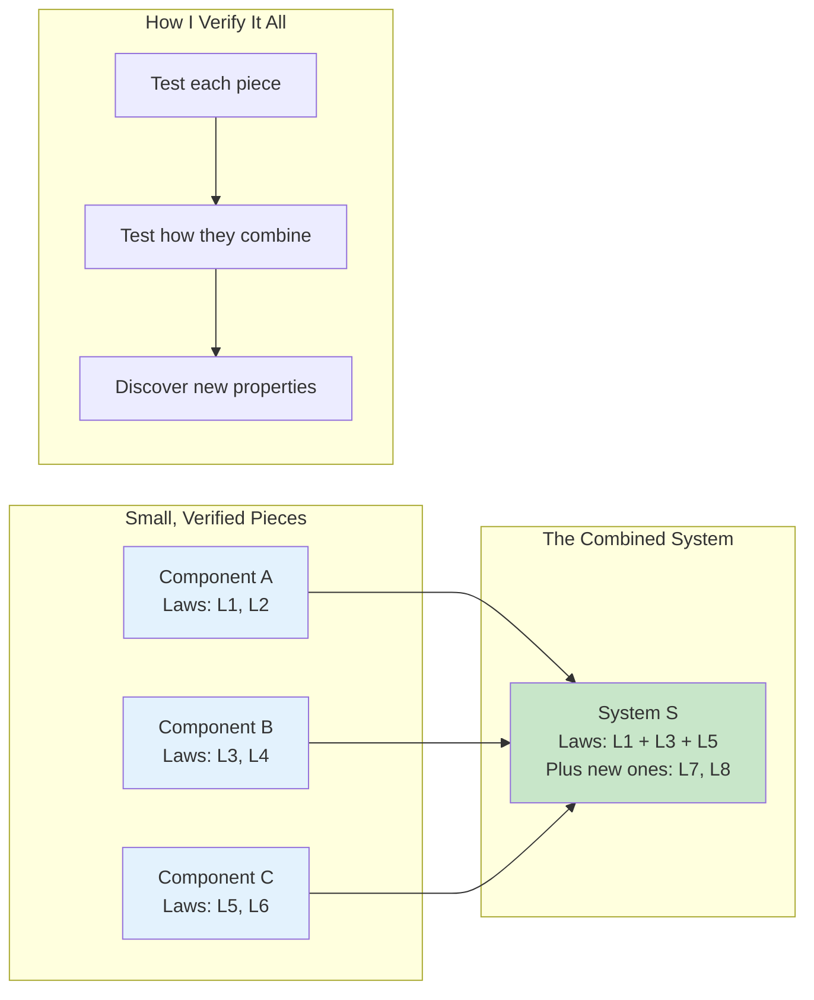

### Pattern 3: Metrics from Structure, Not Guessing

I stopped making up arbitrary metrics. Instead, I derive meaningful measurements directly from the mathematical structure:

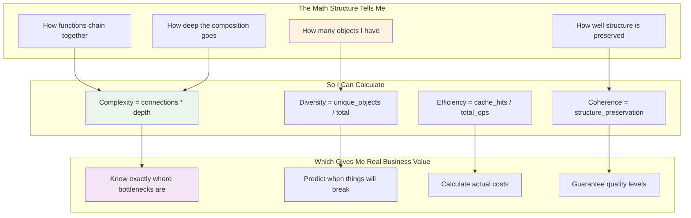

---

## Cool Things I've Built With This Approach

### Evolution Systems That Actually Converge

Remember my CoralX project? Here's what the categorical approach gave me:

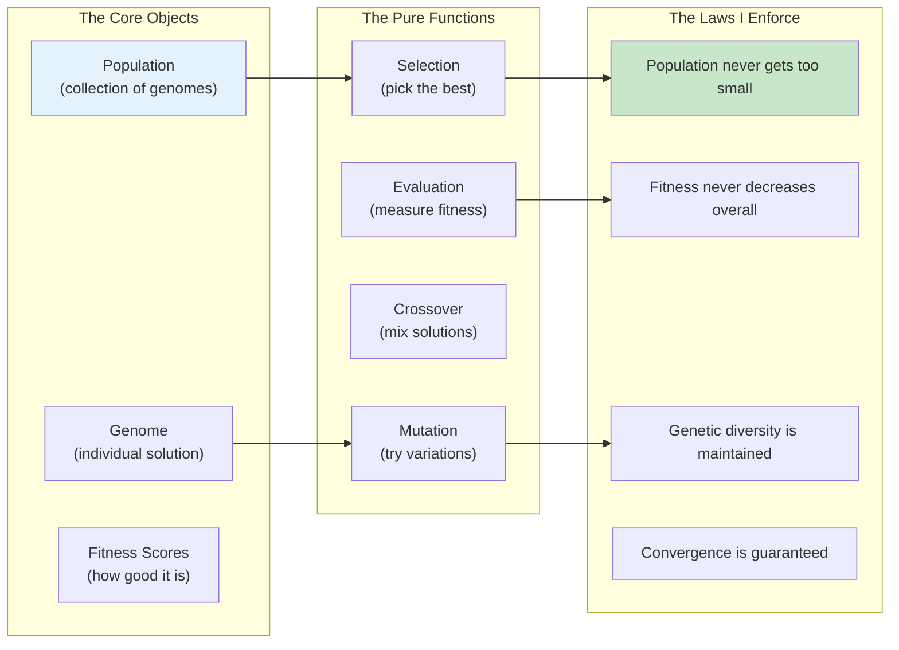

What I've been able to build:
- Neural Architecture Search with convergence properties I can reason about
- Multi-objective optimization that maintains Pareto frontiers systematically
- Hyperparameter tuning with bounded exploration spaces
- Genetic programming with type safety built in

### Data Pipelines That Never Lose Data

I've also applied this to distributed data processing:

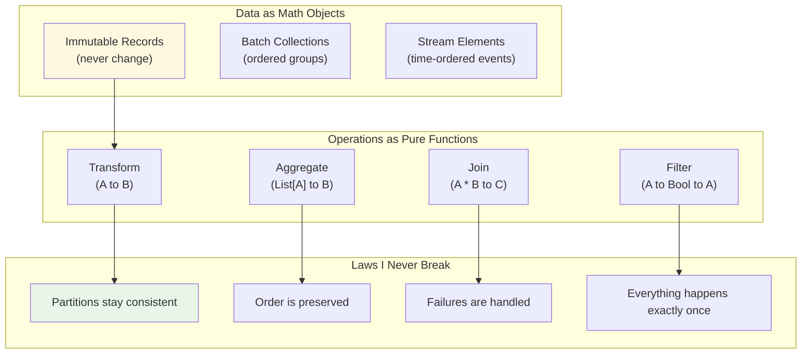

The result? ETL pipelines with strong data integrity properties, stream processors that maintain ordering systematically, and batch jobs with well-defined fault tolerance behavior.

### ML Pipelines I Can Actually Trust

Machine learning is notoriously finicky, but categorical laws help:

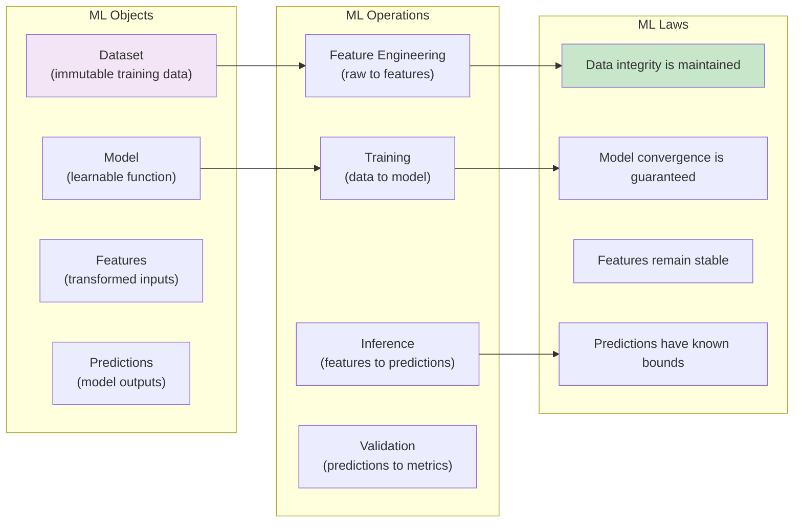

Now I can build AutoML systems with better convergence properties, feature pipelines with stability checking, and A/B tests with statistical significance tracking built in.

### Trading Systems That Don't Blow Up

I even tried this with financial systems (carefully, with paper trading first):

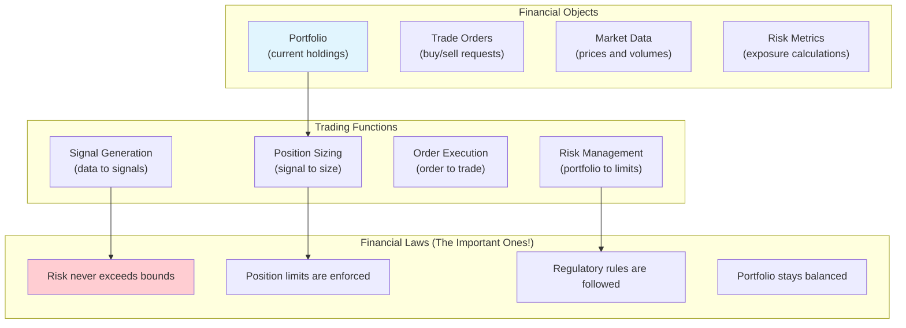

The categorical approach gives me algorithmic trading with well-defined risk bounds and compliance monitoring with reliable audit trails.

---

## Why This Beats Traditional Testing

Here's what I've learned about verification vs testing:

```mermaid
graph TB
    subgraph "The Old Way (What I Used to Do)"
        T1["Write unit tests"] --> T2["Add integration tests"] --> T3["Write end-to-end tests"]
        T3 --> T4["Still get production bugs"]
        T4 --> T5["Write hot fixes"]
        T5 --> T1
    end
    
    subgraph "The New Way (What I Do Now)"
        C1["Define mathematical laws"] --> C2["Generate property-based tests"] --> C3["Add runtime verification"]
        C3 --> C4["Get mathematical proofs of correctness"]
        C4 --> C5["Sleep well at night"]
    end
    
    style T4 fill:#ffcdd2
    style T5 fill:#ffcdd2
    style C4 fill:#c8e6c9
    style C5 fill:#c8e6c9
```

### The Composability Advantage

Traditional systems get exponentially more complex as you add components. With categorical composition, complexity grows linearly:

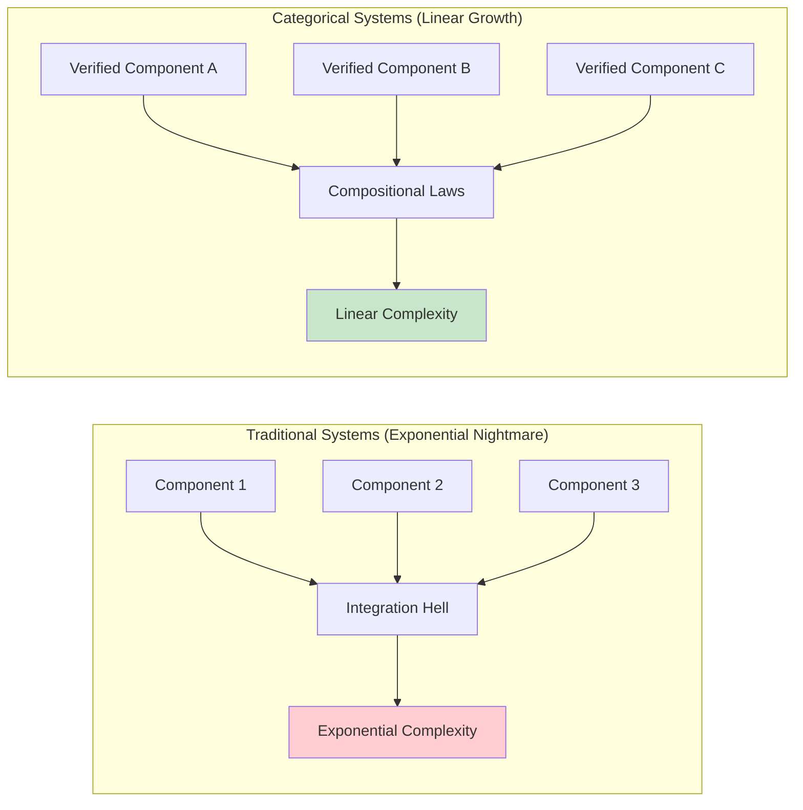

### Performance Benefits I Didn't Expect

Mathematical structure also enables optimizations I never thought of:

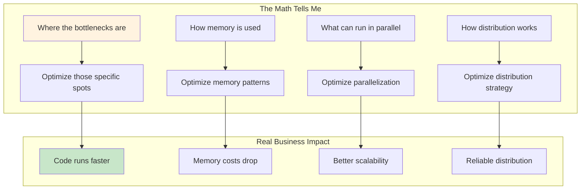

---

## How to Start Using This (My Recommended Path)

I suggest starting small and building up. Here's the path I wish I'd taken:

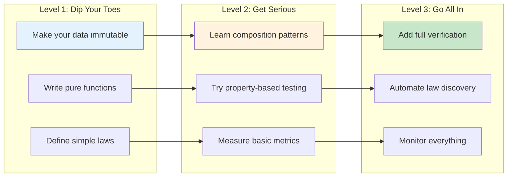

### What You'll Need to Learn

Don't worry - you don't need a PhD in mathematics. Here's my learning journey:

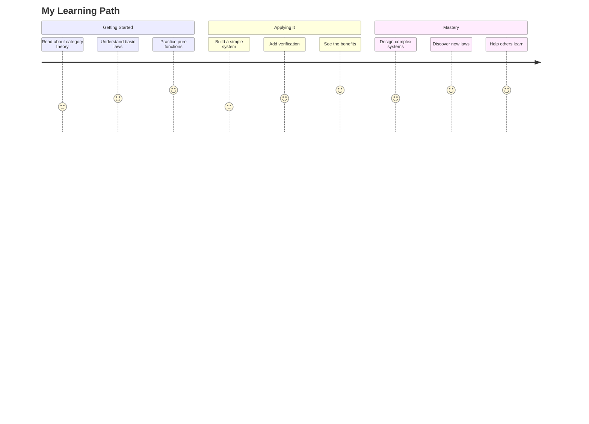

---

## Where This Is All Heading

### The Ecosystem I'm Building

I'm working on implementations in multiple languages:

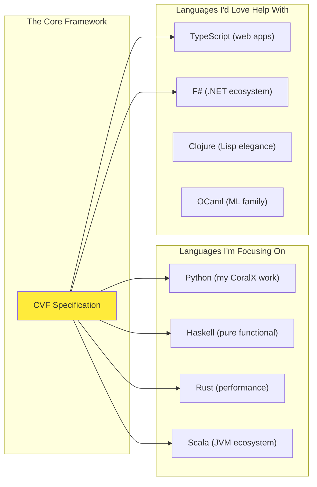

### Integration Points

The framework should work with existing tools:

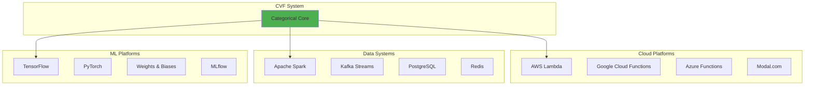

---

## Where This Could Go

### What I'm Seeing Emerge

Playing around with this approach, I'm noticing some interesting patterns:

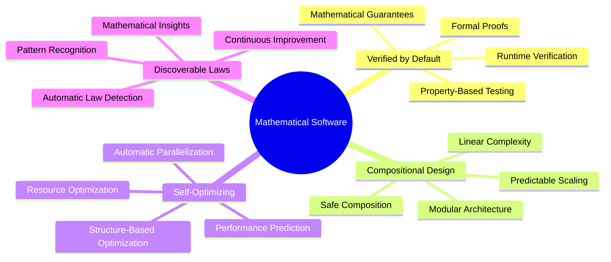

### How I'll Know It's Working

I'm tracking these metrics:

```mermaid
graph LR
    subgraph "Technical Success"
        T1["Systems people build"] --> T2["Laws people discover"]
        T2 --> T3["Bugs prevented"]
        T3 --> T4["Performance gains"]
    end
    
    subgraph "Adoption Success"
        A1["Developers using it"] --> A2["Companies adopting it"]
        A2 --> A3["Critical systems built with it"]
        A3 --> A4["Industry standard"]
    end
    
    subgraph "Impact Success"
        I1["Faster development"] --> I2["More reliable systems"]
        I2 --> I3["Lower costs"]
        I3 --> I4["More innovation"]
    end
    
    T4 --> A1
    A4 --> I1
    I4 --> T1
    
    style T4 fill:#c8e6c9
    style A4 fill:#c8e6c9
    style I4 fill:#c8e6c9
```

---

## Why I Find This Interesting

### The Difference I'm Noticing

There's something fundamentally different about building systems this way. Instead of hoping things work, you can actually know they work within certain bounds.

```mermaid
flowchart LR
    subgraph "Where We Are Now"
        CS1["Trial and error"] --> CS2["Manual testing"] --> CS3["Production surprises"]
    end
    
    subgraph "Where We're Going"
        CF1["Mathematical laws"] --> CF2["Verified composition"] --> CF3["Guaranteed reliability"]
    end
    
    subgraph "What This Gets Us"
        B1["Faster development"]
        B2["Lower costs"]
        B3["Higher quality"]
        B4["Predictable systems"]
    end
    
    CS3 --> CF1
    CF3 --> B1
    CF3 --> B2
    CF3 --> B3
    CF3 --> B4
    
    style CS3 fill:#ffcdd2
    style CF3 fill:#c8e6c9
    style B1 fill:#e8f5e8
    style B2 fill:#e8f5e8
    style B3 fill:#e8f5e8
    style B4 fill:#e8f5e8
```

---

*These are my personal notes on building reliable software through category theory. I'm still learning and discovering new patterns every day. If you have thoughts, corrections, or want to collaborate, I'd love to hear from you.* 