# CORAL-X Dynamic Meta-Optimization System

## 🎯 Overview: Self-Adaptive Evolutionary AI

This document outlines the design for transforming CORAL-X from a **static evolutionary system** into a **dynamic meta-optimization engine** that learns to improve its own optimization strategy based on emergent behavior patterns and performance metrics.

**Core Concept**: Create a "beat the metrics" system where CORAL-X continuously adapts its objective functions, training parameters, and evolutionary strategies based on real-time emergent behavior detection and performance analysis.

## 🔄 Current Static vs Proposed Dynamic Architecture

### Static Elements (Current System)


### Dynamic Meta-Optimization System (Proposed)


## 🧠 Meta-Optimization Engine Architecture

### Core Components

```mermaid
flowchart TD
    EVAL["Generation N Results<br/>Multiple genome evaluations"] --> EMERGENT["Emergent Behavior Analysis<br/>Pattern detection & confidence"]
    
    EMERGENT --> METRICS["Meta-Metrics Calculation<br/>• Innovation rate<br/>• Efficiency trends<br/>• Solution diversity<br/>• Breakthrough frequency"]
    
    METRICS --> ADAPT{Adaptation Triggers}
    
    ADAPT -->|High elegance| WEIGHTS1["↗️ Increase style weight<br/>↘️ Decrease security weight"]
    ADAPT -->|Low efficiency| SPACE1["↗️ Expand low-rank space<br/>Try rank=(1,2,3)"]
    ADAPT -->|Plateaus| TRAINING1["↗️ Increase learning rate<br/>↗️ Add training epochs"]
    ADAPT -->|Breakthroughs| GENERATIONS1["↗️ Extend total generations<br/>↗️ Increase population"]
    
    WEIGHTS1 --> NEXT["Generation N+1<br/>Uses adapted parameters"]
    SPACE1 --> NEXT
    TRAINING1 --> NEXT
    GENERATIONS1 --> NEXT
    
    style EMERGENT fill:#e1f5fe
    style ADAPT fill:#fff3e0
    style NEXT fill:#c8e6c9
```



### Meta-Learning Feedback Loop


## 🎯 Dynamic Objective Function Evolution

### Adaptive Weight System

```mermaid
graph TB
    subgraph "Current Fixed Weights"
        FIXED["bugfix: 0.3<br/>style: 0.15<br/>security: 0.25<br/>runtime: 0.1<br/>syntax: 0.2"]
    end
    
    subgraph "Dynamic Weight Adaptation"
        TRIGGER["Emergent Behavior Triggers"]
        
        TRIGGER --> RULE1["High Elegant Solutions<br/>→ ↗️ style weight<br/>→ ↗️ runtime weight"]
        TRIGGER --> RULE2["Low Efficiency<br/>→ ↗️ runtime weight<br/>→ ↘️ security weight"]
        TRIGGER --> RULE3["Perfect Solutions<br/>→ ↗️ complexity challenge<br/>→ New problem selection"]
        TRIGGER --> RULE4["Training Plateaus<br/>→ ↗️ exploration<br/>→ Parameter space expansion"]
        
        RULE1 --> ADAPTED["Adapted Weights<br/>bugfix: 0.4<br/>style: 0.25<br/>security: 0.15<br/>runtime: 0.15<br/>syntax: 0.05"]
        RULE2 --> ADAPTED
        RULE3 --> ADAPTED
        RULE4 --> ADAPTED
    end
    
    style FIXED fill:#ffebee
    style ADAPTED fill:#c8e6c9
    style TRIGGER fill:#e1f5fe
```



### Emergent Behavior → Weight Adaptation Rules

| Emergent Pattern | Confidence Threshold | Weight Adaptation Strategy |
|------------------|---------------------|---------------------------|
| **Elegant Solutions** | > 80% | ↗️ Style weight (+0.1), ↗️ Runtime weight (+0.05) |
| **Efficient Adaptation** | < 30% | ↗️ Runtime weight (+0.1), ↘️ Security weight (-0.05) |
| **Pythonic Evolution** | > 70% | ↗️ Style weight (+0.05), ↗️ Syntax weight (+0.05) |
| **Late Breakthrough** | Any detection | Extend generations (+5), ↗️ Population (+10) |
| **Perfect Convergence** | 100% test pass | Challenge increase (harder problems) |
| **Training Plateaus** | 3+ generations | Parameter space expansion |

## 🚀 Dynamic Training Parameter Adaptation

### Smart Training Pipeline

```mermaid
flowchart TD
    GENOME["New Genome for Training"] --> ANALYZE["Analyze Genome Characteristics<br/>• CA complexity<br/>• LoRA parameters<br/>• Historical performance"]
    
    ANALYZE --> PROFILE{Training Profile}
    
    PROFILE -->|High complexity| INTENSIVE["Intensive Training<br/>epochs: 8<br/>lr: 1e-4<br/>batch_size: 2"]
    
    PROFILE -->|Standard| BALANCED["Balanced Training<br/>epochs: 5<br/>lr: 2e-4<br/>batch_size: 4"]
    
    PROFILE -->|Simple/Cached| EFFICIENT["Efficient Training<br/>epochs: 3<br/>lr: 3e-4<br/>batch_size: 8"]
    
    INTENSIVE --> MONITOR["Training Monitoring<br/>Loss curve analysis<br/>Convergence detection"]
    BALANCED --> MONITOR
    EFFICIENT --> MONITOR
    
    MONITOR --> ADAPT{Early Adaptation}
    
    ADAPT -->|Converged early| STOP["Early stopping<br/>Save compute resources"]
    ADAPT -->|Slow progress| BOOST["Boost training<br/>↗️ epochs, ↗️ lr"]
    ADAPT -->|Unstable| STABILIZE["Stabilize<br/>↘️ lr, gradient clipping"]
    
    style ANALYZE fill:#e1f5fe
    style MONITOR fill:#fff3e0
    style ADAPT fill:#f3e5f5
```



### Performance-Guided Parameter Evolution


## 📊 Meta-Metrics and Adaptation Triggers

### Emergent Behavior Meta-Metrics

```yaml
meta_metrics:
  innovation_rate:
    description: "Rate of discovering novel solution patterns"
    calculation: "unique_patterns_per_generation / total_evaluations"
    adaptation_trigger: 
      low_threshold: 0.1
      action: "increase_exploration"
  
  efficiency_trend:
    description: "Trend in low-parameter high-performance solutions"
    calculation: "efficient_solutions_trend_over_5_generations"
    adaptation_trigger:
      declining_threshold: -0.2
      action: "expand_low_rank_space"
  
  solution_diversity:
    description: "Diversity of successful solution approaches"
    calculation: "hamming_distance_between_successful_codes"
    adaptation_trigger:
      low_threshold: 0.3
      action: "increase_mutation_rate"
  
  breakthrough_frequency:
    description: "Frequency of late-generation breakthroughs"
    calculation: "breakthroughs_after_generation_20 / total_generations"
    adaptation_trigger:
      high_threshold: 0.3
      action: "extend_evolution_time"
```

### Adaptation Decision Tree


## 🔧 Implementation Architecture

### Dynamic Configuration System


### Software Architecture Integration


## 📋 Implementation Phases

### Phase 1: Emergent Behavior → Objective Weights
**Duration**: 2-3 weeks
**Goal**: Dynamic objective function adaptation

```yaml
phase_1_features:
  - Emergent behavior confidence → objective weight mapping
  - Simple adaptation rules (if-then logic)
  - Weight adjustment frequency (every 3 generations)
  - Performance tracking and validation
  
implementation_files:
  - coral/domain/adaptive_objectives.py
  - coral/domain/emergent_feedback.py
  - coral/application/meta_optimizer.py
```

### Phase 2: Training Parameter Adaptation
**Duration**: 3-4 weeks
**Goal**: Intelligent training parameter selection

```yaml
phase_2_features:
  - Genome-specific training profiles
  - Loss curve analysis and early stopping
  - Learning rate adaptation based on convergence
  - Resource optimization (compute efficiency)
  
implementation_files:
  - coral/domain/adaptive_training.py
  - coral/domain/training_profiles.py
  - infra/modal/adaptive_training_service.py
```

### Phase 3: Parameter Space Evolution
**Duration**: 4-5 weeks
**Goal**: Self-expanding optimization space

```yaml
phase_3_features:
  - Success-guided parameter space expansion
  - Unsuccessful parameter pruning
  - Novel parameter combination discovery
  - Search space efficiency optimization
  
implementation_files:
  - coral/domain/parameter_evolution.py
  - coral/domain/search_space_optimizer.py
  - coral/application/space_manager.py
```

### Phase 4: Full Meta-Evolution
**Duration**: 6-8 weeks
**Goal**: Complete self-adaptive system

```yaml
phase_4_features:
  - Multi-level meta-optimization
  - Strategy evolution (evolving evolution strategies)
  - Cross-experiment learning
  - Publication-ready results and analysis
  
implementation_files:
  - coral/domain/meta_evolution.py
  - coral/domain/strategy_evolution.py
  - coral/application/full_meta_system.py
```

## 🎛️ Configuration Examples

### Dynamic Meta-Optimization Config

```yaml
# coral_x_dynamic_config.yaml
meta_optimization:
  enabled: true
  adaptation_frequency: 3  # Every 3 generations
  
  # Objective function evolution
  objective_adaptation:
    mode: "emergent_guided"
    learning_rate: 0.1
    
    rules:
      elegant_solutions_high:
        threshold: 0.8
        actions:
          - increase_style_weight: 0.1
          - increase_runtime_weight: 0.05
          - decrease_security_weight: 0.05
      
      efficient_adaptation_low:
        threshold: 0.3
        actions:
          - expand_low_rank_space: [1, 2, 3]
          - increase_runtime_weight: 0.1
      
      perfect_convergence:
        threshold: 1.0
        actions:
          - select_harder_problems: true
          - increase_complexity_challenge: 0.2

  # Training parameter evolution
  training_adaptation:
    mode: "performance_guided"
    
    profiles:
      high_complexity:
        triggers: ["ca_complexity > 0.8", "rank > 32"]
        parameters:
          epochs: 8
          learning_rate: 1e-4
          batch_size: 2
      
      efficient:
        triggers: ["rank <= 4", "cached_similarity > 0.9"]
        parameters:
          epochs: 3
          learning_rate: 3e-4
          batch_size: 8
    
    convergence_detection:
      early_stopping: true
      patience: 2
      min_improvement: 0.001

  # Parameter space evolution
  space_evolution:
    enabled: true
    expansion_strategy: "success_guided"
    pruning_strategy: "performance_based"
    
    expansion_rules:
      rank_success_high:
        condition: "rank_4_success > 0.9"
        action: "add_lower_ranks: [1, 2]"
      
      alpha_correlation:
        condition: "high_alpha_elegant_correlation > 0.7"
        action: "add_higher_alphas: [128.0, 256.0]"

# Emergent behavior tracking (enhanced)
emergent_tracking:
  enabled: true
  confidence_threshold: 0.7
  adaptation_integration: true  # Feed back to meta-optimization
  
  meta_metrics:
    innovation_rate: true
    efficiency_trend: true
    solution_diversity: true
    breakthrough_frequency: true
```

### Adaptive Execution Config

```yaml
execution:
  mode: "adaptive"  # vs "static"
  
  population_size:
    base: 20
    adaptation_strategy: "performance_guided"
    min: 15
    max: 50
    
  generations:
    base: 10
    adaptation_strategy: "breakthrough_detection"
    min: 8
    max: 25
    extension_trigger: "late_breakthrough_frequency > 0.3"
  
  selection_mode: "dynamic_pareto"  # Enhanced NSGA-II with adaptive weights
```

## 🎯 Expected Outcomes

### Research Impact
- **Novel contribution**: First self-adaptive evolutionary AI system for code generation
- **Performance improvements**: 10-30% better optimization efficiency
- **Computational efficiency**: 20-40% reduction in unnecessary training
- **Publication potential**: Top-tier AI/Software Engineering venues

### Technical Benefits
- **Self-tuning system**: Reduces manual hyperparameter optimization
- **Adaptive exploration**: Discovers better parameter combinations automatically
- **Resource efficiency**: Optimizes compute usage based on genome characteristics
- **Robust evolution**: Prevents stagnation and promotes continuous improvement

### Meta-Learning Capabilities
- **Cross-experiment learning**: Adapts strategies based on historical performance
- **Domain adaptation**: Adjusts to different problem types automatically
- **Strategy evolution**: Evolves its own evolutionary strategies
- **Emergence amplification**: Actively promotes emergent behavior patterns

---

**Implementation Status**: Ready for Phase 1 development. The existing CORAL-X architecture with NSGA-II selection and emergent behavior tracking provides the perfect foundation for building this dynamic meta-optimization system.

**Next Steps**: Begin with simple emergent behavior → objective weight adaptation, then progressively add more sophisticated meta-learning capabilities through the four implementation phases. 