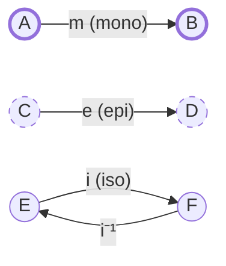
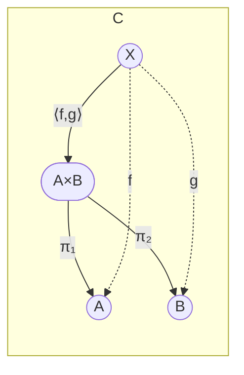
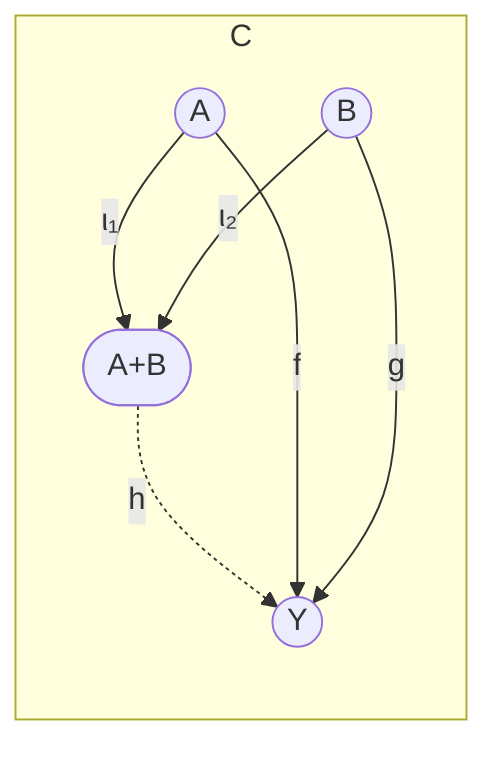
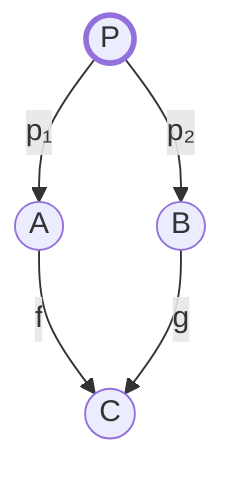
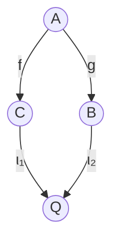
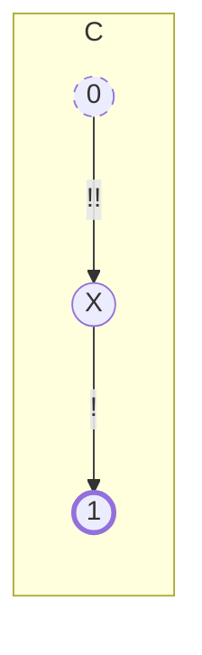
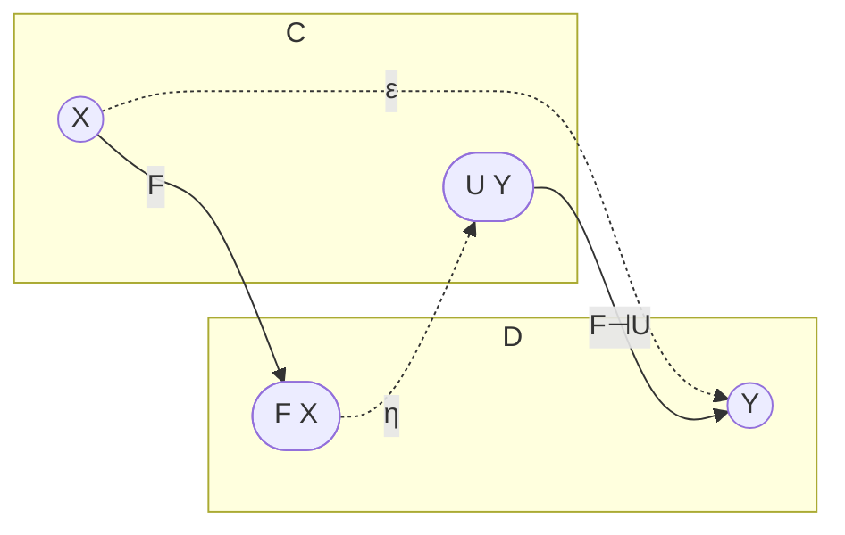
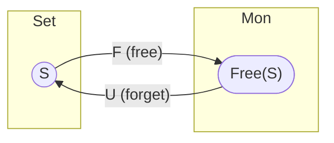
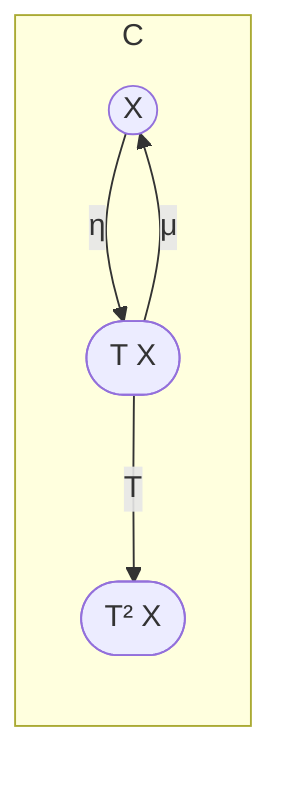
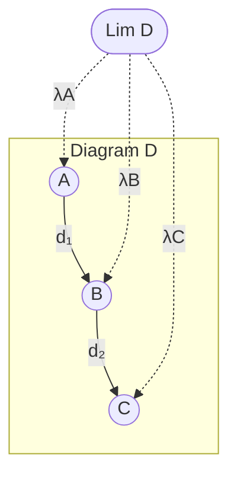

**Category-Theory cheat-sheet in pictures**

---

## 0 · Legend (applies to all sketches)

```
(A)          round node  = object
A -->|f| B   labelled arrow = morphism
...dotted... extra structure (cone legs, iso)
```

<br>

## 1 · Mono / Epi / Iso



*Bold arrow* = **monomorphism** (left-cancellable);
dashed = **epimorphism** (right-cancellable);
double-headed pair = **isomorphism**.

---

## 2 · Product  $A × B$



`⟨f,g⟩` is the **unique morphism** making the outer triangles commute – that’s the universal property of a **product**.

---

## 3 · Coproduct  $A + B$



`h` factors **uniquely** through the injections; dual to the product.

---

## 4 · Pullback  (fibre-product)



`P` plus arrows `p₁, p₂` make the square commute and are **universal**—give *any* other commuting square you get a unique map into `P`.

---

## 5 · Pushout  (dual of pullback)



Replace “fibre” with “co-fibre” and arrows with duals.

---

## 6 · Terminal & Initial Objects



*Exactly one* arrow **to** the terminal `1`;
*exactly one* arrow **from** the initial `0`.

---

## 7 · Adjunction  $F ⊣ U$



Natural bijection

$$
\text{Hom}_\mathbf{D}(F X,\,Y) \;\cong\; \text{Hom}_\mathbf{C}(X,\,U Y)
$$

`η` = unit, `ε` = counit.

---

## 8 · Free / Forgetful (classic adjunction)



`F ⊣ U` : sets ⟷ monoids.
This picture generalises to **free groups**, **free categories**, etc.

---

## 9 · Monad from Adjunction



`T = U F`, `η` (unit) and `μ = U ε F` (multiplication) satisfy the monad laws.

---

## 10 · Limit Cone (general pattern)



Any other cone factors *uniquely* through `L`.  Replace arrows with duals to picture a colimit.

---