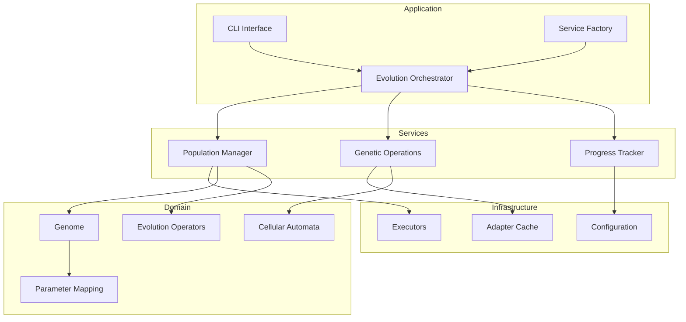
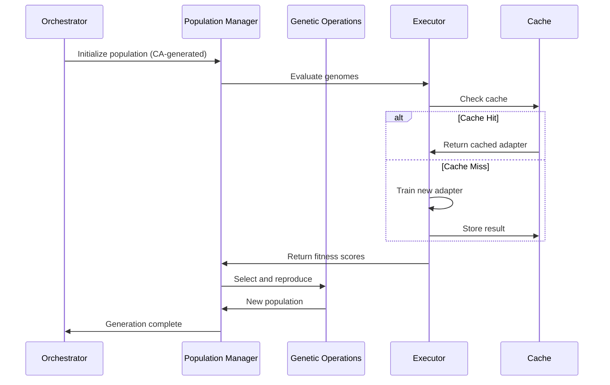
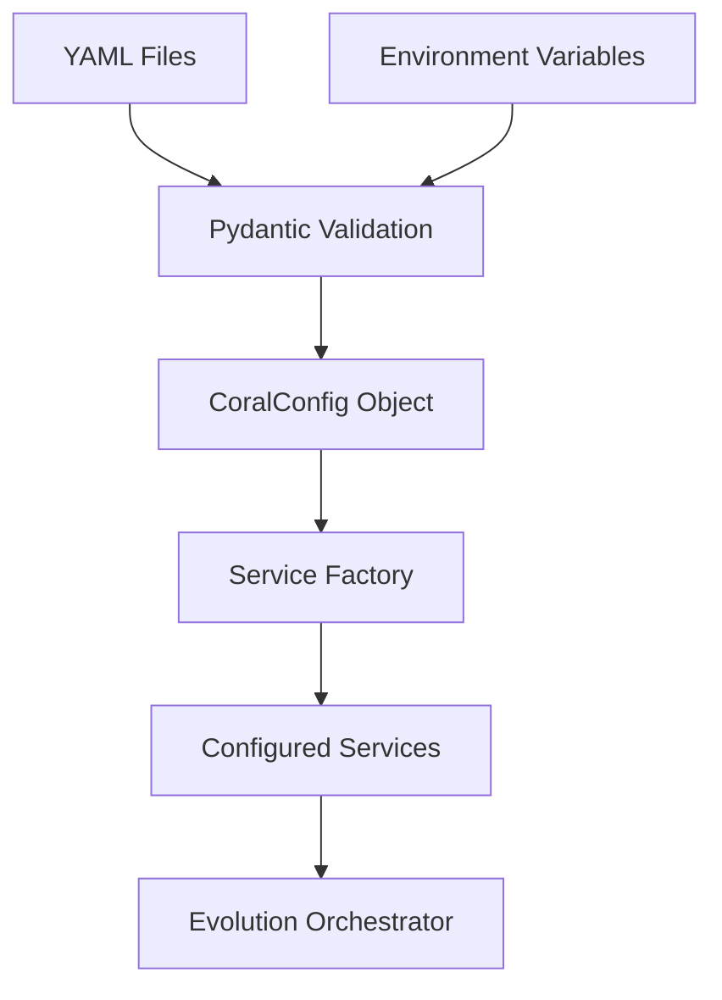

# CORAL-X Architecture

**Note**: CORAL-X is an experimental research project exploring evolutionary approaches to LoRA optimization. The architecture described here represents our current research implementation and may evolve as we continue to investigate these techniques.

## Design Philosophy

Clean domain logic, explicit dependencies, fail-fast validation. The system separates what changes (business rules) from what doesn't (infrastructure), making it easier to test, debug, and extend.

## Layer Structure



## Core Components

### Domain Layer (`coral/domain/`)

Pure business logic with no infrastructure dependencies:

- **`genome.py`**: Immutable genetic representation (Heavy + Light genes)
- **`ca.py`**: Cellular automata engine for structured diversity
- **`neat.py`**: Evolution operators (selection, crossover, mutation)
- **`mapping.py`**: CA pattern → LoRA parameter translation
- **`categorical_*.py`**: Category theory cache mathematics

### Services Layer (`coral/services/`)

Application services that coordinate domain logic:

- **`population_manager.py`**: Population lifecycle, selection pressure
- **`genetic_operations.py`**: Crossover/mutation orchestration  
- **`progress_tracker.py`**: Real-time monitoring and metrics
- **`baseline_evaluator.py`**: Performance comparison framework

### Infrastructure Layer (`coral/infra/`)

External system integration:

- **`modal_executor.py`**: Distributed training via Modal
- **`adapter_cache.py`**: Persistent storage with categorical hashing
- **Configuration system**: YAML validation with Pydantic schemas

## Data Flow

### Evolution Loop



### Configuration Resolution



## Key Design Decisions

### Immutable Genomes
Genomes never change after creation. Evolution operations return new instances. This prevents bugs where mutations affect multiple parts of the population.

### Service Injection
Services are injected into the orchestrator rather than created internally. This makes testing easier and allows runtime behavior changes.

### Categorical Cache
Traditional caches use arbitrary keys. Our categorical cache respects the mathematical structure of LoRA parameter relationships, enabling principled reuse.

### Multi-Objective Everything
Real systems optimize multiple criteria. NSGA-II selection maintains diverse solutions rather than converging to a single point.

## Extension Points

### New Model Types
Implement `FitnessFn` interface in `plugins/{model_name}/`:

```python
class MyModelFitness(FitnessFn):
    def __call__(self, genome: Genome) -> ObjectiveScores:
        # Your evaluation logic
        pass
```

### Custom Infrastructure  
Implement `Executor` interface for your platform:

```python
class MyExecutor(Executor):
    def execute_batch(self, genomes: List[Genome]) -> List[float]:
        # Your distributed training logic
        pass
```

### Different Evolution Strategies
Subclass `PopulationManager` or `GeneticOperationsService`:

```python
class MySelectionStrategy(PopulationManager):
    def select_survivors(self, population, scores):
        # Your selection logic
        pass
```

## Testing Strategy

- **Domain**: Pure functions, comprehensive unit tests
- **Services**: Integration tests with mock dependencies
- **Infrastructure**: End-to-end tests against real systems

Focus on testing what breaks, not achieving coverage metrics.

## Performance Considerations

### Caching Efficiency
Cache hit rates improve over generations as the population converges. Early generations train everything, later generations mostly reuse.

### Memory Management
- Lazy model loading (only when needed)
- Automatic device placement with `device_map="auto"`
- Gradient checkpointing for large models

### Distributed Scaling
Modal executor handles failures gracefully with retries and backoff. Queue-based architecture scales with available resources.

---

*This architecture represents our current approach to managing complexity in evolutionary ML experiments. The abstractions help maintain clarity when running long-duration evolutionary experiments and facilitate reproducible research.*