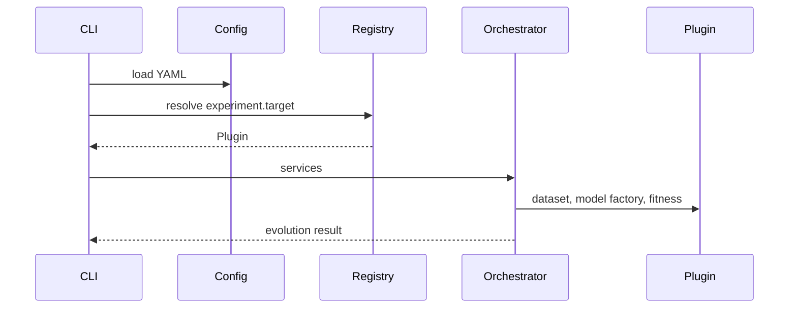

# Architecture

CORAL-X runs evolutionary adapter search through a local CLI, a plugin registry, and protocol-based orchestration.

## Boundaries

- `core` owns orchestration, config, domain models, and service interfaces.
- `plugins` owns target-specific dataset/model/fitness implementations.
- `infra` owns local execution and structural cache primitives.
- The orchestrator never imports concrete plugins.

## Plugin Flow

```mermaid
sequenceDiagram
    participant CLI
    participant Config
    participant Registry
    participant Orchestrator
    participant Plugin

    CLI->>Config: load YAML
    CLI->>Registry: resolve experiment.target
    Registry-->>CLI: Plugin
    CLI->>Orchestrator: services
    Orchestrator->>Plugin: dataset, model factory, fitness
    Orchestrator-->>CLI: evolution result
```

Local mini targets:

- `quixbugs_mini`
- `fakenews_mini`

Real-model targets:

- `quixbugs_gemma4`, which uses `google/gemma-4-E2B-it` and requires optional ML dependencies plus a local model download.
- `gsm8k_lora`, which trains PEFT LoRA adapters for small Qwen/Qwen-Math models on `openai/gsm8k`. The proof path records exact-answer accuracy plus base, fixed, and random controls.

Controlled benchmark target:

- `ca_onemax`, which optimizes active cells in the CA grid and is useful for checking evolutionary search pressure without model noise.

## Determinism Scope

The local architecture keeps config parsing, initial population creation, and structural cache-key generation stable for a fixed config and seed. Real-model training outputs and fitness can vary with hardware, dependency versions, and runtime settings.

## Cache Keys

Heavy genes are canonicalized and hashed with SHA-256. Equivalent structural genes produce the same key, while structural changes produce a different key.
