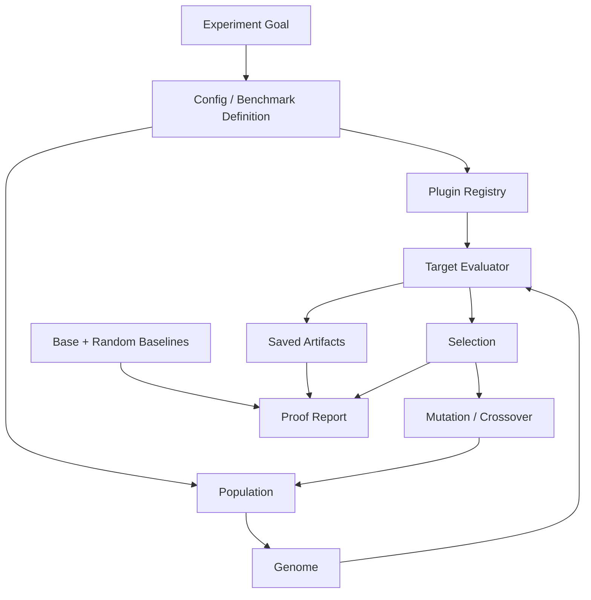

# CORAL-X Architecture And Purpose

## Short Answer

CORAL-X is a framework for testing whether evolutionary search can improve AI
system behavior without manually guessing every prompt, LoRA configuration,
training setting, or decoding policy.

For the lower-level mechanics of CA feature mapping, NEAT-style reproduction,
selection, mutation, crossover, and the current sticker script, see
`docs/evolution_mechanics.md`.

The important word is **testing**. CORAL-X is useful only when it compares
evolution against serious baselines:

- a fixed baseline
- random search with the same budget
- a held-out benchmark
- repeatable seeds and saved artifacts

If evolution cannot beat those baselines, the result is still useful: it tells
us that the search machinery is not earning its complexity for that target.

## What CORAL-X Is Trying To Prove

The core hypothesis is:

```text
Some AI behavior can be improved by treating model-adjacent choices as genomes,
evaluating them on a benchmark, and evolving the best candidates over time.
```

Those model-adjacent choices can include:

- prompt text
- few-shot examples
- decoding settings
- LoRA rank, alpha, dropout, target modules, and learning rate
- training duration and dataset sampling
- ComfyUI workflow parameters
- sampler, CFG, steps, LoRA strength, and seed policy

CORAL-X is not trying to prove that evolution always works. It is trying to
separate three cases:

```text
evolution beats base and random    => useful search signal
evolution beats base only          => maybe prompt/config tuning, not enough
evolution fails to beat random     => evolutionary machinery is not justified
```

That distinction matters. A model can look better after tuning because we spent
more attempts, not because evolution was the right algorithm.

## Why This Can Be Helpful

Manual tuning is usually informal search. A person tries prompts, model knobs,
LoRA configs, and seeds until something looks good. That can produce good
artifacts, but it is hard to prove what worked.

CORAL-X makes the search explicit:

1. Define the search space.
2. Generate a population of candidates.
3. Evaluate every candidate the same way.
4. Save every prompt, seed, config, output, and score.
5. Keep the best candidates.
6. Mutate or cross candidates into the next generation.
7. Compare against fixed and random baselines.
8. Evaluate the selected winner on held-out data.

The value is not just better outputs. The value is a repeatable answer to:

```text
Did structured evolutionary search help, or did we just get lucky?
```

## What CORAL-X Is Not

CORAL-X is not a replacement for a benchmark.

If the benchmark is weak, CORAL-X can optimize the wrong thing. The current
sticker benchmark is a good example: it can reward outline, centering, and plain
background, but it does not yet fully understand whether the generated object is
semantically correct or whether the background is commercially usable.

CORAL-X is also not a guarantee that LoRA training helps. The GSM8K LoRA run
showed the opposite: the base math model was already strong, and LoRA training
damaged exact-answer accuracy. That was a valuable negative result because it
redirected the project toward prompt and behavior evolution.

## System Architecture



## Core Components

### Core

`core/` contains the target-independent machinery:

- config loading
- genome objects
- cellular automata feature extraction
- LoRA-shaped candidate mapping
- population creation
- evolutionary orchestration
- mutation and crossover
- tournament and Pareto selection
- structural cache keys
- progress and JSONL artifact logging

The core should not know about GSM8K, ComfyUI, stickers, QuixBugs, or any
specific model. It should only know how to evolve and evaluate candidates
through protocols.

### Plugins

`plugins/` contains target-specific experiments.

A plugin owns:

- dataset loading
- model setup
- prompt formatting
- training or inference
- target-specific metrics
- conversion of metrics into fitness scores

Examples:

- `ca_onemax`: controlled evolutionary benchmark with no model
- `gsm8k_lora`: LoRA training for math reasoning
- `gsm8k_prompt_evolution`: prompt and decoding evolution for GSM8K
- `quixbugs_*`: code repair targets

### Scripts

`scripts/` currently contains practical local workflows that are useful before
they are promoted into full plugins.

For the sticker work:

- `scripts/sticker_lora_comfy.py` builds the dataset and Comfy workflow
- `scripts/sticker_lora_evolve.py` evolves Comfy generation behavior

This is the right place for fast iteration. Once the shape is stable, the
sticker target can become a formal CORAL-X plugin.

### Artifacts

Artifacts are central to the project. A run is not credible if we cannot inspect
what happened.

Useful run artifacts include:

- candidate genome/config
- prompt text
- LoRA name and strength
- sampler, CFG, steps, seed
- generated output path
- per-subject scores
- average candidate score
- best candidate JSON
- final report JSON
- image sheets for visual review

For long runs, every candidate should be written as soon as it completes so the
run can be resumed or audited.

## Genome Types

CORAL-X can evolve different genome shapes depending on the target.

### LoRA Genome

Used for training/search over adapter settings:

```text
rank
alpha
dropout
target_modules
learning_rate
training_steps
dataset slice
seed
```

This is expensive because each candidate may require training.

### Prompt Genome

Used for behavior search without changing weights:

```text
system prompt
reasoning instruction
answer format instruction
few-shot examples
temperature
top_p
max_new_tokens
self-consistency count
```

This is cheaper and often a better first move when the base model is already
strong.

### Comfy Sticker Genome

Used for image generation behavior around an existing LoRA:

```text
lora_name
strength_model
strength_clip
prompt_template
negative_prompt
cfg
steps
sampler
scheduler
seed_offset
```

This does not currently retrain LoRA weights. It evolves the generation recipe
around trained LoRAs.

## Benchmark Strategy

CORAL-X should always distinguish three data roles:

```text
train/evolution: candidates are created and improved here
dev/selection:   winners are selected here
test/final:      used only after the run design is fixed
```

The test split should not be used repeatedly during tuning. Otherwise the
project becomes manual overfitting with extra machinery.

## Current Sticker Benchmark

The current image experiment is intentionally simple:

```text
Goal: generate clean sticker-like icons
Model: SD1.5 checkpoint in ComfyUI
Adapter: cxsticker LoRA variants
Benchmark: COCO object class names
Search: LoRA strength, prompt template, negative prompt, CFG, steps, sampler
Metric: local sticker proxy score
```

The COCO class benchmark is useful because it gives fixed object names:

```text
coco/train: 40 object names
coco/dev:   20 object names
coco/test:  20 object names
```

This makes the result less hand-picked. Instead of asking whether one prompt
looks good, we ask:

```text
Can the same evolved generation recipe produce sticker-like outputs across many
held-out object names?
```

## Current Sticker Metric

The current proxy score rewards:

- plain background
- strong outline
- centered object
- reasonable object area
- edge density near a target range
- low clutter

This is helpful for automation, but incomplete.

Known weaknesses:

- It does not fully verify object identity.
- It can reward messy line art.
- It does not robustly reject all non-plain backgrounds.
- It does not know whether an image is a commercially usable sticker.

So the current score is a first benchmark, not the final benchmark.

## What A Stronger Image Benchmark Needs

The next improvement should add at least one semantic or perceptual judge:

- CLIP similarity between generated image and object name
- object detector score for COCO classes
- background segmentation/plainness score
- image aesthetic or quality model
- human preference labels for a small fixed validation set
- VLM yes/no checklist, for example:

```text
Is there one main object?
Is the object the requested subject?
Is the image sticker-like?
Is the background plain or removable?
Is the object centered and not cropped?
```

For a serious claim, the final report should show:

```text
evolved best > fixed baseline
evolved best > random search best with same budget
evolved best holds up on coco/test
same conclusion across multiple seeds
```

## Relationship To GEPA, CA, And NEAT

GEPA-style search is useful when failures can be reflected into prompt edits.
It fits text tasks where we can store failure traces:

```text
question
reference answer
candidate answer
parse result
why it failed
revised instruction
```

CA and NEAT-style search are useful for maintaining population diversity and
evolving structured candidates over generations.

For CORAL-X, the practical comparison should be:

```text
random search
CA/NEAT-style evolution
GEPA-style reflective mutation
CA/NEAT + GEPA hybrid
```

The winner depends on the target. The framework should make that comparison
cheap and honest.

## What Counts As Success

A CORAL-X run should not be called successful because it produced a nice image
or one good score.

Minimum success criteria:

```text
held-out performance beats base/fixed baseline
held-out performance beats random search with equal budget
candidate artifacts are saved
benchmark split is fixed before the run
result repeats across multiple seeds
```

For the sticker target, a credible claim would look like:

```text
Across three seeds on COCO held-out object names, CORAL-X evolution improves
sticker score and semantic object match over fixed prompt settings and
equal-budget random search.
```

## Why Negative Results Matter

The GSM8K LoRA result was not a failure of the project. It was evidence that the
initial LoRA direction was weak for that setup:

```text
base model > evolved LoRA
random search ~= evolved LoRA
```

That tells us:

- do not spend more time blindly training LoRAs for GSM8K
- prefer prompt/decoding evolution first for strong base models
- keep random baselines mandatory
- treat held-out exact accuracy as the headline metric

This is exactly the kind of decision CORAL-X should enable.

## Near-Term Roadmap

1. Keep the COCO sticker benchmark fixed.
2. Add a random-search baseline to the sticker runner.
3. Strengthen the image score with semantic/background checks.
4. Run multi-seed COCO dev evolution.
5. Evaluate only selected winners on COCO test.
6. Promote the sticker runner into a formal `sticker_lora_comfy` plugin.
7. Add true LoRA-training evolution only after the inference benchmark shows
   useful signal.

## Bottom Line

CORAL-X is helpful if it stays disciplined.

It should not be a machine for generating impressive one-off examples. It should
be a machine for answering this question:

```text
Given a model, a search space, and a benchmark, does evolutionary search improve
behavior more reliably than fixed settings or random search?
```

If the answer is yes, CORAL-X gives us better candidates and evidence. If the
answer is no, CORAL-X prevents us from wasting time on an idea that only looked
good anecdotally.
