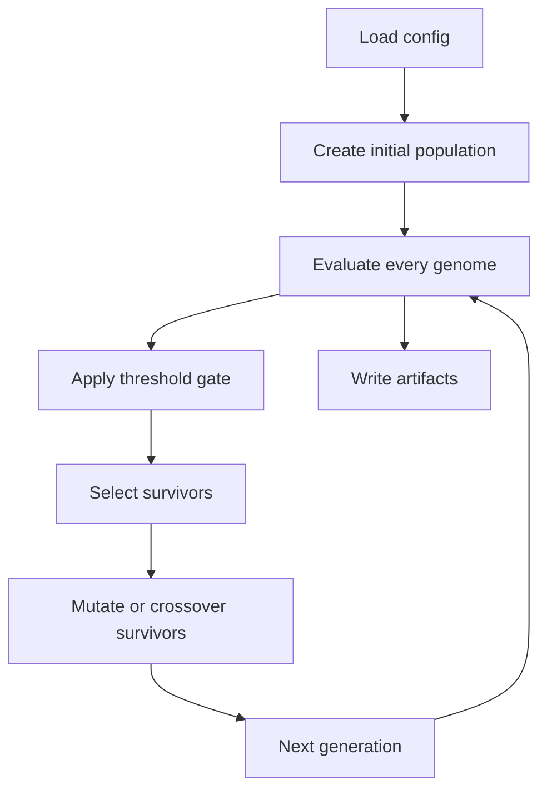
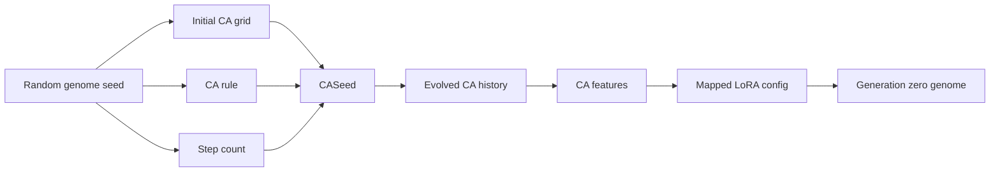
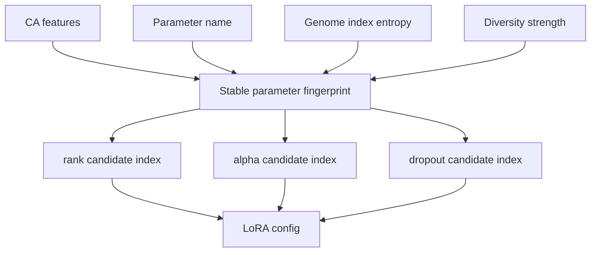
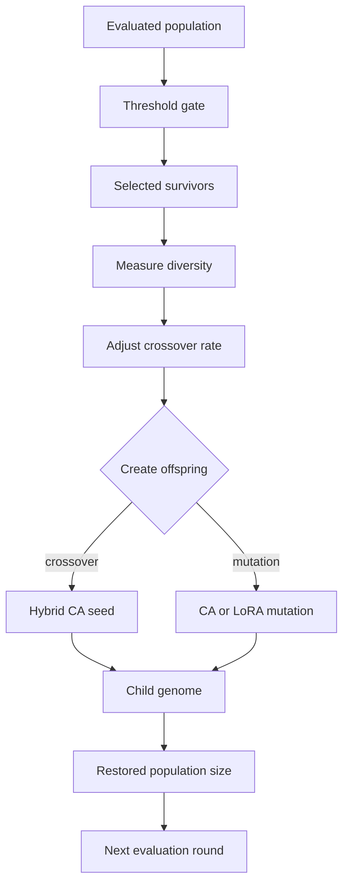
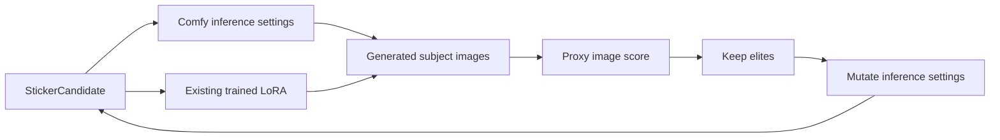
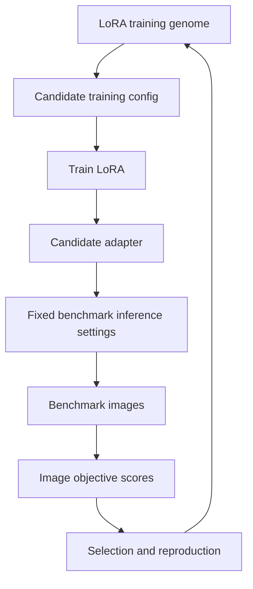

# CORAL-X Evolution Mechanics

This document explains how CORAL-X evolution works at the implementation level:
how parameters are chosen, what cellular automata contribute, what the
NEAT-style layer does, and how this differs from the current Comfy sticker
script.

## Two Evolution Paths In This Repo

There are currently two related but different paths:

```text
1. Core CORAL-X evolution
   Uses CA-seeded genomes + NEAT-style mutation/crossover.
   Lives under core/ and plugins/.

2. Sticker Comfy evolution script
   Uses a simpler direct candidate search over Comfy inference settings.
   Lives in scripts/sticker_lora_evolve.py.
```

The distinction matters.

The core path is the architectural direction for LoRA/prompt/plugin evolution.
The sticker script is a fast local experiment that validates Comfy automation,
COCO subject scoring, image sheets, and resumable artifact logging. It should
eventually be promoted into a formal plugin and connected to the core evolution
machinery.

## Core CORAL-X Evolution Loop

At a high level, core CORAL-X does this:

```text
load config
create initial population
evaluate every genome
filter by thresholds
select survivors
mutate/crossover survivors
repeat for N generations
write artifacts
```



In code, the main flow is:

```text
core.cli.main
  -> plugins.registry resolves experiment.target
  -> core.application.evolution_orchestrator.EvolutionOrchestrator
  -> core.domain.experiment.create_initial_population
  -> plugin model/dataset/fitness evaluation
  -> core.services.population_manager selection
  -> core.services.genetic_operations mutation/crossover
```

The important files are:

```text
core/domain/ca.py
core/domain/feature_extraction.py
core/domain/mapping.py
core/domain/genome.py
core/domain/neat.py
core/domain/experiment.py
core/application/evolution_orchestrator.py
core/services/population_manager.py
core/services/genetic_operations.py
core/services/pareto/selection.py
```

## Genome In The Core System

The core genome is defined in `core/domain/genome.py`.

Conceptually:

```text
Genome
  id
  CA seed
    grid
    rule
    steps
  CA features
    complexity
    intensity
    periodicity
    convergence
  LoRA config
    rank
    alpha
    dropout
    target_modules
    adapter_type
  fitness
  multi-objective scores
  metadata
  run_id
```

The CA seed is not itself the model parameter. The CA seed is a structured way
to generate diversity. CORAL-X evolves the CA seed and maps the resulting CA
behavior into candidate parameters.

## How Initial Parameters Are Chosen

Initial population creation happens in
`core/domain/experiment.py:create_initial_population()`.

For each genome index `i`:

```text
genome_seed = config.seed + i * 1000
```

That seed drives:

- Python `Random`
- NumPy random generator

Then CORAL-X samples:

```text
initial CA grid
CA rule
CA step count
```

The initial grid is sampled from:

```text
evo.ca.grid_size
evo.ca.initial_density
```

Example:

```text
grid_size: 8 x 8
initial_density: 0.5
```

That means each cell starts as active with probability `0.5`.

The CA rule is sampled from:

```text
evo.ca.rule_range
```

The CA step count is sampled from:

```text
evo.ca.steps_range
```

So generation zero is not just random LoRA configs. It is:

```text
random CA seed -> evolved CA history -> CA features -> LoRA parameter mapping
```



## Cellular Automata Layer

The CA implementation is in `core/domain/ca.py`.

A `CASeed` contains:

```text
grid: binary matrix
rule: integer rule number
steps: number of CA evolution steps
```

The CA evolves by repeatedly applying `next_step()`.

For each cell, the implementation looks at a 3x3 Moore neighborhood:

```text
top-left, top, top-right
left, center, right
bottom-left, bottom, bottom-right
```

It uses periodic boundary conditions, so edges wrap around.

The rule number is treated as a bit pattern. The implementation combines:

```text
center cell state
number of live neighbors
```

into a small rule index, then checks the corresponding bit in the rule number.

Plain English:

```text
Different CA rules create different spatial/time patterns.
Those patterns are summarized into features.
Those features are used to choose candidate params.
```

## CA Feature Extraction

Feature extraction is in `core/domain/feature_extraction.py`.

CORAL-X extracts four features:

```text
complexity
intensity
periodicity
convergence
```

### Complexity

Complexity measures how visually/informationally rich the final CA grid is.

It combines:

- Shannon entropy of the final grid
- edge density
- diversity of local 2x2 patterns
- variance

High complexity means the CA ended in a varied pattern. Low complexity means it
ended in something uniform or simple.

### Intensity

Intensity measures how much the CA changed over time.

It compares every grid to the previous grid and computes:

```text
changed cells / total cells
```

High intensity means the CA stayed active and dynamic. Low intensity means it
barely changed.

### Periodicity

Periodicity looks for repeated CA states.

The implementation hashes every grid state and checks whether states repeat at
short periods.

High periodicity means the CA entered a cycle.

### Convergence

Convergence measures whether the CA is stabilizing.

It computes the change rate at every step and fits a slope. If the change rate
is decreasing, convergence is higher.

## Mapping CA Features To LoRA Params

The mapping layer is in `core/domain/mapping.py`.

The config provides candidate sets:

```text
rank_candidates
alpha_candidates
dropout_candidates
target_modules
adapter_type
```

Example:

```yaml
evo:
  rank_candidates: [4, 8, 16]
  alpha_candidates: [4, 8, 16]
  dropout_candidates: [0.0, 0.05, 0.1]
  target_modules: ["q_proj", "v_proj"]
```

CORAL-X does not generate arbitrary rank/alpha/dropout values. It chooses from
the configured candidate sets.

For each parameter type, it builds a stable fingerprint from:

```text
CA complexity
CA intensity
CA periodicity
CA convergence
parameter name
genome index entropy
diversity strength
```

Then it maps that fingerprint into the candidate list by index.

Conceptually:

```text
candidate_index = stable_hash(CA features + param name + genome index) % len(candidates)
```



This is why two genomes with different CA histories can map to different LoRA
configs even when they use the same candidate lists.

## Why Use CA At All?

CA is a diversity generator.

Instead of sampling LoRA configs directly with plain random search, CORAL-X
creates structured latent patterns, extracts features, and uses those features
to choose parameters.

The intended benefit is:

```text
similar CA behavior -> similar candidate region
mutated CA behavior -> nearby but different candidate region
crossover CA behavior -> recombined candidate region
```

This gives the evolutionary algorithm something more structured to mutate than
a flat list of independent parameters.

That said, CA only earns its place if it beats random search. If CA-seeded
evolution does not beat equal-budget random search, then the CA layer is not
providing useful search pressure for that target.

## NEAT-Style Layer

The NEAT-style code is in `core/domain/neat.py`.

This is not a full canonical NEAT implementation for neural network topology.
It is “NEAT-style” in the practical sense:

- keep a population of genomes
- evaluate fitness
- select survivors
- mutate genomes
- cross parent genomes
- preserve diversity
- evolve over generations

In this repo, the evolved object is not a neural topology. It is a genome
containing:

```text
CA seed + mapped adapter config + scores
```

## Selection

Selection is handled by `core/services/population_manager.py`.

Supported survivor selection modes:

```text
pareto
tournament
fitness
```

### Fitness Selection

Fitness selection sorts evaluated genomes by scalar fitness and keeps the top
`k`.

### Tournament Selection

Tournament selection repeatedly samples a small group of candidates and keeps
the best candidate from each group.

In code:

```text
tournament_size = 3
winner = max(sampled_genomes, key=fitness)
```

Tournament selection can preserve more diversity than simply sorting everyone
globally.

### Pareto / NSGA-II Selection

Pareto selection is in `core/services/pareto/selection.py`.

It uses NSGA-II style selection:

1. Sort candidates into non-dominated fronts.
2. Prefer candidates in better fronts.
3. If a front only partly fits, use crowding distance to keep diverse points.

A candidate dominates another candidate if:

```text
it is at least as good on every objective
and strictly better on at least one objective
```

The current `MultiObjectiveScores` fields are:

```text
bugfix
style
security
runtime
syntax
```

Those names came from code-repair targets, but plugins can map their own
metrics into the same structure. For image work, we should eventually replace
or generalize these names so they fit image objectives directly.

## Threshold Gate

Before selection, `PopulationManager.apply_threshold_gate()` can filter
candidates that fail minimum per-objective thresholds.

This exists so a candidate cannot survive by being excellent on one objective
while completely failing another required objective.

If the threshold gate leaves too few genomes, the manager keeps the top genomes
by fitness so the run does not collapse.

## Mutation In Core CORAL-X

Mutation happens in `core/domain/neat.py:mutate()`.

There are two mutation paths:

```text
70% CA mutation
30% direct LoRA mutation
```

### CA Mutation

CA mutation changes the CA seed, then regenerates the LoRA config from the new
CA features.

It can:

- flip a grid cell
- slightly change the CA rule
- slightly change the CA step count

Then:

```text
new CA seed
  -> evolve CA
  -> extract features
  -> map features to LoRA config
  -> new genome
```

This is the more “CORAL-X” mutation path.

### Direct LoRA Mutation

Direct LoRA mutation preserves the CA seed and directly changes one or more LoRA
params:

```text
rank:   30% chance to choose a new rank candidate
alpha:  30% chance to choose a new alpha candidate
dropout: 30% chance to choose a new dropout candidate
```

It does not currently mutate target modules in this function.

## Crossover In Core CORAL-X

Crossover happens in `core/domain/neat.py:crossover()`.

Current crossover is mostly CA-level crossover:

```text
take grid from one parent
take rule/steps from the other parent
evolve the hybrid CA
extract features
map features to LoRA config
```

So the child is not simply:

```text
rank from parent A
alpha from parent B
dropout from parent A
```

There is a helper for direct LoRA config crossover, but the main crossover path
currently uses hybrid CA seeds and remaps from features.

## Reproduction

`core/services/genetic_operations.py` owns reproduction.

For each generation:

1. Start with selected survivors.
2. Fill the rest of the population with offspring.
3. For each offspring:
   - choose crossover with probability `execution.crossover_rate`
   - otherwise choose mutation
4. Continue until `execution.population_size` is restored.



The service also adjusts crossover rate based on diversity:

```text
low diversity  -> increase crossover rate
high diversity -> decrease crossover rate
```

Diversity is calculated from:

- fitness diversity
- LoRA rank diversity
- LoRA alpha diversity
- LoRA dropout diversity

## Evaluation

The orchestrator evaluates each genome through a plugin.

The core does not know how to evaluate GSM8K, code repair, fake news, or images.
It calls:

```text
model = plugin.model_factory()(genome.lora_cfg, genome)
problems = plugin.dataset().problems()
scores = plugin.fitness_fn().evaluate_multi_objective(
    genome,
    model,
    problems,
    genome.ca_features,
)
```

The plugin decides what the scores mean.

For example:

- GSM8K can score exact answer accuracy and formatting.
- Code repair can score tests passed and syntax.
- Sticker generation can score background, outline, semantic match, and layout.

The orchestrator then writes candidate data to:

```text
candidate_evaluations.jsonl
```

## What Is Cached?

The genome exposes a heavy-gene key:

```text
rank
alpha
dropout
target_modules
adapter_type
run_id
```

These are considered “heavy” because changing them may require retraining or
rebuilding an adapter.

Cheap runtime knobs, such as temperature or prompt decoding settings, should not
reuse the same cache identity if they affect evaluation. Some plugins therefore
add their own plugin-specific cache key that includes dataset and evaluation
settings.

For LoRA-training targets, a proper cache key should include at least:

```text
base model
rank
alpha
dropout
target modules
learning rate
steps
dataset fingerprint
caption strategy
seed
```

## Current Sticker Script Mechanics

The current sticker script is `scripts/sticker_lora_evolve.py`.

It does **not** use the core CA/NEAT implementation yet.

It evolves a simpler `StickerCandidate`:

```text
candidate_id
lora_name
strength_model
strength_clip
cfg
steps
prompt_template_id
negative_prompt_id
sampler_name
scheduler
seed_offset
```



This is inference-setting evolution around already-trained LoRAs.

It does not evolve:

```text
LoRA weights
rank
alpha
training steps
learning rate
optimizer
captioning
dataset repeats
```

## How Sticker Initial Params Are Chosen

The first four candidates are handwritten seed candidates:

```text
g0_c00: cxsticker_v1, strength 0.35/0.30, CFG 8.0, 32 steps, template 0, negative 0
g0_c01: cxsticker_v1, strength 0.45/0.35, CFG 7.5, 28 steps, template 1, negative 0
g0_c02: cxsticker_v2, strength 0.55/0.45, CFG 8.0, 32 steps, template 0, negative 0
g0_c03: cxsticker_v2, strength 0.45/0.35, CFG 7.0, 28 steps, template 2, negative 1
```

If the requested population is larger than four, the rest are random candidates.

Random candidates choose:

```text
lora_name:        cxsticker_v1 or cxsticker_v2
strength_model:   uniform 0.25 to 0.75
strength_clip:    uniform 0.20 to 0.60
cfg:              uniform 6.0 to 9.0
steps:            one of 20, 24, 28, 32, 36
prompt_template:  random template id
negative_prompt:  random negative id
sampler:          euler
scheduler:        normal or karras
seed_offset:      random integer
```

## How Sticker Candidates Are Evaluated

For each candidate, the script evaluates a fixed list of subjects.

With COCO dev, subjects are object names like:

```text
wine glass
cup
fork
knife
spoon
...
```

For every subject:

1. Load the Comfy API workflow.
2. Insert candidate params into the workflow.
3. Format the prompt template with the subject.
4. Post the workflow to Comfy `/prompt`.
5. Poll Comfy `/history/{prompt_id}` until the image is done.
6. Compute proxy image metrics.
7. Save the result row.

The image seed is:

```text
880000 + candidate.seed_offset + subject_index
```

So a candidate uses deterministic but different seeds per subject.

## Sticker Proxy Score

The current score is a local image heuristic.

It rewards:

```text
plain border/background
dark outline fraction near a target
edge density near a target
centered subject mass
reasonable subject area
low clutter
```

The weighted score is:

```text
0.24 * background
+ 0.22 * outline
+ 0.22 * edge
+ 0.22 * center
+ 0.10 * area
- 0.20 * clutter_penalty
```

This score is useful for automation, but it is not enough for a strong claim.
It does not fully check:

- whether the object is semantically correct
- whether the background is truly removable
- whether the image is commercially useful
- whether the object is aesthetically good

## How Sticker Mutation Works

After each generation, the script ranks candidates by average score.

It keeps:

```text
max(2, population_size // 3)
```

as elites.

Then it fills the next population with:

```text
random immigrants with probability --random-immigrant-rate
otherwise mutated copies of elites
```

Default random immigrant rate:

```text
0.25
```

Mutation changes:

```text
strength_model: +/- 0.12, clamped to 0.15..0.85
strength_clip:  +/- 0.10, clamped to 0.10..0.70
cfg:            +/- 0.8,  clamped to 4.5..10.5
steps:          35% chance to resample
prompt_template:30% chance to resample
negative_prompt:25% chance to resample
scheduler:      20% chance to resample
lora_name:      15% chance to resample
seed_offset:    always resampled
```

There is no crossover in the current sticker script.

## What The Current Sticker Run Is Actually Proving

The current sticker run answers:

```text
Can evolutionary search find better Comfy inference settings for existing
sticker LoRAs across fixed COCO object prompts?
```

It does not answer:

```text
Can evolutionary search train a better LoRA?
```

For true LoRA evolution, the genome must become a training genome.

## What True Sticker LoRA Evolution Should Look Like

A proper LoRA-training genome should include:

```text
network_dim / rank
network_alpha
learning_rate
unet_lr
text_encoder_lr
train_unet_only
train_text_encoder
max_train_steps
caption template
dataset repeats
optimizer
lr_scheduler
resolution
seed
trigger token
```

Then each candidate evaluation is:

```text
create candidate training config
train LoRA
copy LoRA into Comfy
generate benchmark images with fixed inference settings
score images
write artifacts
```



For that experiment, inference settings should be mostly fixed. Otherwise we
cannot tell whether improvement came from better LoRA training or just better
prompt/CFG choices.

## Correct Experimental Stack For Stickers

A disciplined sticker experiment should compare:

```text
fixed LoRA training config
random LoRA training configs with same budget
CA/NEAT LoRA training evolution
inference-only evolution baseline
```

The final report should separate:

```text
training improvement
inference-setting improvement
random-search improvement
held-out test performance
```

This prevents us from claiming “evolved LoRA” when we only evolved Comfy
settings.

## Summary

Core CORAL-X:

```text
CA seed -> CA history -> CA features -> mapped params -> evaluation -> selection
-> CA/LoRA mutation or CA crossover -> next generation
```

Current sticker script:

```text
direct Comfy settings -> generate COCO subject images -> proxy score -> keep
best settings -> mutate settings -> next generation
```

Both are evolutionary search, but they are not the same experiment. The core
CA/NEAT path is the framework we should use for true LoRA-training evolution.
The sticker script is a useful stepping stone and baseline, not the final claim.
