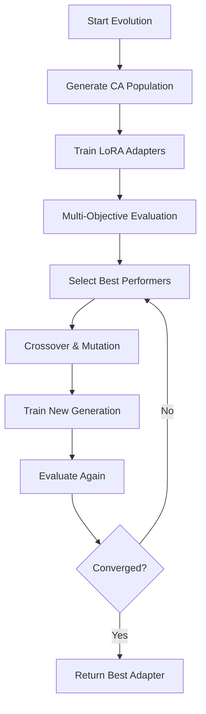

# Getting Started with CORAL-X

## Installation

```bash
# Clone repository
git clone <repository-url>
cd coralx

# Install dependencies
pip install -r requirements.txt

# Verify installation
python core/cli/main.py --help
```

## Your First Evolution Run

### 1. Check Available Configs

```bash
ls config/
# tinyllama_local.yaml     - Fake news detection (Mac-friendly)
# codellama_local.yaml   - Code generation (if available)
# quick_test.yaml        - Fast verification run
```

### 2. Run Local Evolution

```bash
# Start evolution (will download model if needed)
python core/cli/main.py run --config config/tinyllama_local.yaml

# Monitor progress in another terminal
tail -f runs/current/evolution_progress.json
```

### 3. What Happens During Evolution



You'll see logs showing:
- Cellular automata generating initial population
- LoRA training for each genome (takes 10-20 minutes each)
- Multi-objective scores for each adapter
- Selection and mutation creating new generation

### 4. Understanding the Output

Evolution produces multiple metrics per adapter:

```bash
📊 Fake News Detection Results for gen0_genome0000:
   P1 Detection Accuracy: 0.600    # Primary task performance
   P2 Fake News Recall: 0.000      # How well it catches fake news
   P3 Real News Precision: 1.000   # Avoids false positives
   P4 Cross-Source Robustness: 0.840  # Generalizes across sources
   P5 Confidence Calibration: 0.500   # Uncertainty quality
   P6 Efficiency Score: 0.954       # Inference speed
```

## Common Use Cases

### Fake News Detection

```bash
# Run the example
python -m coral.cli.main run --config config/tinyllama_local.yaml

# Check results
ls cache/adapter_*/  # Trained adapters
cat runs/current/evolution_progress.json  # Progress metrics
```

### Custom Dataset

1. Add your dataset to `datasets/my_data/`
2. Create config file:

```yaml
experiment:
  dataset:
    path: "./datasets/my_data"
    datasets: ["my_data"]
    max_samples: 100
    
evaluation:
  test_samples: 20
  # Define what success looks like for your task
```

### Different Model

```yaml
experiment:
  model:
    name: "microsoft/DialoGPT-medium"  # Your model
    max_seq_length: 512
    
cache:
  base_checkpoint: "microsoft/DialoGPT-medium"
```

## Monitoring Your Run

### Real-Time Progress

```bash
# Evolution status
python -m coral.cli.main status

# Detailed logs  
tail -f logs/*.log

# Progress JSON
watch -n 5 'cat runs/current/evolution_progress.json | jq .progress_percent'
```

### Understanding Progress

The `evolution_progress.json` file shows:

```json
{
  "status": "evolving",
  "current_generation": 2,
  "max_generations": 5,
  "population_size": 8,
  "best_fitness": 0.782,
  "cache_stats": {
    "hit_rate": 0.65,        // 65% cache hits = faster training
    "total_adapters": 12
  },
  "training_stats": {
    "adapters_trained": 4,   // New adapters this generation  
    "training_rate": 0.5     // Training throughput
  }
}
```

## Configuration Tips

### Local Development

```yaml
# Start small for testing
execution:
  generations: 2
  population_size: 4
  
training:
  max_steps: 20          # Quick verification
  batch_size: 2          # Memory-friendly
```

### Production Runs

```yaml
# Scale up for real results  
execution:
  generations: 10
  population_size: 16
  
training:
  max_steps: 200         # Thorough training
  batch_size: 8          # Better utilization
```

### Mac Compatibility

```yaml
training:
  torch_dtype: "float16"    # NOT bfloat16
  max_grad_norm: 1.0        # Prevent NaN gradients
  learning_rate: 1e-4       # Conservative rate
```

## Troubleshooting

### Common Issues

**Model won't load**: Check HuggingFace token and model access
```bash
export HF_TOKEN="your_token_here"
```

**Out of memory**: Reduce batch size or use gradient accumulation
```yaml
training:
  batch_size: 1
  gradient_accumulation_steps: 8  # Effective batch = 8
```

**NaN gradients**: Lower learning rate and enable gradient clipping
```yaml
training:
  learning_rate: 5e-5
  max_grad_norm: 1.0
```

### Getting Help

Check the logs first:
```bash
# Recent errors
grep ERROR logs/*.log

# Training progress
grep "loss:" logs/*.log

# Cache efficiency  
grep "CACHE" logs/*.log
```

## Next Steps

Once you have a successful local run:

1. **Scale up**: Increase population size and generations
2. **Try Modal**: Deploy to cloud for distributed training
3. **Custom tasks**: Adapt the plugin system for your models
4. **Monitor production**: Set up continuous evolution on real workloads

The system is designed to grow with your needs - start simple, scale when you need it.