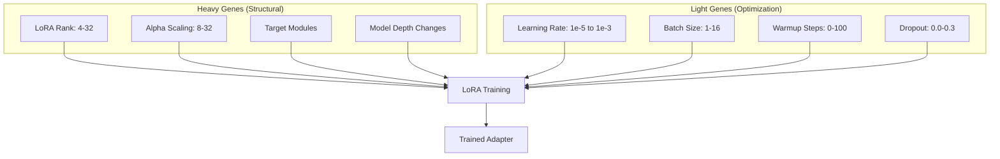
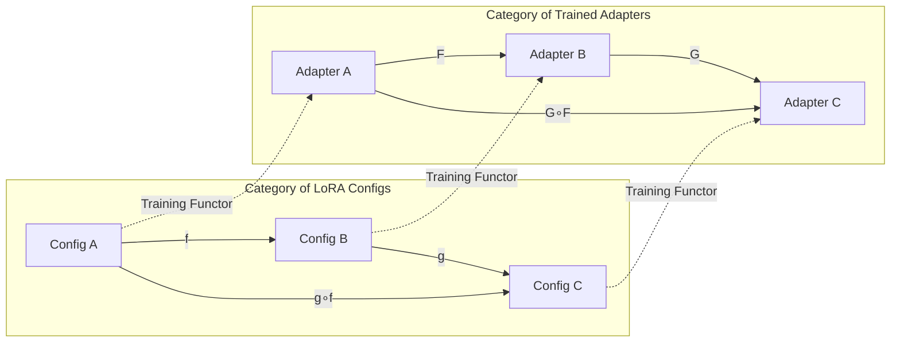
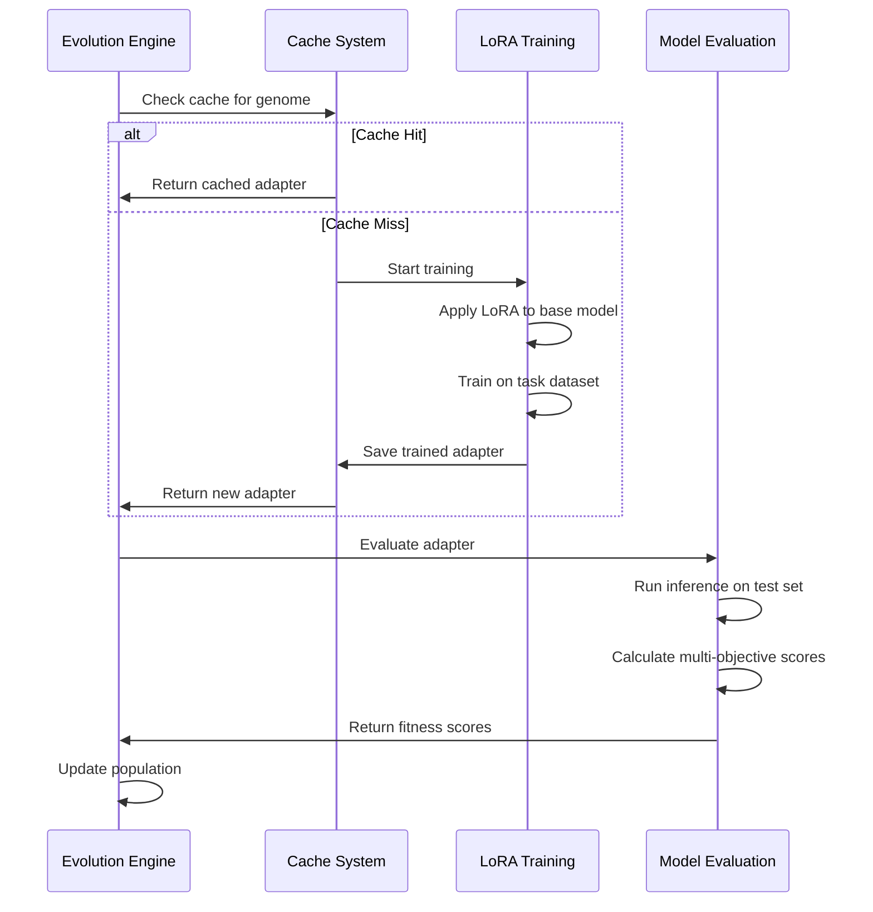

# Technical Deep Dive: Cellular Automata & Category Theory in CORAL-X

**Research Context**: This document describes the theoretical foundations and implementation details of CORAL-X, an experimental system investigating evolutionary approaches to LoRA hyperparameter optimization. The techniques described here represent novel applications of established concepts from evolutionary computation, cellular automata, and category theory to the domain of neural network adapter configuration.

## NEAT + Cellular Automata

CORAL-X combines NEAT (NeuroEvolution of Augmenting Topologies) with cellular automata for a unique approach to LoRA optimization. While traditional NEAT evolves neural network topologies, we adapt it to evolve LoRA parameter configurations.

### Why NEAT for LoRA Evolution?

NEAT's key insight is that structure should evolve gradually, starting simple and complexifying over time. For LoRA adapters:

- **Species Protection**: Different LoRA architectures (ranks, module targets) form species
- **Historical Markings**: Track which parameter combinations have been successful
- **Complexification**: Start with simple configs, gradually explore higher ranks/more modules
- **Innovation Numbers**: Ensure genetic diversity in parameter space

## The Problem with Random Initialization

Most evolutionary algorithms start with random populations. For LoRA parameters, this means:
- Random rank/alpha combinations that might be incompatible
- No structure in the search space 
- Poor initial diversity leads to premature convergence
- Evolution wastes time exploring obviously bad configurations

## Cellular Automata for Structured Diversity

Instead of random initialization, we use cellular automata to generate structured patterns that map to LoRA parameters. This gives us diverse but meaningful starting configurations.

### How CA Rules Work

```python
def generate_lora_genome(ca_rule: int, steps: int, grid_size: tuple) -> Genome:
    # Start with random grid
    grid = initialize_random_grid(grid_size, density=0.3)
    
    # Evolve according to CA rule
    for _ in range(steps):
        grid = apply_ca_rule(grid, ca_rule)
    
    # Extract meaningful features
    features = analyze_grid_patterns(grid)
    
    # Map to LoRA parameters
    return Genome(
        heavy_genes=HeavyGenes(
            rank=map_complexity_to_rank(features.complexity),
            alpha=map_density_to_alpha(features.density),
            target_modules=select_modules(features.symmetry)
        ),
        light_genes=LightGenes(
            learning_rate=map_entropy_to_lr(features.entropy),
            dropout=map_sparsity_to_dropout(features.sparsity)
        )
    )
```

### Why This Works

1. **Structured Exploration**: CA rules create patterns with internal logic
2. **Diversity Preservation**: Different rules produce qualitatively different patterns
3. **Scalable**: Can generate thousands of unique configurations from rule space
4. **Reproducible**: Same seed + rule always produces same configuration

## Heavy vs Light Gene Architecture

The two-stage gene system separates concerns for more efficient evolution:



### Heavy Genes (Low Mutation Rate)
These fundamentally change the model's capacity and architecture:

- **LoRA Rank**: Determines adapter expressiveness (4 = lightweight, 32 = high capacity)
- **Alpha Scaling**: Controls adaptation strength vs base model preservation  
- **Target Modules**: Which transformer layers get LoRA adapters
- **Architecture Choices**: Model-specific structural decisions

Heavy genes change slowly because structural mutations are usually harmful.

### Light Genes (High Mutation Rate)
These tune the training dynamics without changing model structure:

- **Learning Rate**: How aggressively to update during training
- **Batch Size**: Training efficiency vs memory usage
- **Warmup Schedule**: Gradient scaling during initial training
- **Dropout Rates**: Regularization strength

Light genes can mutate frequently since they're easier to recover from.

### NEAT Evolution Strategy

CORAL-X adapts NEAT's principles for LoRA parameter evolution:

```python
def neat_evolve_population(population):
    # 1. Species formation based on LoRA architecture similarity
    species = form_species(population, compatibility_threshold=0.3)
    
    # 2. Species-level fitness sharing
    for species in species_list:
        shared_fitness = adjust_fitness_sharing(species)
    
    # 3. Reproduction within and across species
    offspring = []
    for species in species_list:
        species_offspring = reproduce_species(species)
        offspring.extend(species_offspring)
    
    # 4. Historical marking for innovation tracking
    for child in offspring:
        assign_innovation_numbers(child)
    
    return offspring

def reproduce_species(species):
    """NEAT reproduction with LoRA-specific crossover."""
    if len(species) >= 2 and random() < crossover_rate:
        # Crossover: blend compatible LoRA structures
        parent1, parent2 = select_parents(species) 
        child = crossover_lora_configs(parent1, parent2)
    else:
        # Mutation: modify existing LoRA parameters
        parent = select_parent(species)
        child = mutate_lora_config(parent)
    
    return child
```

### Species Formation for LoRA Configs

```python
def compatibility_distance(genome1: Genome, genome2: Genome) -> float:
    """Calculate compatibility distance between LoRA configurations."""
    # Structural differences (heavy genes)
    rank_diff = abs(genome1.heavy_genes.rank - genome2.heavy_genes.rank) / 32
    module_diff = jaccard_distance(
        genome1.heavy_genes.target_modules, 
        genome2.heavy_genes.target_modules
    )
    
    # Optimization differences (light genes) 
    lr_diff = abs(genome1.light_genes.learning_rate - genome2.light_genes.learning_rate)
    dropout_diff = abs(genome1.light_genes.dropout - genome2.light_genes.dropout)
    
    # NEAT compatibility formula adapted for LoRA
    c1, c2, c3 = 1.0, 1.0, 0.4  # NEAT compatibility coefficients
    return c1 * rank_diff + c2 * module_diff + c3 * (lr_diff + dropout_diff)
```

## Category Theory Cache System

We use category theory to build a principled caching system that avoids redundant training while ensuring mathematical correctness.

### The Basic Insight

LoRA adapters can be composed and reused if we preserve their mathematical relationships. Category theory provides the framework for tracking these relationships.



### Categorical Hash Function

```python
def categorical_hash(genome: Genome) -> str:
    """
    Generate hash that respects categorical structure.
    
    If genome1 ~= genome2 in the parameter category,
    then hash(genome1) == hash(genome2)
    """
    # Heavy genes form the object identity
    heavy_sig = (
        genome.heavy_genes.rank,
        genome.heavy_genes.alpha,
        tuple(sorted(genome.heavy_genes.target_modules))
    )
    
    # Light genes form morphisms (transformations)
    light_sig = normalize_light_genes(genome.light_genes)
    
    # Categorical product
    return hashlib.sha256(
        str(heavy_sig + light_sig).encode()
    ).hexdigest()[:16]
```

### Functor Properties

The training process is functorial - it preserves the relationships between configurations:

1. **Identity**: Training the identity configuration gives the base model
2. **Composition**: Training (config1 ∘ config2) = train(config1) ∘ train(config2)  
3. **Associativity**: (A ∘ B) ∘ C = A ∘ (B ∘ C)

This lets us safely reuse adapters and compose them in new contexts.

### Cache Lookup Strategy

```python
def get_or_train_adapter(genome: Genome) -> LoRAAdapter:
    # Check exact match first
    cache_key = categorical_hash(genome)
    if cache.exists(cache_key):
        return cache.load(cache_key)
    
    # Check for compositional matches
    for cached_genome in cache.list_compatible(genome):
        if can_compose(cached_genome, genome):
            base_adapter = cache.load(categorical_hash(cached_genome))
            return compose_adapters(base_adapter, genome.light_genes)
    
    # No match - train from scratch
    return train_new_adapter(genome)
```

## Multi-Objective Fitness Evaluation

We evaluate each LoRA adapter across multiple dimensions to capture real-world performance trade-offs.

### Objective Design (Fake News Detection)

```python
@dataclass
class FakeNewsObjectives:
    detection_accuracy: float    # Primary task performance
    fake_news_recall: float     # Catch misinformation (critical)
    real_news_precision: float  # Avoid false positives  
    cross_source_robustness: float  # Generalization across sources
    confidence_calibration: float   # Uncertainty quantification
    efficiency_score: float     # Inference speed

def evaluate_genome(genome: Genome, dataset: Dataset) -> FakeNewsObjectives:
    adapter = get_or_train_adapter(genome)
    model = load_model_with_adapter(adapter)
    
    results = []
    for sample in dataset.test_samples:
        pred = model.predict(sample.text)
        results.append({
            'prediction': pred.label,
            'confidence': pred.confidence,
            'actual': sample.label,
            'source': sample.source,
            'inference_time': pred.timing
        })
    
    return FakeNewsObjectives(
        detection_accuracy=calculate_accuracy(results),
        fake_news_recall=calculate_recall(results, label='fake'),
        real_news_precision=calculate_precision(results, label='real'), 
        cross_source_robustness=calculate_cross_source_robustness(results),
        confidence_calibration=calculate_calibration(results),
        efficiency_score=calculate_efficiency(results)
    )
```

### NSGA-II Selection

We use NSGA-II for multi-objective selection, which maintains a diverse set of non-dominated solutions rather than converging to a single optimum.

```python
def select_survivors(population: List[Genome], scores: List[Objectives]) -> List[Genome]:
    # Calculate Pareto fronts
    fronts = calculate_pareto_fronts(scores)
    
    # Calculate crowding distance within each front
    for front in fronts:
        distances = calculate_crowding_distance(front)
        front.sort(key=lambda x: distances[x], reverse=True)
    
    # Select survivors from best fronts
    survivors = []
    for front in fronts:
        if len(survivors) + len(front) <= target_size:
            survivors.extend(front)
        else:
            # Fill remaining slots with most diverse from current front
            remaining = target_size - len(survivors)
            survivors.extend(front[:remaining])
            break
    
    return survivors
```

## Training Pipeline Integration

The evolution system integrates tightly with the LoRA training pipeline to ensure we're optimizing real performance, not proxy metrics.

### Training Process



### Error Recovery

Training can fail for various reasons (OOM, divergent loss, model loading issues). The system handles this gracefully:

```python
def robust_training(genome: Genome, max_retries: int = 3) -> LoRAAdapter:
    for attempt in range(max_retries):
        try:
            return train_lora_adapter(genome)
        except OutOfMemoryError:
            # Reduce batch size and retry
            genome = genome.with_reduced_memory_footprint()
        except ConvergenceError:
            # Adjust learning rate and retry  
            genome = genome.with_conservative_training()
        except Exception as e:
            if attempt == max_retries - 1:
                # Final attempt failed
                return fallback_adapter(genome)
            logger.warning(f"Training attempt {attempt+1} failed: {e}")
```


## Configuration Best Practices

### Local Development
```yaml
execution:
  generations: 2
  population_size: 4
  
training:
  max_steps: 50        # Quick verification
  batch_size: 2        # Memory-friendly
```

### Production Runs
```yaml
execution:
  generations: 20
  population_size: 32
  
training:
  max_steps: 1000      # Thorough training
  batch_size: 16       # Full utilization
```

### Mac MPS Compatibility
```yaml
training:
  torch_dtype: "float16"  # Not bfloat16
  device_map: "auto"      # Let transformers handle device placement
  max_grad_norm: 1.0      # Prevent gradient explosion
```

## Debugging Guide

### Common Issues

**NaN Gradients**: Usually caused by learning rate too high or missing gradient clipping
```yaml
training:
  learning_rate: 1e-5   # Conservative
  max_grad_norm: 1.0    # Essential
```

**Memory Errors**: Reduce batch size or use gradient accumulation
```yaml 
training:
  batch_size: 1
  gradient_accumulation_steps: 8  # Effective batch size = 8
```

**Poor Evolution Progress**: Check diversity and selection pressure
```yaml
diversity:
  mode: "adaptive"
  base_strength: 1.5    # Higher diversity

threshold:
  schedule: "sigmoid"   # Gradual pressure increase
```

### Performance Monitoring

The system logs comprehensive metrics:
- Training loss curves for each adapter
- Population diversity over generations
- Cache hit rates and training efficiency  
- Multi-objective score distributions
- Genetic operation statistics (crossover/mutation rates)

Check `runs/{run_id}/evolution_progress.json` for real-time metrics.

## Future Extensions

The architecture supports several natural improvements:

### Hierarchical Search
- Coarse-grained exploration with large populations
- Fine-grained local search around promising regions
- Multi-scale cellular automata for different levels of abstraction

### Transfer Learning
- Warm-start evolution with adapters from related tasks
- Cross-task knowledge transfer through categorical mappings
- Progressive complexity increase (curriculum evolution)

### Online Adaptation  
- Real-time fitness evaluation on live data streams
- Dynamic objective weighting based on deployment metrics
- Continuous evolution in production environments

The service-oriented architecture makes these extensions straightforward without major refactoring.