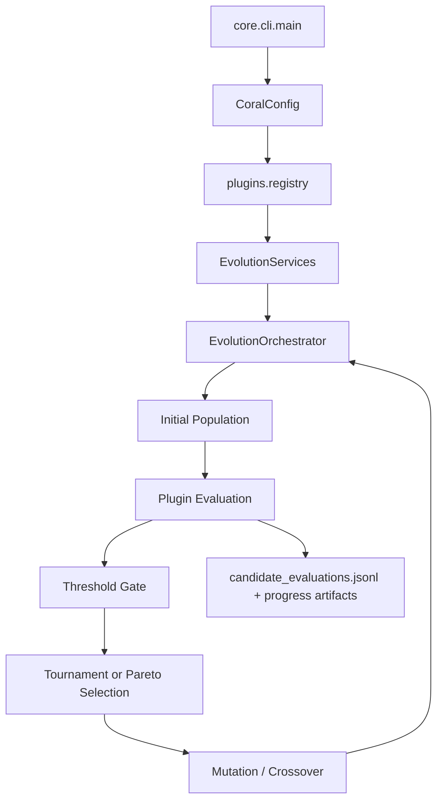

# Technical Deep Dive

CORAL-X runs an evolutionary loop over LoRA-shaped adapter configurations. The core system is local and protocol-driven: configuration selects an experiment target, the plugin registry supplies the target-specific dataset/model/fitness implementation, and the orchestrator evaluates and reproduces genomes across generations.


```mermaid
flowchart TD
    CLI["core.cli.main"]
    Config["CoralConfig"]
    Registry["plugins.registry"]
    Services["EvolutionServices"]
    Orchestrator["EvolutionOrchestrator"]
    Population["Initial Population"]
    Eval["Plugin Evaluation"]
    Thresholds["Threshold Gate"]
    Selection["Tournament or Pareto Selection"]
    GeneticOps["Mutation / Crossover"]
    Artifacts["candidate_evaluations.jsonl + progress artifacts"]

    CLI --> Config
    Config --> Registry
    Registry --> Services
    Services --> Orchestrator
    Orchestrator --> Population
    Population --> Eval
    Eval --> Thresholds
    Thresholds --> Selection
    Selection --> GeneticOps
    GeneticOps --> Orchestrator
    Eval --> Artifacts
```

## Configuration Model

Configuration is loaded through `core.common.config_loader.load_config()` and validated by `core.common.config.CoralConfig`. The important sections are:

- `seed`: root seed for deterministic local population creation and service RNGs.
- `execution`: generation count, population size, output directory, selection mode, survival rate, and crossover rate.
- `evo`: CA ranges and LoRA candidate sets.
- `experiment`: plugin target, dataset settings, model settings, and target-specific evaluation settings.
- `training`: optimizer settings used by plugins that train adapters.
- `evaluation`: objective weights and test sample counts.
- `infra`: executor selection. The current executor type is `local`.
- `cache`: artifact directory, base checkpoint identity, cleanup threshold, and optional run id.
- `threshold`: per-objective threshold schedule used after evaluation.

The CLI exposes two commands:

- `run`: validates config, resolves the plugin, and runs evolution.
- `prove`: runs the GSM8K LoRA target with evolution plus base, fixed-LoRA, and random-control evaluations.

`--dry-run` executes config loading, plugin resolution, artifact path validation, and deterministic population creation without model evaluation.

## Domain Model

The central domain object is `core.domain.genome.Genome`:

- `seed`: a `CASeed` containing the CA grid, rule, and number of steps.
- `lora_cfg`: a LoRA-shaped config with rank, alpha, dropout, target modules, and adapter type.
- `ca_features`: extracted CA features reused by plugins and cheap-knob mapping.
- `fitness`: scalar fitness used by tournament and simple fitness selection.
- `multi_scores`: vector fitness with `bugfix`, `style`, `security`, `runtime`, and `syntax`.
- `run_id`: optional experiment isolation id included in heavy-gene identity.

`MultiObjectiveScores.overall_fitness()` converts the five objective scores into a scalar. Pareto selection uses the vector directly; tournament selection uses the scalar.

## Population Creation

`core.domain.experiment.create_initial_population()` builds generation zero from config and seed. For genome index `i`, it derives a separate random state from:

```text
genome_seed = config.seed + i * 1000
```

That seed drives both Python's `Random` and NumPy's generator. Each genome receives:

- an id like `gen0_genome0000`
- a binary CA grid sampled from `evo.ca.initial_density`
- a CA rule sampled from `evo.ca.rule_range`
- a step count sampled from `evo.ca.steps_range`
- CA history from `core.domain.ca.evolve()`
- features from `core.domain.feature_extraction.extract_features()`
- a LoRA config from `core.domain.mapping.map_features_to_lora_config()`

The implementation avoids Python's salted `hash()` in evolution-critical paths. Structural identity and feature-derived entropy use `core.domain.stable_hash`.

## CA Feature Extraction

`extract_features()` summarizes a CA history into four values:

| Feature | Implementation Signal |
| --- | --- |
| `complexity` | Entropy of the final grid combined with spatial complexity. Spatial complexity uses edge density, local 2x2 pattern diversity, and variance. |
| `intensity` | Average cell-change rate across consecutive CA states. |
| `periodicity` | Repeated grid-state hashes across short periods in the history. |
| `convergence` | Downward slope of change rate over time. |

These features are deliberately compact. They give the mapping layer enough signal to place genomes into different adapter configurations without making plugins depend on full CA histories.

## Feature To Adapter Mapping

`core.domain.mapping.map_features_to_lora_config()` maps CA features onto configured candidate sets:

- `rank_candidates`
- `alpha_candidates`
- `dropout_candidates`
- `target_modules`
- `adapter_type`

The mapping combines CA features, parameter name, diversity strength, and genome index into a stable integer fingerprint. That fingerprint indexes into each candidate set. The genome index is extra entropy, so two similar CA histories can still map to different adapter choices when the population needs diversity.

Heavy genes are the structural adapter fields:

```text
rank, alpha, dropout, target_modules, adapter_type, run_id
```

Cheap knobs are runtime generation settings such as temperature, top-p, top-k, repetition penalty, and max tokens. They are mapped separately where a plugin supports them, so generation behavior can vary without changing the heavy-gene cache key.

## Evolution Loop

`core.application.evolution_orchestrator.EvolutionOrchestrator.run_evolution()` owns the main lifecycle:

1. Validate generations, population size, executor, plugin dataset, model factory, and fitness function.
2. Create the initial population from CA seeds.
3. For each generation, evaluate unevaluated genomes.
4. Apply the threshold gate to multi-objective scores.
5. Record generation progress and candidate-level JSONL rows.
6. Select survivors.
7. Reproduce through mutation or crossover until the next generation reaches the configured population size.
8. Return the final population, best genome, generation count, elapsed time, and status.

Evaluation is plugin-driven. For each genome, the orchestrator calls:

```text
model = plugin.model_factory()(genome.lora_cfg, genome)
problems = list(plugin.dataset().problems())
scores = plugin.fitness_fn().evaluate_multi_objective(genome, model, problems, genome.ca_features)
```

If the model runner exposes `last_metrics`, the orchestrator serializes those metrics into the genome metadata and into `candidate_evaluations.jsonl`.

## Threshold Gate

After evaluation, `PopulationManager.apply_threshold_gate()` computes generation-specific objective thresholds and filters genomes whose multi-objective scores do not meet them. Thresholds are configured with base and max values for each objective.

If filtering leaves fewer than two genomes, the manager keeps the top genomes by scalar fitness so reproduction still has enough parents. This keeps strict threshold configs from collapsing the population in early generations.

## Selection

CORAL-X supports three survivor selection paths:

- `pareto`: NSGA-II style non-dominated sorting with crowding distance from `core.services.pareto.selection`.
- `tournament`: seeded tournament selection over evaluated genomes.
- fallback fitness selection: sort by scalar fitness and keep the top `k`.

Pareto selection operates on `MultiObjectiveScores`. Tournament and direct fitness selection use `Genome.fitness`, which is derived from the same score vector.

## Mutation And Crossover

`core.services.genetic_operations.GeneticOperationsService` wraps the domain operations and records generation statistics.

Mutation has two paths:

- CA mutation: mutate rule, steps, or grid cells, then re-evolve the CA and remap features to LoRA.
- LoRA mutation: change one adapter parameter directly while preserving the CA seed and features.

Crossover builds a child CA seed from two parents by combining grid regions and parent CA parameters. It then evolves the hybrid CA and remaps the resulting features into a LoRA config.

Both operations create generation-aware ids such as:

```text
gen1_mut_0003_4821
gen1_cross_0001x0004_7392
```

## Structural Hashing And Cache Identity

`core.domain.stable_hash` canonicalizes runtime values before hashing:

- dictionaries are sorted by key
- lists and tuples are recursively canonicalized
- NumPy arrays include values, dtype, and shape
- NumPy scalar values are converted to Python scalars
- floats are rounded to 12 decimal places

`infra.adapter_cache.HeavyGenes.to_hash()` hashes canonical heavy-gene data with SHA-256 and returns a shortened digest for adapter artifact paths. Equivalent structural genes produce the same cache key; changes to structural genes change the key.

The GSM8K LoRA plugin has its own evaluation cache key that also includes fitness-relevant settings and dataset content, because training settings and eval slices affect candidate metrics.

## Plugin Boundary

Plugins implement the protocol in `core.ports.interfaces`:

```python
class Plugin(Protocol):
    def dataset(self) -> DatasetProvider: ...
    def model_factory(self) -> Callable[[LoRAConfig, Genome | None], ModelRunner]: ...
    def fitness_fn(self) -> FitnessFn: ...
```

The registry in `plugins/registry.py` maps `experiment.target` to one of the supported plugins. Core orchestration never imports a concrete plugin directly; service creation resolves the plugin and passes protocol implementations into `EvolutionServices`.

This boundary keeps target-specific concerns local to plugins:

- dataset loading
- model setup
- prompt formatting
- adapter training
- candidate evaluation
- metric shaping into `MultiObjectiveScores`

## Run Modes

`quixbugs_mini` uses three tiny code-repair prompts and a mock runner. The runner returns deterministic repaired functions, and the fitness function scores bugfix, style, security, runtime, and syntax signals.

`fakenews_mini` uses a small local classification set and a heuristic mock runner. It is useful for checking plugin wiring with a non-code target.

`ca_onemax` scores each genome directly from active cells in the CA grid. It removes model behavior from the loop, so it is the cleanest target for checking selection pressure.

`quixbugs_gemma4` runs local Gemma 4 inference through `google/gemma-4-E2B-it`. It uses the same QuixBugs mini problems but exercises a real model runner and execution-based code checks.

`gsm8k_lora` trains PEFT LoRA adapters for a local causal language model on deterministic GSM8K train/eval slices. The micro config uses `Qwen/Qwen2.5-0.5B-Instruct`; the larger math benchmark config uses `Qwen/Qwen2.5-Math-1.5B-Instruct` with boxed-answer prompting. Candidate metrics include exact answer accuracy, formatted-answer rate, train loss, eval loss, loss-derived fitness, timings, predictions, and cache source.

The first `gsm8k_math_benchmark` run completed locally on April 27, 2026. It validated the proof harness but did not validate a stronger scientific claim: the base model outscored evolved LoRA on exact accuracy, and the best random control matched the evolved exact accuracy. That result should steer future work toward better objectives, train/validation splits, and search spaces before making public performance claims.

## Artifacts

The evolution run writes artifacts under `execution.output_dir` and cache paths under `cache.artifacts_dir`.

Common artifacts include:

- `candidate_evaluations.jsonl`: one row per evaluated genome with generation, genome id, fitness, multi-objective scores, LoRA config, CA summary, and plugin metadata.
- `genetic_tracking/`: crossover and mutation tracking emitted by `GeneticOperationsTracker`.
- progress data from `ProgressTracker`, including generation summaries and best-fitness history.
- GSM8K LoRA adapter/evaluation cache entries keyed by structural config and evaluation settings.
- `proof_report.json` from the `prove` command, including evolution, fixed-LoRA, base-model, and random-control records.

## Determinism Boundaries

The local deterministic pieces are:

- Pydantic config validation for the same YAML input.
- Initial CA population creation for a fixed seed and config.
- CA feature hashing and structural cache-key generation.
- Seeded tournament selection and local genetic operations.

Real-model inference and LoRA training can vary with hardware backend, dependency versions, model implementation details, and runtime settings. CORAL-X records candidate settings and metrics so runs can be inspected and compared at the artifact level.

## Adding A Target

To add a target:

1. Implement `DatasetProvider`, `ModelRunner`, `FitnessFn`, and a `Plugin`.
2. Register the target in `plugins/registry.py`.
3. Add a config under `config/examples/`.
4. Keep import-time behavior lightweight, especially for model and dataset dependencies.
5. Add tests for registry resolution, dry-run validation, deterministic population creation, and target-specific scoring.

The core should stay independent of target-specific model and dataset code; plugins own that boundary.
